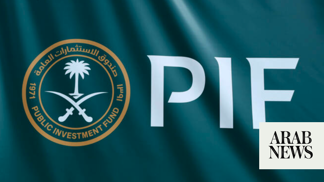

# PIF assets rise 5% to $1.21tn, net profit more than doubles

Source: https://www.arabnews.com/node/2649080/business-economy
Captured source: https://www.arabnews.com/node/2649080/business-economy
Published: 2026-06-30T12:40:11+03:00
Modified: 2026-06-30T12:49:28+03:00
Author: Arab News

## Summary

RIYADH: Saudi Arabia’s Public Investment Fund boosted its total assets to SR4.54 trillion ($1.21 trillion) by the end of 2025, representing a 5.09 percent increase compared to the previous year, according to a disclosure filed with the London Stock Exchange. The sovereign wealth fund reported gross revenue of SR449.93 billion in 2025, reflecting a 9 percent year-on-year

## Image

## Video Or Embed URLs

- https://f7c4b929bc9c42af03f5ccf4082dab9c.safeframe.googlesyndication.com/safeframe/1-0-45/html/container.html
- https://static.addtoany.com/menu/sm.25.html
- about:blank
- https://www.google.com/recaptcha/api2/aframe
- https://imasdk.googleapis.com/js/core/bridge3.774.0_en.html
- https://cm.g.doubleclick.net/partnerpixels?gdpr=0&us_privacy=1---&gpp_sid=-1&url=https%3A%2F%2Fwww.arabnews.com%2Fnode%2F2649080%2Fbusiness-economy

## Text

https://arab.news/cpp82

RIYADH: Saudi Arabia’s Public Investment Fund boosted its total assets to SR4.54 trillion ($1.21 trillion) by the end of 2025, representing a 5.09 percent increase compared to the previous year, according to a disclosure filed with the London Stock Exchange.

The sovereign wealth fund reported gross revenue of SR449.93 billion in 2025, reflecting a 9 percent year-on-year increase.

PIF, often described as the financial engine of the Kingdom, plays a central role in advancing Saudi Arabia’s Vision 2030 objectives to diversify the economy and reduce dependence on oil revenues.

Through investments in strategic domestic projects and global assets, the fund aims to accelerate economic transformation, foster new industries, create jobs and position the country as a global investment hub.

PIF’s net profit for 2025 stood at SR65.1 billion, compared with SR25.8 billion in 2024, more than doubling year on year.

“Over 2025, PIF continued to advance its position as an active, long-term investor, delivering progress across priority sectors, expanding strategic partnerships and strengthening Saudi Arabia’s domestic ecosystem,” said the fund in a media fact sheet.

The disclosure further said that the fund’s operating profit increased to SR77.9 billion in 2025, up from SR34.6 billion in 2024.

Liquidity remained strong, with over SR350 billion in cash and cash equivalents, providing significant firepower to execute PIF’s investment strategy.

The report also outlined the significant achievements by the PIF in 2025, powering Saudi Arabia’s economic diversification efforts.

In the area of accelerating artificial intelligence and advanced technology capabilities, PIF launched Humain, a company established to operate and invest across the AI value chain, encompassing infrastructure, data centers, and cloud capabilities, as well as advanced models and applications.

Last year, PIF and Aramco signed initial terms for Aramco to acquire a significant minority stake in Humain, with PIF retaining majority ownership. This partnership aims to combine key AI assets and scale Humain’s capabilities.

On deepening Saudi capital markets and international investment partnerships, PIF signed memorandums of understanding with Goldman Sachs Asset Management and Franklin Templeton to support new investment strategies focused on Saudi Arabia and the wider Gulf Cooperation Council region.

“These partnerships are intended to attract global capital and expertise, broaden investment products and support the continued development of Saudi Arabia’s asset management sector,” added the report.

To develop the tourism sector, PIF launched Expo 2030 Riyadh Co. to build and operate the facilities for the Kingdom’s first World Expo and preserve the legacy of the event.

The occasion is expected to support sustainable tourism, create private-sector opportunities, and contribute significantly to Saudi gross domestic product across construction, operations, and legacy phases.

In diversifying its funding base and supporting green projects, PIF priced its debut euro-denominated green bond, a €1.65 billion offering that was more than six times oversubscribed.

The wealth fund also launched its first commercial paper program, adding a new short-term funding source to complement its existing bonds, sukuk, and loans.

Regarding strengthening private-sector engagement and local content, PIF held the third Private Sector Forum in 2025, bringing together the fund’s portfolio companies, government entities, and private-sector partners to highlight opportunities in emerging sectors and giga-projects.
