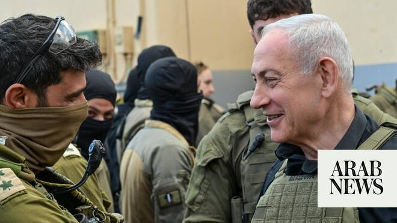

# In south Lebanon, Netanyahu says Israel will stay as long as Hezbollah ‘threatens us’

Source: https://www.arabnews.com/node/2649150/middle-east
Captured source: https://www.arabnews.com/node/2649150/middle-east
Published: 2026-06-30T19:55:11+03:00
Modified: 2026-06-30T19:57:10+03:00
Author: AFP

## Summary

JERUSALEM: Israeli Prime Minister Benjamin Netanyahu visited troops in southern Lebanon on Tuesday, vowing that his country’s forces would stay in the area as long as Iran-backed Hezbollah remained a “threat.” His comments came after Lebanon and Israel signed a framework agreement under US sponsorship last week to pave the way for peace between them and disarm Hezbollah. The

## Image

## Video Or Embed URLs

- https://2a5c7d417a5cffa0516e458f09ebd8ce.safeframe.googlesyndication.com/safeframe/1-0-45/html/container.html
- https://static.addtoany.com/menu/sm.25.html
- about:blank
- https://imasdk.googleapis.com/js/core/bridge3.774.0_en.html
- https://www.google.com/recaptcha/api2/aframe
- https://sync.teads.tv/wigo-no-slot
- https://cm.g.doubleclick.net/partnerpixels?gdpr=0&us_privacy=1---&gpp_sid=-1&url=https%3A%2F%2Fwww.arabnews.com%2Fnode%2F2649150%2Fmiddle-east

## Text

https://arab.news/8wy7p

Israeli troops are operating in a self-declared “security zone” stretching around 10 kilometers (six miles) deep inside Lebanese territory along the border

JERUSALEM: Israeli Prime Minister Benjamin Netanyahu visited troops in southern Lebanon on Tuesday, vowing that his country’s forces would stay in the area as long as Iran-backed Hezbollah remained a “threat.” His comments came after Lebanon and Israel signed a framework agreement under US sponsorship last week to pave the way for peace between them and disarm Hezbollah. The deal makes any Israeli withdrawal from occupied Lebanese land conditional on Beirut disarming Hezbollah by creating “pilot zones” that the Lebanese military will take over. “Our position is clear: we will not leave southern Lebanon until the threat has disappeared. And as long as Hezbollah, armed, is here and threatening us, we will stay here,” Netanyahu said according to a statement from his office. He added that “we say to Iran and to Hezbollah: leave this place, you no longer belong here... There are two sovereign states that want to live in peace.” Hezbollah drew Lebanon into the Middle East war in March with rocket fire at Israel, triggering Israeli airstrikes and a ground invasion. Israeli troops are operating in a self-declared “security zone” stretching around 10 kilometers (six miles) deep inside Lebanese territory along the border. Lebanese authorities say Israeli attacks since the war began on March 2 have killed more than 4,200 people. In the same period, the Israeli military has reported 38 soldiers and one civilian contractor killed.
