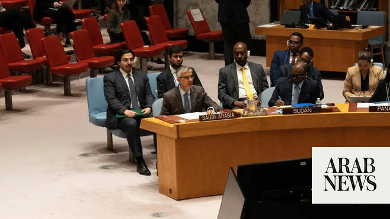

# Saudi envoy calls for stronger global cooperation against terrorist misuse of AI

Source: https://www.arabnews.com/node/2649200/world
Captured source: https://www.arabnews.com/node/2649200/world
Published: 2026-07-01T02:47:44+03:00
Modified: 2026-07-01T03:24:27+03:00
Author: Ephrem Kossaify

## Summary

NEW YORK: Saudi Arabia’s permanent representative to the UN on Tuesday called for strengthened international cooperation, expertise exchange and investment in capacity building to prevent terrorist groups from exploiting new and emerging technologies. Abdulaziz Alwasil was speaking during a UN General Assembly session, which he co-chaired, on strategic capacity building to

## Image

## Video Or Embed URLs

- https://imasdk.googleapis.com/js/core/bridge3.774.0_en.html
- https://f2e349ace0c58a0252eb1dac3e1b3507.safeframe.googlesyndication.com/safeframe/1-0-45/html/container.html
- about:blank
- https://static.addtoany.com/menu/sm.25.html
- https://www.google.com/recaptcha/api2/aframe
- https://cm.g.doubleclick.net/partnerpixels?gdpr=0&us_privacy=1---&gpp_sid=-1&url=https%3A%2F%2Fwww.arabnews.com%2Fnode%2F2649200%2Fworld

## Text

https://arab.news/pq95s

Abdulaziz Alwasil co-chairs UN General Assembly session

Capacity building in Yemen ‘particularly important to counter growing threat of terrorist groups’

NEW YORK: Saudi Arabia’s permanent representative to the UN on Tuesday called for strengthened international cooperation, expertise exchange and investment in capacity building to prevent terrorist groups from exploiting new and emerging technologies.

Abdulaziz Alwasil was speaking during a UN General Assembly session, which he co-chaired, on strategic capacity building to counter the misuse of artificial intelligence and emerging technologies.

He noted that capacity building in Yemen is “particularly important to counter the growing threat of terrorist groups, including the terrorist Houthi militia and Al-Qaeda, seeking to access and exploit modern technologies such as drones and other emerging technologies.”

Alwasil said the world is witnessing accelerating developments in new and emerging technologies, and terrorist groups are growing more capable of exploiting these tools to recruit members, spread extremist propaganda, raise funds and plot attacks.

Countries must strengthen their preparedness and national capabilities to keep pace with these evolving threats, he added.

Alwasil said his country believes that capacity building is a key pillar in combating terrorism and extremism, stressing that success in counterterrorism efforts hinges not only on security measures but also strong national institutions, efficient legal frameworks, close international cooperation, and sustained investment in human and technical capacity development.

He outlined the Kingdom’s record of supporting capacity-building efforts at the national, regional and international levels.

Saudi Arabia contributed to the establishment of the UN Counter-Terrorism Centre in 2011, providing a total of $110 million to support member states in enhancing their ability to implement the UN Global Counter-Terrorism Strategy.

Alwasil said the Kingdom continues to support international efforts through active participation in the Global Counterterrorism Forum, the Global Coalition to Defeat Daesh, and the Islamic Military Counter Terrorism Coalition, guided by the belief that counterterrorism is a collective responsibility requiring effective partnerships and continuous exchange of expertise and knowledge.

He added that Saudi Arabia established the Global Center for Combating Extremist Ideology, known as Etidal, which works to monitor, analyze and combat extremist discourse, and harnesses modern technology to raise awareness and counter terrorist propaganda in the digital space.

Alwasil said capacity-building programs must be based on the needs and national priorities of beneficiary states, and must be implemented at the request of, and in full coordination with, those states to ensure sustainability and effectiveness.

He added that through the coalition to support the UN-recognized government in Yemen, and in coordination with that government, Saudi Arabia has supported efforts to build the capacities of Yemeni security institutions to counter terrorism, “especially in liberated regions in southern Yemen,” to detect and disrupt financial and logistical support networks and stop attempts to transfer technology and military capabilities to terrorist groups.

Alwasil said this has contributed to bolstering security and stability, and has prevented these groups from exploiting security vacuums to expand their activities.
