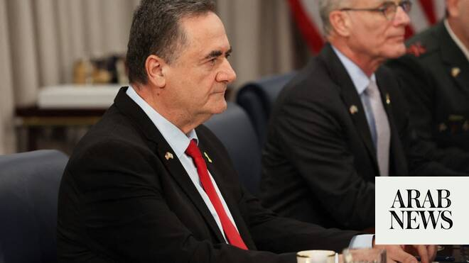

# Israel defense minister says troops to stay ‘indefinitely’ in Lebanon, Syria, Gaza

Source: https://www.arabnews.com/node/2649244/middle-east
Captured source: https://www.arabnews.com/node/2649244/middle-east
Published: 2026-07-01T12:57:23+03:00
Modified: 2026-07-01T12:59:17+03:00
Author: AFP

## Summary

JERUSALEM: Israel’s defense minister said Wednesday that Israeli forces would remain in self-proclaimed “security zones” established in Lebanon, Syria and Gaza, without any timeline for withdrawal. “The IDF will remain in the security zones in Lebanon, Syria and Gaza indefinitely in order to protect our residents and communities from jihadist elements,” Israel Katz said. “We

## Image

## Video Or Embed URLs

- https://7d9eaabb7f7fdede23595a7f6faca759.safeframe.googlesyndication.com/safeframe/1-0-45/html/container.html
- https://static.addtoany.com/menu/sm.25.html
- about:blank
- https://www.google.com/recaptcha/api2/aframe
- https://imasdk.googleapis.com/js/core/bridge3.774.0_en.html
- https://sync.teads.tv/wigo-no-slot
- https://cm.g.doubleclick.net/partnerpixels?gdpr=0&us_privacy=1---&gpp_sid=-1&url=https%3A%2F%2Fwww.arabnews.com%2Fnode%2F2649244%2Fmiddle-east

## Text

https://arab.news/yndaa

Israeli officials, including Prime Minister Benjamin Netanyahu, have repeatedly ruled out withdrawing troops from southern Lebanon

JERUSALEM: Israel’s defense minister said Wednesday that Israeli forces would remain in self-proclaimed “security zones” established in Lebanon, Syria and Gaza, without any timeline for withdrawal. “The IDF will remain in the security zones in Lebanon, Syria and Gaza indefinitely in order to protect our residents and communities from jihadist elements,” Israel Katz said. “We will not withdraw from the security zones,” Katz said at function held in honor of Israeli soldiers killed during the 2006 war in Lebanon. Katz also reiterated an earlier warning to Iran, saying the Islamic republic would be struck with “full force” if it attacked Israel over its operations in Lebanon. Israel and Lebanon signed a US-sponsored framework agreement under US sponsorship on Friday to pave the way for peace between the two countries and disarm Iran-backed militant group Hezbollah. Israeli officials, including Prime Minister Benjamin Netanyahu, have repeatedly ruled out withdrawing troops from southern Lebanon, where Israeli forces continue to clash with Hezbollah fighters. They maintain that any troop withdrawal would happen only after Hezbollah has been disarmed across Lebanon. Hezbollah drew Lebanon into the Middle East war in early March with rocket fire aimed at Israel to avenge the killing of Iran’s supreme leader in US-Israeli strikes. Israel responded with massive airstrikes and a ground invasion of southern Lebanon. According to Lebanon’s health ministry, nearly 4,300 people have been killed in Israeli attacks since the war erupted. The Israeli military says it has lost 38 soldiers and one civilian contractor in Lebanon since fighting began in early March. Israel has also carried out repeated incursions and bombings in Syria since the overthrow of longtime ruler Bashar Assad, saying it seeks to establish a demilitarised zone in the country’s south. In Gaza, Israeli forces occupy nearly 70 percent of the territory. Both the Palestinian Islamist movement Hamas and the Israeli military accuse each other of violating the ceasefire, which has been in effect since October last year.
