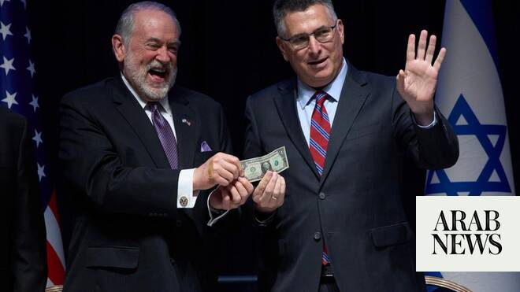

# US signs agreement to build permanent embassy in Jerusalem

Source: https://www.arabnews.com/node/2649275/middle-east
Captured source: https://www.arabnews.com/node/2649275/middle-east
Published: 2026-07-01T16:39:09+03:00
Modified: 2026-07-01T18:51:26+03:00
Author: AFP

## Summary

JERUSALEM: The United States on Wednesday signed an agreement to build a new embassy compound in Jerusalem, in a move that Israel said reflected the “unbreakable alliance” between the countries. During his first term, US President Donald Trump recognized Jerusalem as Israel’s capital in December 2017 and ordered the relocation of Washington’s diplomatic mission from Tel Aviv.

## Image

## Video Or Embed URLs

- blob:https://www.arabnews.com/64930ff9-2414-42a5-9c81-c3e588022eb7
- https://imasdk.googleapis.com/js/core/bridge3.774.0_en.html
- https://b3a0114a10037cbe4cbb94dbca3b5872.safeframe.googlesyndication.com/safeframe/1-0-45/html/container.html
- https://static.addtoany.com/menu/sm.25.html
- about:blank
- https://sync.teads.tv/wigo-no-slot
- https://www.google.com/recaptcha/api2/aframe
- https://cm.g.doubleclick.net/partnerpixels?gdpr=0&us_privacy=1---&gpp_sid=-1&url=https%3A%2F%2Fwww.arabnews.com%2Fnode%2F2649275%2Fmiddle-east

## Text

https://arab.news/4r8dg

Israel says the move reflects the “unbreakable alliance” between the countries

Trump broke with decades of US policy in 2017 when he ordered the relocation of Washington’s diplomatic mission from Tel Aviv

JERUSALEM: The United States on Wednesday signed an agreement to build a new embassy compound in Jerusalem, in a move that Israel said reflected the “unbreakable alliance” between the countries. During his first term, US President Donald Trump recognized Jerusalem as Israel’s capital in December 2017 and ordered the relocation of Washington’s diplomatic mission from Tel Aviv. But the services were spread across several locations in Jerusalem until a single permanent site could be found. “The United States not only recognizes Jerusalem as the eternal, indigenous, and forever capital of the Jewish people, but also that the United States says that we’re going to do something about it,” US ambassador to Israel Mike Huckabee said during a signing ceremony at Israel’s foreign ministry. “We are going to plant our flag, our American flag, on the soil of Jerusalem for a permanent and a brand new embassy compound that will serve as our mothership of diplomatic activities here in Israel. “I would say God made that decision 3,800 years ago, and we finally got around to acknowledging what had been determined long before the United States of America came along,” he added.

The embassy will be built at the Allenby compound in southern Jerusalem. Trump’s 2017 decision broke with decades of US policy, under which Jerusalem’s final status was expected to be determined through negotiations between Israelis and Palestinians. Jerusalem has long been one of the most contested cities in the Israeli-Palestinian conflict. After Israel captured East Jerusalem during the 1967 Arab-Israeli war, it declared the city its undivided capital, a claim that has not been widely recognized internationally. Palestinians seek East Jerusalem as the capital of a future Palestinian state. Because of these competing claims, most countries established their embassies in Tel Aviv, maintaining that Jerusalem’s status should be resolved through peace negotiations in accordance with international law and relevant United Nations resolutions. Israel’s Foreign Minister Gideon Saar said the agreement to build Washington’s permanent embassy in Jerusalem underscored the “unbreakable alliance” between the two countries. “President Trump’s historic decision in 2017 to move the embassy to Jerusalem set the record straight,” he said at the signing ceremony. “And today, with the agreement to begin building a permanent embassy complex, that decision becomes even deeper and more enduring.” In a separate post on X, Huckabee said: “Just as the US is vital and irreplaceable for Israel, Israel is vital for the US and its interests in the region.” The embassy agreement comes after the United States and Israel fought alongside each other during a months-long military campaign against Iran. The move also follows a period of reported tensions between Trump and Israeli Prime Minister Benjamin Netanyahu amid disagreements over efforts to end the war with Iran.
