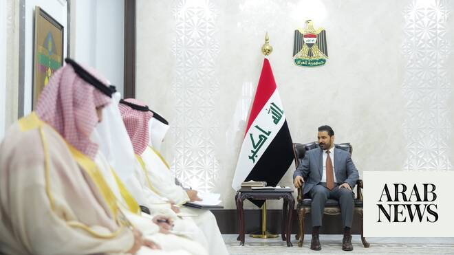

# Iraq, GCC discuss stronger ties as Baghdad pledges closer Gulf cooperation

Source: https://www.arabnews.com/node/2649278/middle-east
Captured source: https://www.arabnews.com/node/2649278/middle-east
Published: 2026-07-01T16:49:35+03:00
Modified: 2026-07-01T16:49:35+03:00
Author: Arab News

## Summary

LONDON: Iraqi Prime Minister Ali Falih Al-Zaidi on Wednesday met Gulf Cooperation Council (GCC) Secretary-General Jassem Mohammed Albudaiwi, as both sides discussed strengthening relations and expanding cooperation between Iraq and Gulf states. Albudaiwi conveyed congratulations from Gulf leaders to Al-Zaidi following his appointment as prime minister and the formation of

## Image

## Video Or Embed URLs

- https://1e07a9966a1662f7c0bd9a87704f3a7f.safeframe.googlesyndication.com/safeframe/1-0-45/html/container.html
- https://static.addtoany.com/menu/sm.25.html
- about:blank
- https://imasdk.googleapis.com/js/core/bridge3.774.0_en.html
- https://www.google.com/recaptcha/api2/aframe
- https://sync.teads.tv/wigo-no-slot
- https://cm.g.doubleclick.net/partnerpixels?gdpr=0&us_privacy=1---&gpp_sid=-1&url=https%3A%2F%2Fwww.arabnews.com%2Fnode%2F2649278%2Fmiddle-east

## Text

https://arab.news/v9df9

Al-Zaidi said his government was committed to deepening ties with GCC countries

LONDON: Iraqi Prime Minister Ali Falih Al-Zaidi on Wednesday met Gulf Cooperation Council (GCC) Secretary-General Jassem Mohammed Albudaiwi, as both sides discussed strengthening relations and expanding cooperation between Iraq and Gulf states. Albudaiwi conveyed congratulations from Gulf leaders to Al-Zaidi following his appointment as prime minister and the formation of Iraq’s new government. During the meeting, Al-Zaidi said his government was committed to deepening ties with GCC countries, describing them as Iraq’s “Arab depth” and stressing the importance of building relations with regional and international partners. He said Iraq was entering a new phase focused on strengthening state institutions, developing the economy, upholding the rule of law and reinforcing national sovereignty. Albudaiwi praised what he described as reform efforts by the Iraqi government, including steps to strengthen the economy, tackle corruption and ensure that arms remain under state control. He also expressed the GCC’s readiness to expand partnerships with Iraq across various fields. Albudaiwi also met with Judge Faiq Zidan, President of Iraq’s Supreme Judicial Council, during which they reviewed ways to enhance cooperation and discussed regional and international developments. Both sides stressed the importance of joint action to strengthen relations and support security and stability in the region.
