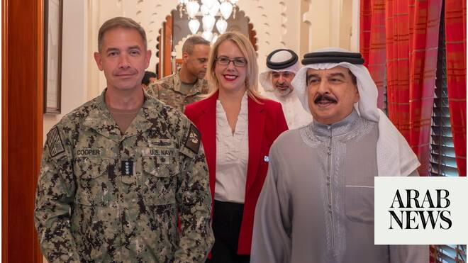

# Bahrain’s king, US commander discuss military cooperation

Source: https://www.arabnews.com/node/2649437/middle-east
Captured source: https://www.arabnews.com/node/2649437/middle-east
Published: 2026-07-02T18:37:13+03:00
Modified: 2026-07-02T18:38:13+03:00
Author: Arab News

## Summary

LONDON: King Hamad bin Isa Al-Khalifa of Bahrain received in Manama Adm. Charles Bradford Cooper II, commander of US Central Command, on Thursday to discuss military cooperation. The meeting focused on the relations and ongoing coordination between Bahrain and the US, particularly in defense and military sectors, underscoring the friendship and alliance between the two

## Image

## Video Or Embed URLs

- https://9d0a1b3aa1a4c249d7d10656b9a1760b.safeframe.googlesyndication.com/safeframe/1-0-45/html/container.html
- https://static.addtoany.com/menu/sm.25.html
- about:blank
- https://imasdk.googleapis.com/js/core/bridge3.774.0_en.html
- https://www.google.com/recaptcha/api2/aframe
- https://sync.teads.tv/wigo-no-slot
- https://cm.g.doubleclick.net/partnerpixels?gdpr=0&us_privacy=1---&gpp_sid=-1&url=https%3A%2F%2Fwww.arabnews.com%2Fnode%2F2649437%2Fmiddle-east

## Text

https://arab.news/wm7kk

Meeting reviews efforts to enhance regional stability in wake of Iranian attacks

LONDON: King Hamad bin Isa Al-Khalifa of Bahrain received in Manama Adm. Charles Bradford Cooper II, commander of US Central Command, on Thursday to discuss military cooperation.

The meeting focused on the relations and ongoing coordination between Bahrain and the US, particularly in defense and military sectors, underscoring the friendship and alliance between the two countries, according to Bahrain News Agency.

King Hamad, who is the supreme commander of Bahrain’s armed forces, emphasized the crucial role of the US in ensuring regional and global security, and promoting international peace.

They reviewed efforts to enhance regional stability and discussed the Iranian attacks. Bahrain, which hosts the US Navy’s Fifth Fleet, was one of 10 countries in the Middle East targeted by Iran with missile and drone attacks amid the US-Israel war with Tehran.

The conflict began on Feb. 28 and has escalated across the region for over 100 days. Last month, the US and Iran signed a memorandum of understanding to end the clashes and to start negotiation rounds on critical issues, including Iran’s nuclear program and the freedom of navigation in the Strait of Hormuz.
