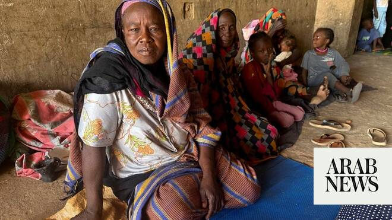

# UN aid truck destroyed in Darfur drone strike as El-Obeid siege deepens

Source: https://www.arabnews.com/node/2649467/middle-east
Captured source: https://www.arabnews.com/node/2649467/middle-east
Published: 2026-07-02T22:24:20+03:00
Modified: 2026-07-02T22:25:24+03:00
Author: Ephrem Kossaify

## Summary

NEW YORK: A UN refugee agency-contracted truck carrying humanitarian relief supplies was struck by a drone near Tendelti in White Nile state on Tuesday, destroying 50 metric tons of aid intended for vulnerable populations in South Kordofan, the UN spokesman’s office said Thursday .

## Image

## Video Or Embed URLs

- https://f6476171219f1e5ba15e0bd0350ba39a.safeframe.googlesyndication.com/safeframe/1-0-45/html/container.html
- https://static.addtoany.com/menu/sm.25.html
- about:blank
- https://www.google.com/recaptcha/api2/aframe
- https://imasdk.googleapis.com/js/core/bridge3.774.0_en.html
- https://cm.g.doubleclick.net/partnerpixels?gdpr=0&us_privacy=1---&gpp_sid=-1&url=https%3A%2F%2Fwww.arabnews.com%2Fnode%2F2649467%2Fmiddle-east

## Text

https://arab.news/gmx2q

Incident comes amid escalating RSF attacks on North Kordofan capital

Attack leaves thousands who depend on the assistance without urgently needed items, UN spokesman says

NEW YORK: A UN refugee agency-contracted truck carrying humanitarian relief supplies was struck by a drone near Tendelti in White Nile state on Tuesday, destroying 50 metric tons of aid intended for vulnerable populations in South Kordofan, the UN spokesman’s office said Thursday .

The driver escaped unharmed, but the destroyed cargo, which was being transported to Abu Jubeyha in South Kordofan, included 1,000 non-food item kits comprising 3,000 blankets, 2,000 jerry cans, 1,000 kitchen sets, 3,000 sleeping mats, 2,000 plastic sheets, and 1,000 solar lamps, UN spokesman Stephane Dujarric said.

He said thousands of people who depend on the assistance would now go without urgently needed relief items.

Dujarric told Arab News the UN had no information on which party was responsible for the drone strike.

“We’ve seen different parties in this conflict use drones,” he said, noting that such devices are inexpensive and easy to operate.

He added: “Why would anyone want to prevent people from getting blankets and plastic sheeting and the basic necessities that they need to survive? That’s a question I can’t even begin to answer.”

The incident came as the UN voiced mounting concern over escalating violence across Sudan and worsening humanitarian needs.

In White Nile State, humanitarian partners reported multiple drone strikes in Kosti city on Tuesday that injured at least three civilians, Dujarric said.

Despite the challenges, aid operations continued in parts of the country.

The World Health Organization said an 8.5-metric-ton convoy of medical supplies, including cholera kits, had joined an inter-agency convoy bound for Dilling and Kadugli in South Kordofan to help address growing health needs and strengthen outbreak preparedness, according to Dujarric.

The attack on the aid truck coincided with a deepening crisis in El-Obeid, the North Kordofan capital. The paramilitary Rapid Support Forces have encircled the city and subjected it to near-daily drone strikes on infrastructure, including its power station, and fuel depots.

The UN and rights groups have warned that as many as 500,000 civilians are at risk of atrocities if the RSF launches a ground assault, drawing comparisons to last October’s fall of El-Fasher in Darfur, which the UN said bore the hallmarks of genocide.

The UN humanitarian affairs office, OCHA, reiterated its call for the protection of civilians and civilian infrastructure across Sudan and urged donors to scale up funding to meet the country’s escalating humanitarian needs.
