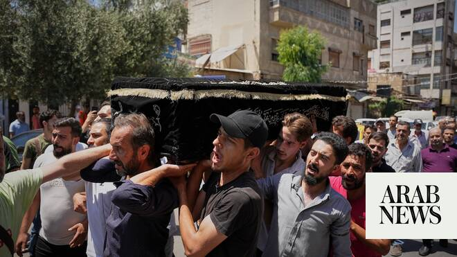

# Saudi Arabia condemns bombing at Damascus cafe

Source: https://www.arabnews.com/node/2649547/saudi-arabia
Captured source: https://www.arabnews.com/node/2649547/saudi-arabia
Published: 2026-07-03T16:52:57+03:00
Modified: 2026-07-03T17:26:51+03:00
Author: Arab News

## Summary

RIYADH: Saudi Arabia on Friday condemned and denounced the bombing of a cafe in the Al-Hijaz area of Damascus, after an explosive device detonated at the site on Thursday, killing and injuring several people. In a statement, the Ministry of Foreign Affairs said that the Kingdom stood in solidarity with Syria against all forms of violence, extremism and terrorism. It also

## Image

## Video Or Embed URLs

- https://86014eba89d96ac22fa4ebae022d3013.safeframe.googlesyndication.com/safeframe/1-0-45/html/container.html
- https://static.addtoany.com/menu/sm.25.html
- about:blank
- https://www.google.com/recaptcha/api2/aframe
- https://imasdk.googleapis.com/js/core/bridge3.774.0_en.html
- https://sync.teads.tv/wigo-no-slot
- https://cm.g.doubleclick.net/partnerpixels?gdpr=0&us_privacy=1---&gpp_sid=-1&url=https%3A%2F%2Fwww.arabnews.com%2Fnode%2F2649547%2Fsaudi-arabia

## Text

https://arab.news/2bkr7

A bomb blast at a crowded cafe in central Damascus killed at least nine people and wounded dozens of others on Thursday

RIYADH: Saudi Arabia on Friday condemned and denounced the bombing of a cafe in the Al-Hijaz area of Damascus, after an explosive device detonated at the site on Thursday, killing and injuring several people.

In a statement, the Ministry of Foreign Affairs said that the Kingdom stood in solidarity with Syria against all forms of violence, extremism and terrorism. It also offered condolences to the families of the victims and to the Syrian government and people, wishing the injured a speedy recovery.

A bomb blast at a crowded cafe in central Damascus killed at least nine people and wounded dozens of others on Thursday, Syrian state media reported.

Syrian officials have promised to arrest those behind the attack, but no updates were announced in the investigation and there has been no immediate claim of responsibility.

Syrian state television said that an explosive device had been planted at the cafe, near the Palace of Justice in the center of the capital.
