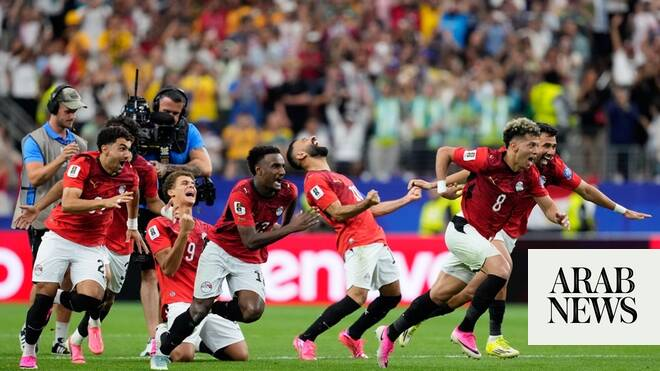

# Arab teams at World Cup 2026: Egypt overcome Australia to reach last 16 in 2026 World Cup

Source: https://www.arabnews.com/node/2649602/sport
Captured source: https://www.arabnews.com/node/2649602/sport
Published: 2026-07-04T01:08:11+03:00
Modified: 2026-07-04T10:16:00+03:00
Author: Ali Khaled

## Summary

DUBAI: Egypt have beaten Australia in a penalty shootout at Dallas Stadium to reach the Round of 16 of the 2026 World Cup. It was their first-ever knockout stage win. They now join Morocco as the second African and Arab nation to reach the last 16 of this tournament. Egypt had been buoyed by the news that captain and talisman Mohamed Salah had overcome injury concerns after

## Image

## Video Or Embed URLs

- https://imasdk.googleapis.com/js/core/bridge3.774.0_en.html
- https://161b87065d5e7cecca00d806e5540dc4.safeframe.googlesyndication.com/safeframe/1-0-45/html/container.html
- https://static.addtoany.com/menu/sm.25.html
- about:blank
- https://www.google.com/recaptcha/api2/aframe
- https://cm.g.doubleclick.net/partnerpixels?gdpr=0&us_privacy=1---&gpp_sid=-1&url=https%3A%2F%2Fwww.arabnews.com%2Fnode%2F2649602%2Fsport

## Text

https://arab.news/vuzsd

Pharaohs claim dramatic 4-2 penalty shootout win after tense match ends 1-1

First-ever knockout stage victory means Egypt join Morocco as 2nd African and Arab nation to reach last 16

DUBAI: Egypt have beaten Australia in a penalty shootout at Dallas Stadium to reach the Round of 16 of the 2026 World Cup. It was their first-ever knockout stage win.

For the latest updates, follow us @ArabNewsSport

They now join Morocco as the second African and Arab nation to reach the last 16 of this tournament.

Egypt had been buoyed by the news that captain and talisman Mohamed Salah had overcome injury concerns after asking to be substituted in the last group match against Iran. Going into the match, a front four of Salah, Mostafa Zico, Emam Ashour, and Omar Marmoush on paper posed a major threat to the Australian defense.

The Socceroos once again started with a 3-4-3 formation, with 20-year-old Nestor Irankunda tasked with providing the threat up front.

The first chance of the match fell to Cristian Volpato after five minutes, his left-footed curling effort skimming the top of Egypt’s bar. Minutes later, Jordan Bos drove through the Egyptian defense before being thwarted by Mohamed Hany as he shaped to have an effort on Mostafa Shobeir’s goal.

The breakthrough came at the other end, however, and it took the Pharaohs only 13 minutes to take the lead, with Ashour starting and ending the passage of play which gave him his second goal of the tournament. His initial shot from a Salah lay-off was blocked, and when the ball was then crossed into the box by Karim Hafez, Ashour’s free header gave Australian keeper Patrick Beach no chance.

Following the hydration break, Australia came more into the game, but the rest of the half was a stop-start affair, with niggly fouls and stoppages preventing any period of maintained dominance from either team.

Seconds into the second half Marmoush could have dealt Australia a mortal blow, but his right-foot finish drifted past the post after being put through brilliantly by Zico. Egypt would come to regret that miss on 55 minutes, when a curling freekick was flicked into his own net by Hany — 1-1 and game on.

On 67 minutes, Egypt attempted to claw back some momentum by replacing Zico and Hamdi Fathy with Haissem Hassan and Hossam Abdelmaguid. Five minutes later Ashour scuffed a shot wide after some decent possession play by Egypt following the second-half hydration break. Egypt stepped up their efforts in the last 10 minutes, but could not find a way past a solid Australian defense marshalled by the excellent Harry Souttar.

Deep into stoppage time, Ramy Rabia almost won it for Egypt, but his flicked header from Salah’s cross was met with a sensational save by Beach.

With substitutes Trezeguet and Hassan increasingly dangerous down the wings, Australia were the happier of the two teams to see the arrival of extra time.

Salah finally had a sight of goal three minutes into extra time, but his right-foot shot cleared the bar. Chances continued to be few and far between.

Marwan Attia’s deflected shot in the 108th minute almost wrong-footed Beach, but the keeper was grateful the ball came straight at him. Egypt were piling on the pressure, but the Australian rearguard stood firm. Salah rolled back the years by cutting through the defense with seven minutes of extra time left, but his shot was blocked for a corner. As penalties beckoned, Australia replaced Beach with the veteran Matt Ryan.

Souttar and Lucas Harrington missed for Australia. Mahmoud Saber, Rabia, Salah — with a Panenka kick — and Abdelmaguid scored as Egypt emerged victorious on an exhausting night.

They will now face either Argentina or Cabo Verde in the Round of 16 on Tuesday, July 7, at Mercedes Benz Stadium in Atlanta.
