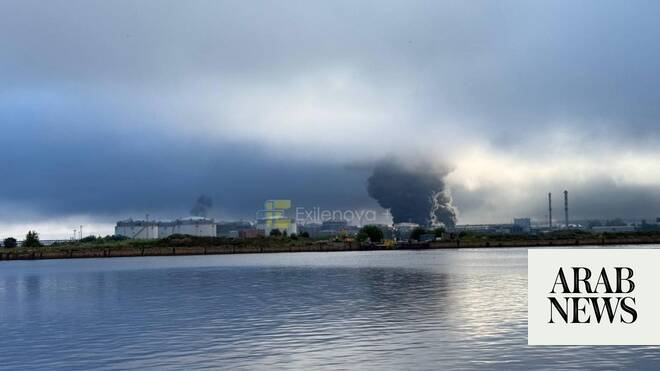

# Ukrainian drones hit St. Petersburg oil terminal in latest long-range attack on Russia

Source: https://www.arabnews.com/node/2649643/world
Captured source: https://www.arabnews.com/node/2649643/world
Published: 2026-07-04T16:17:26+03:00
Modified: 2026-07-04T16:21:11+03:00
Author: AP

## Summary

KYIV: A Ukrainian drone attack struck an oil terminal in St. Petersburg on Saturday, Russian officials said, as Kyiv presses on with bombardment of Russia’s oil infrastructure. Almost daily long-range attacks on Russian oil facilities have created a fuel crisis and heaped political pressure on the Kremlin as its all-out invasion of Ukraine stretches into its fifth year. Gov.

## Image

## Video Or Embed URLs

- https://platform.twitter.com/embed/Tweet.html?creatorScreenName=Arab_News&creatorUserId=69172612&dnt=false&embedId=twitter-widget-0&features=eyJ0ZndfdGltZWxpbmVfbGlzdCI6eyJidWNrZXQiOltdLCJ2ZXJzaW9uIjpudWxsfSwidGZ3X2ZvbGxvd2VyX2NvdW50X3N1bnNldCI6eyJidWNrZXQiOnRydWUsInZlcnNpb24iOm51bGx9LCJ0ZndfdHdlZXRfZWRpdF9iYWNrZW5kIjp7ImJ1Y2tldCI6Im9uIiwidmVyc2lvbiI6bnVsbH0sInRmd19yZWZzcmNfc2Vzc2lvbiI6eyJidWNrZXQiOiJvbiIsInZlcnNpb24iOm51bGx9LCJ0ZndfZm9zbnJfc29mdF9pbnRlcnZlbnRpb25zX2VuYWJsZWQiOnsiYnVja2V0Ijoib24iLCJ2ZXJzaW9uIjpudWxsfSwidGZ3X21peGVkX21lZGlhXzE1ODk3Ijp7ImJ1Y2tldCI6InRyZWF0bWVudCIsInZlcnNpb24iOm51bGx9LCJ0ZndfZXhwZXJpbWVudHNfY29va2llX2V4cGlyYXRpb24iOnsiYnVja2V0IjoxMjA5NjAwLCJ2ZXJzaW9uIjpudWxsfSwidGZ3X3Nob3dfYmlyZHdhdGNoX3Bpdm90c19lbmFibGVkIjp7ImJ1Y2tldCI6Im9uIiwidmVyc2lvbiI6bnVsbH0sInRmd19kdXBsaWNhdGVfc2NyaWJlc190b19zZXR0aW5ncyI6eyJidWNrZXQiOiJvbiIsInZlcnNpb24iOm51bGx9LCJ0ZndfdXNlX3Byb2ZpbGVfaW1hZ2Vfc2hhcGVfZW5hYmxlZCI6eyJidWNrZXQiOiJvbiIsInZlcnNpb24iOm51bGx9LCJ0ZndfdmlkZW9faGxzX2R5bmFtaWNfbWFuaWZlc3RzXzE1MDgyIjp7ImJ1Y2tldCI6InRydWVfYml0cmF0ZSIsInZlcnNpb24iOm51bGx9LCJ0ZndfbGVnYWN5X3RpbWVsaW5lX3N1bnNldCI6eyJidWNrZXQiOnRydWUsInZlcnNpb24iOm51bGx9LCJ0ZndfdHdlZXRfZWRpdF9mcm9udGVuZCI6eyJidWNrZXQiOiJvbiIsInZlcnNpb24iOm51bGx9fQ%3D%3D&frame=false&hideCard=false&hideThread=false&id=2073314218086969456&lang=en&origin=https%3A%2F%2Fwww.arabnews.com%2Fnode%2F2649643%2Fworld&sessionId=3730a5f2873c308ec4af6bb41196e540e8ed8dfb&siteScreenName=Arab_News&siteUserId=69172612&theme=light&widgetsVersion=6a3ad42b224df%3A1778106238597&width=600px
- https://7f5a652d121fbb82a26d7cb83c5182f5.safeframe.googlesyndication.com/safeframe/1-0-45/html/container.html
- https://static.addtoany.com/menu/sm.25.html
- https://platform.twitter.com/widgets/widget_iframe.1227a5674072e080ffb1ba14ac0c1079.html?origin=https%3A%2F%2Fwww.arabnews.com
- about:blank
- https://www.google.com/recaptcha/api2/aframe
- https://imasdk.googleapis.com/js/core/bridge3.774.0_en.html
- https://sync.teads.tv/wigo-no-slot
- https://cm.g.doubleclick.net/partnerpixels?gdpr=0&us_privacy=1---&gpp_sid=-1&url=https%3A%2F%2Fwww.arabnews.com%2Fnode%2F2649643%2Fworld

## Text

https://arab.news/5k2eq

Zelensky described the attack as part of Ukraine’s “long-range sanctions” against Russia

He said that Ukrainian forces also hit a military target on the island of Kronstadt, just off the coast of St. Petersburg

KYIV: A Ukrainian drone attack struck an oil terminal in St. Petersburg on Saturday, Russian officials said, as Kyiv presses on with bombardment of Russia’s oil infrastructure. Almost daily long-range attacks on Russian oil facilities have created a fuel crisis and heaped political pressure on the Kremlin as its all-out invasion of Ukraine stretches into its fifth year. Gov. Alexander Beglov said the city’s Kirovsky district on the Baltic Sea was hit. He also said that air defenses shot down 72 Ukrainian drones across Russia’s second-largest city and the surrounding region. Ukrainian President Volodymyr Zelensky described the attack as part of Ukraine’s “long-range sanctions” against Russia. He said that Ukrainian forces also hit a military target on the island of Kronstadt, just off the coast of St. Petersburg.

“The Ukrainian defense forces hit the port oil infrastructure, which earns money for the Russian war, and there were also hits on Kronstadt — an important military target,” he said in a post on Telegram. St. Petersburg’s Kirovsky district was previously hit in June, ahead of Russia’s flagship St. Petersburg International Economic Forum. The Crimean peninsula, which Russia annexed in 2014, has suffered particularly from heavy strikes, causing local authorities to suspend gasoline sales to civilians. A Ukrainian attack on Saturday killed one person and injured two more, including a 10-year-old child, the Moscow-installed Gov. Sergei Aksyonov said. Ukrainian attacks bring the war home Russian President Vladimir Putin has shrugged off Ukraine’s strikes on Russia’s energy facilities as “not critical,” and insisted the war will continue until his goals are met. He has described the attacks on Russian energy as an effort by Ukraine to distract attention from its losses on the battlefield, although analysts say the advance of Russian forces has been stymied in recent months. On Friday, Putin visited the Russian military headquarters directing the war in Ukraine and received a report on the capture of the city of Kostyantynivka, after weeks of intense street battles. He hailed it as a key step toward capturing the nearby cities of Sloviansk and Kramatorsk, the key remaining strongholds in the so-called “forest belt” of heavily fortified cities in the Donetsk region that remain in Ukraine’s hands. The capture of Kostyantynivka, a big transport and industrial hub, is of “major strategic importance,” Putin, clad in military fatigues, said in televised comments. Ukrainian officials deny that Russia has taken control of Kostiantynivka. Speaking with local outlet Ukrainska Pravda, General Staff spokesperson Maj. Andriy Kovalev accused Moscow of spreading “outright disinformation” and said that Russian forces had not succeeded in capturing the city. The Russian leader appears to believe his government can keep the fuel crisis from eroding his authority and support for the war he launched more than four years ago. At the very least, the attacks have brought the war home even more poignantly for millions of Russians, shattering Putin’s narrative of the conflict as something that doesn’t affect the lives of ordinary people in his country. The border city of Belgorod, which Ukrainian drone strikes have also repeatedly targeted, was left almost completely without power on Saturday due to overnight attacks, local media reported. Meanwhile, eight people were wounded after a Russian attack struck residential buildings in Ukraine’s southeastern region of Zaporizhzhia, including two children, local authorities said on Saturday.
