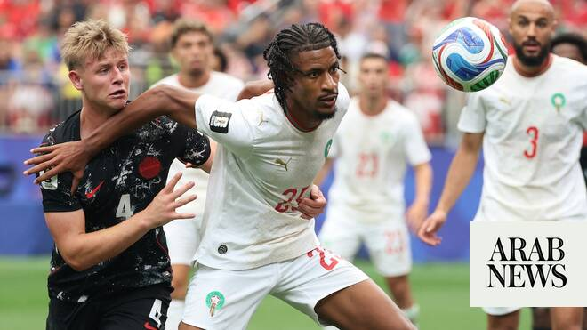

# Patient Morocco beat co-hosts Canada to set up quarterfinal against France

Source: https://www.arabnews.com/node/2649716/sport
Captured source: https://www.arabnews.com/node/2649716/sport
Published: 2026-07-05T10:45:09+03:00
Modified: 2026-07-05T10:45:09+03:00
Author: Gary Meenaghan

## Summary

HOUSTON: The end result was as expected, but for 45 minutes the performance was not. After a quintessential game of two halves, Morocco became the first African team in history to twice reach the World Cup quarterfinals, yet it was not the easy game against Canada that many fans anticipated. When the final whistle went, two-goal hero Azzedine Ounahi said he “felt like crying”

## Image

## Video Or Embed URLs

- https://16bcb6bbc358179f730afce94372aea3.safeframe.googlesyndication.com/safeframe/1-0-45/html/container.html
- https://static.addtoany.com/menu/sm.25.html
- about:blank
- https://www.google.com/recaptcha/api2/aframe
- https://imasdk.googleapis.com/js/core/bridge3.774.0_en.html
- https://cm.g.doubleclick.net/partnerpixels?gdpr=0&us_privacy=1---&gpp_sid=-1&url=https%3A%2F%2Fwww.arabnews.com%2Fnode%2F2649716%2Fsport

## Text

https://arab.news/8c4ma

HOUSTON: The end result was as expected, but for 45 minutes the performance was not. After a quintessential game of two halves, Morocco became the first African team in history to twice reach the World Cup quarterfinals, yet it was not the easy game against Canada that many fans anticipated. When the final whistle went, two-goal hero Azzedine Ounahi said he “felt like crying” after helping to give his country the celebrations its people were expecting.

For the latest updates, follow us @ArabNewsSport

Heading into Houston Stadium, the Moroccan fans were confident their place in the last-eight was all but assured. Ranked No7 in the world — 23 places higher than their North American opponents — and with the experience of four years ago when they reached the semi-finals in Qatar, fans wearing fezzes and draped in the red and green flag of their nation spoke of a “comfortable” win and “two or three nil”.

In the end it was indeed 3-0, but for the first half at least, comfortable it was not. In fact, Canada coach Jesse Marsch’s pre-match declaration that Morocco have “zero weaknesses” looked like a bluff as his Canada side showed enough determination, ambition, and speed of attack to rattle the African champions. Jonathan David, Tani Oluwaseyi, and Alistair Johnston all missed early chances, while Morocco offered little.

The Atlas Lions looked neutered for much of the first half, managing just one touch in the opposition box. Ounahi, however, showed shortly after half-time that true predators do not need to get close to kill, with his goal from distance changing the shape of the game.

“These days, there are no easy teams anymore,” said Ounahi, who added a second before Al-Ain’s Sofiane Rahimi wrapped it up in added time.

“People say, ‘Morocco will go through easily; it’ll be an easy match,’ but that’s not the case. Every team plays with determination and gives everything they have. In the first half, we had some problems building up from the back, but in the second, we stayed calm, tried to find the right solutions to win the match, and, alhamdulillah, you could see we were much better in the second half.”

Real Madrid forward Brahim Diaz, who snared two assists to take his tally to four this summer, echoed his teammate’s sentiments.

“Sometimes football is like this. The World Cup is really difficult, the most important thing is how we developed the mentality we have because we knew we didn’t have a good first half, and we came out to put everything on the pitch. In football and in life, you have bad times, so how you keep your head up and keep going is most important. I’m so proud of my team.”

Ounahi, who plays his domestic football with Girona, was lifted onto the shoulders of his teammates at full-time, but the 26-year-old was quick to play down his Man of the Match-winning role, insisting Morocco is a team united and ready to fight together.

“Honestly, I’m proud of everyone,” he said. “I’m proud of the whole group. It’s not about the fact I scored today. We’re one team, we all want the same thing, and we all share the same objective. whether it was me who scored or someone else, we’re all happy. I’m proud of this generation, and I’m proud of this group.”

The 68,777 fans crammed into the roofed Houston Stadium were certainly entertained. Even as Canada enjoyed some sustained possession in the second half, Morocco’s colourful supporters began whistling so loudly that the entire arena rang with a relentless tinnitus-like whine.

“Sometimes I feel like crying when I see them out celebrating — the elderly, the young people, little kids, women —everyone is supporting the team, everyone is happy,” Ounahi said. “We know how important football is to the Moroccan people. Our goal is to make them proud. Inshallah, if we all stay united, we’ll achieve the best possible result.”

Taking place in Texas on the 250th birthday of the United States of America, the red and white of Canada were left feeling blue, yet they can take great heart from a historic campaign that brought them a first World Cup point, first World Cup victory, and first knockout-stage win, while also showing they can compete with one of the strongest teams at this summer's tournament.

Canada’s Stephen Eustaquio said “the fact we reached the last 16 shows the level we’re getting to”, while Jayden Nelson added he felt a mix of joy and regret after making his World Cup debut. “That’s the next step for us,” he said. “When we have teams suffocated, we need to learn how to put the dagger in because if we had taken our chances in the first half, it would have been a completely different game.”

For the co-hosts, home awaits now, but for Morocco and their growing legion of fez-wearing fans, a historic second last-eight tie against France is up next.
