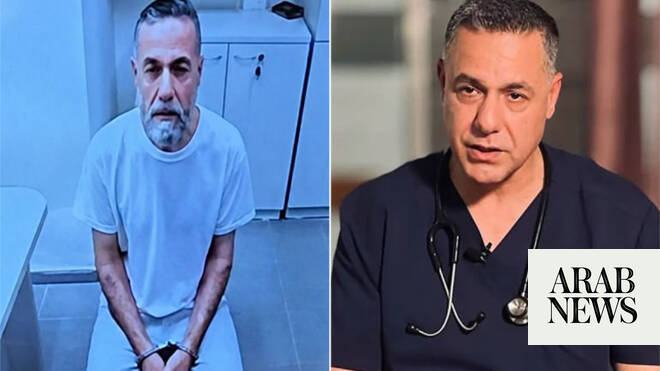

# Palestinian Prisoners’ Society voices concern over detained Gaza hospital director’s condition

Source: https://www.arabnews.com/node/2649742/middle-east
Captured source: https://www.arabnews.com/node/2649742/middle-east
Published: 2026-07-05T19:55:28+03:00
Modified: 2026-07-05T21:21:56+03:00
Author: APWAFA

## Summary

TEL AVIV: The lawyer for a prominent Palestinian doctor who was seized by Israeli forces 18 months ago said his client has been abused in captivity and is in critical condition, according to the human rights group representing him. Hussam Abu Safiya, who served as director of the Kamal Adwan Hospital in northern Gaza, became the face of health workers struggling to treat

## Image

## Video Or Embed URLs

- https://70ce4d5ff4e53e17bb4972769e394e32.safeframe.googlesyndication.com/safeframe/1-0-45/html/container.html
- https://static.addtoany.com/menu/sm.25.html
- about:blank
- https://imasdk.googleapis.com/js/core/bridge3.774.0_en.html
- https://www.google.com/recaptcha/api2/aframe
- https://sync.teads.tv/wigo-no-slot
- https://cm.g.doubleclick.net/partnerpixels?gdpr=0&us_privacy=1---&gpp_sid=-1&url=https%3A%2F%2Fwww.arabnews.com%2Fnode%2F2649742%2Fmiddle-east

## Text

https://arab.news/y27rg

Abu Safiya was physically and psychologically abused, says Physicians for Human Rights

The organization held Israeli authorities fully responsible for the lives of Abu Safiya, other detained medical personnel and Palestinian prisoners

TEL AVIV: The lawyer for a prominent Palestinian doctor who was seized by Israeli forces 18 months ago said his client has been abused in captivity and is in critical condition, according to the human rights group representing him.

Hussam Abu Safiya, who served as director of the Kamal Adwan Hospital in northern Gaza, became the face of health workers struggling to treat patients throughout the Israel-Hamas war. He led the facility through an 85-day siege by the Israeli military, releasing videos in which he pleaded for help before he was arrested in December 2024. He has not been charged. The Israeli military said Abu Safiya, 53, was being investigated on suspicion of cooperating with or working for Hamas. Staff and international aid groups that worked with him deny the claims. Physicians for Human Rights Israel and Abu Safiya’s lawyer, Nasser Odeh, said Abu Safiya appeared extremely weak and struggled to sit upright during a visit on July 2. Odeh said he had recent head injuries around his eyes, ears and neck and experienced difficulty breathing. Odeh and Physicians for Human Rights Israel said they have petitioned for Abu Safiya’s transfer to another facility. Abu Safiya faced physical and psychological abuse and was kept in solitary confinement for extended periods, Odeh said following an appearance before Israel’s Supreme Court last month challenging his continued detainment without charge. Abu Safiya appeared briefly via video during that hearing, looking pale and gaunt, with lash-like marks on both arms. Israel’s Prison Service called the allegations “false and entirely without factual basis.” The prison service declined to discuss the case directly, citing privacy concerns, but said all prisoners and detainees are held in accordance with the law and receive medical care based on Ministry of Health guidelines. “The Israel Prison Service rejects allegations of abuse, torture, starvation, or denial of medical treatment,” the prison service said. Israel has faced severe criticism over its treatment of Palestinian prisoners and detainees since the start of its war with Hamas in October 2023. Human rights organizations and the UN have alleged systematic patterns of abuse. The number of Palestinians in Israeli detention surged after the start of the war, and thousands remain in detention. The Associated Press has previously reported on the dire conditions in prisons. The Palestinian Prisoners’ Society expressed concern over Abu Safiya’s detention conditions and his reported health. The society said the continued detention of medical personnel from the Gaza Strip, including Abu Safiya, forms part of a campaign targeting health care workers. The organization held Israeli authorities fully responsible for the lives of Abu Safiya, other detained medical personnel, and Palestinian prisoners. It called on international human rights organizations, the International Committee of the Red Cross, and the UN to intervene urgently to ensure their protection and secure their release. It also said that states providing political and military support to Israel bear responsibility for the continuation of serious violations of international law. The society said that available information regarding Abu Safiya indicated he had been transferred to a prison section known as “Rakefet,” which Palestinian human rights organizations describe as a high-security section. The statement added that condemnations alone have lost their practical effect in the face of what it described as systematic destruction targeting Palestinian prisoners. The organization cited remarks it said Abu Safiya made to his lawyer: “This is the last time you will see me ... they brought me here to kill me. I do not see myself leaving here alive. This is the end.”
