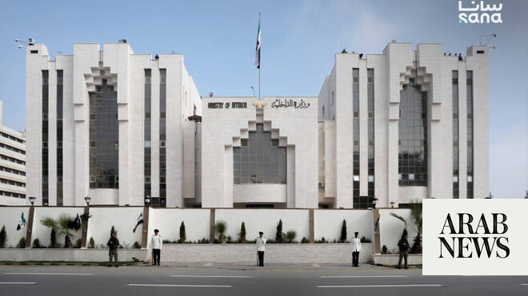

# Syrian security forces foil assassination cell in Hama province

Source: https://www.arabnews.com/node/2649811/middle-east
Captured source: https://www.arabnews.com/node/2649811/middle-east
Published: 2026-07-06T06:50:12+03:00
Modified: 2026-07-06T06:51:14+03:00
Author: Arab News

## Summary

DAMASCUS: Internal Security Forces in Hama province dismantled a criminal cell operating in the al-Ghab area on Sunday, arresting all seven of its members. A source at Syria's Ministry of Interior told SANA that one of the detainees confirmed involvement in the assassination of a resident of the Salhab area in Hama province. The killing, the source added, was documented in a

## Image

## Video Or Embed URLs

- https://4f51ffa78edf9554eb308efd66ef41bb.safeframe.googlesyndication.com/safeframe/1-0-45/html/container.html
- https://static.addtoany.com/menu/sm.25.html
- about:blank
- https://www.google.com/recaptcha/api2/aframe
- https://imasdk.googleapis.com/js/core/bridge3.774.0_en.html
- https://cm.g.doubleclick.net/partnerpixels?gdpr=0&us_privacy=1---&gpp_sid=-1&url=https%3A%2F%2Fwww.arabnews.com%2Fnode%2F2649811%2Fmiddle-east

## Text

https://arab.news/pwdpx

Seven held during raid by Internal Security Forces

Latest security sweep comes amid Syria's fragile political transition

DAMASCUS: Internal Security Forces in Hama province dismantled a criminal cell operating in the al-Ghab area on Sunday, arresting all seven of its members.

A source at Syria's Ministry of Interior told SANA that one of the detainees confirmed involvement in the assassination of a resident of the Salhab area in Hama province. The killing, the source added, was documented in a video recording.

Efforts are continuing to identify additional suspects believed to be linked to the cell.

Syria is navigating a fragile political transition following the collapse of Bashar al-Assad's decades-long dictatorship in December 2024.

The regime's rapid fall, triggered by a sweeping opposition offensive, led to the establishment of the Syrian Transitional Government in March 2025.

Led by President Ahmed al-Sharaa — former commander of Hayat Tahrir al-Sham (HTS) — the provisional administration has spent the past year and a half working to consolidate central authority, draft a new constitution, and rebuild state institutions from the ruins of more than 14 years of civil war.

This is not the first such operation reported by Syrian authorities. In October 2025, Internal Security in Latakia announced the arrest of a terrorist cell allegedly planning assassinations targeting media activists and prominent local figures, with officials at the time saying the plot was aimed at destabilizing the province.

Investigators alleged businessman Rami Makhlouf, a cousin of the ousted Assad, had helped finance that cell along with unspecified foreign entities.
