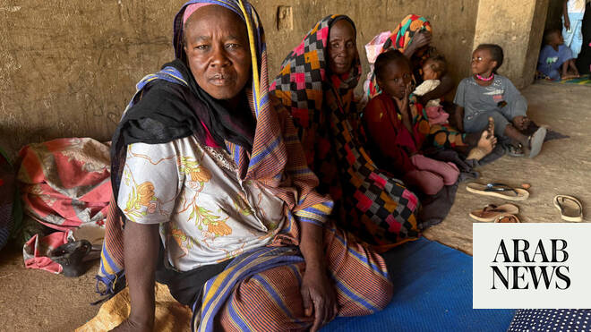

# UN rights council orders urgent inquiry into Sudan’s Al-Obeid

Source: https://www.arabnews.com/node/2649825/middle-east
Captured source: https://www.arabnews.com/node/2649825/middle-east
Published: 2026-07-06T11:56:55+03:00
Modified: 2026-07-06T12:56:39+03:00
Author: Reuters

## Summary

GENEVA: The UN Human Rights Council on Monday passed a motion condemning ​the escalating violence committed by the paramilitary Rapid Support Forces (RSF) in Sudan’s Al-Obeid and setting up an urgent inquiry into abuses there. Britain, which brought the motion alongside 14 other states, has previously warned of the risk ‌of large-scale ‌atrocities as the RSF ​massed ‌forces

## Image

## Video Or Embed URLs

- https://3b9edb72e6253a8df3ed0b1f4e514e2d.safeframe.googlesyndication.com/safeframe/1-0-45/html/container.html
- https://static.addtoany.com/menu/sm.25.html
- about:blank
- https://imasdk.googleapis.com/js/core/bridge3.774.0_en.html
- https://www.google.com/recaptcha/api2/aframe
- https://sync.teads.tv/wigo-no-slot
- https://cm.g.doubleclick.net/partnerpixels?gdpr=0&us_privacy=1---&gpp_sid=-1&url=https%3A%2F%2Fwww.arabnews.com%2Fnode%2F2649825%2Fmiddle-east

## Text

https://arab.news/9adjd

GENEVA: The UN Human Rights Council on Monday passed a motion condemning ​the escalating violence committed by the paramilitary Rapid Support Forces (RSF) in Sudan’s Al-Obeid and setting up an urgent inquiry into abuses there.

Britain, which brought the motion alongside 14 other states, has previously warned of the risk ‌of large-scale ‌atrocities as the RSF ​massed ‌forces ⁠around ​one of ⁠Sudan’s largest cities, a siege that recalls the takeover of Al-Fashir in North Darfur last year.

“These horrors must not be repeated,” Britain’s Human Rights Ambassador Eleanor Sanders told the body.

Others, ⁠like South Africa’s ambassador ‌Zaheer Laher, backed the ‌move, calling the situation ​a “red alert ‌as the rapid security forces are drawing ‌from the very same genocidal playbook they used in Al-Fashir.” The UN human rights chief warned on Friday that a “catastrophe” ‌was unfolding around Al-Obeid, and that his office had documented patterns ⁠of ⁠summary executions, abductions, torture and sexual violence in the surrounding region. In the past, the RSF has denied such abuses — saying the accounts have been manufactured by its enemies and making counter-accusations against them. The motion was adopted by consensus although China disassociated itself from the decision, saying ​it did not ​support investigations that target individual countries without their backing.
