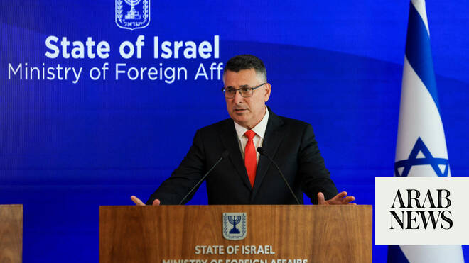

# Israel confirms next round of talks with Lebanon to be held in Rome

Source: https://www.arabnews.com/node/2649955/middle-east
Captured source: https://www.arabnews.com/node/2649955/middle-east
Published: 2026-07-07T13:47:52+03:00
Modified: 2026-07-07T13:49:23+03:00
Author: AFP

## Summary

JERUSALEM: Israeli Foreign Minister Gideon Saar confirmed on Tuesday that the next round of talks with Lebanon will take place in Rome, as the two countries work to build on a framework agreement reached last month with US backing. “Less than two weeks ago, Israel, Lebanon and the United States reached a historic framework agreement. These talks are due to continue next week

## Image

## Video Or Embed URLs

- https://b12342cc013e49b31fc515e2f08fe0f9.safeframe.googlesyndication.com/safeframe/1-0-45/html/container.html
- https://static.addtoany.com/menu/sm.25.html
- about:blank
- https://imasdk.googleapis.com/js/core/bridge3.774.0_en.html
- https://www.google.com/recaptcha/api2/aframe
- https://sync.teads.tv/wigo-no-slot
- https://cm.g.doubleclick.net/partnerpixels?gdpr=0&us_privacy=1---&gpp_sid=-1&url=https%3A%2F%2Fwww.arabnews.com%2Fnode%2F2649955%2Fmiddle-east

## Text

https://arab.news/jcu5t

Israel, Lebanon work to build on a framework agreement reached last month with US backing

JERUSALEM: Israeli Foreign Minister Gideon Saar confirmed on Tuesday that the next round of talks with Lebanon will take place in Rome, as the two countries work to build on a framework agreement reached last month with US backing. “Less than two weeks ago, Israel, Lebanon and the United States reached a historic framework agreement. These talks are due to continue next week in Rome, Italy,” Saar said during a joint press conference with his German counterpart Johann Wadephul in Jerusalem, adding that “Israel has no territorial ambitions in Lebanon.”
