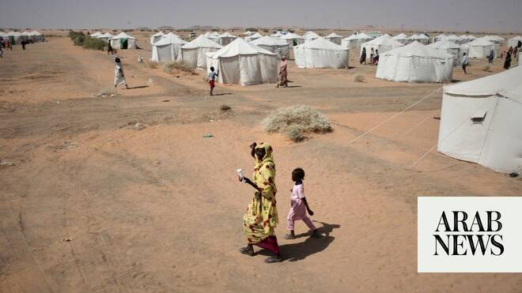

# UN launches urgent inquiry into Sudan’s El-Obeid after finding ‘hallmarks of genocide’ by RSF in El-Fasher

Source: https://www.arabnews.com/node/2650162/middle-east
Captured source: https://www.arabnews.com/node/2650162/middle-east
Published: 2026-07-08T22:00:25+03:00
Modified: 2026-07-08T22:13:27+03:00
Author: Ephrem Kossaify

## Summary

NEW YORK CITY: Sudan’s Rapid Support Forces committed mass killings, systematic abductions of women and girls and mass gang rape in El-Fasher, the UN Fact-Finding Mission for Sudan said in a new report on Wednesday. The findings add further weight to evidence that atrocities committed by the warring parties constitute distinct markers of genocide. The Mission warned that

## Image

## Video Or Embed URLs

- https://226e9a97700cbbf84abf6de54245ebbe.safeframe.googlesyndication.com/safeframe/1-0-45/html/container.html
- https://static.addtoany.com/menu/sm.25.html
- about:blank
- https://www.google.com/recaptcha/api2/aframe
- https://imasdk.googleapis.com/js/core/bridge3.774.0_en.html
- https://cm.g.doubleclick.net/partnerpixels?gdpr=0&us_privacy=1---&gpp_sid=-1&url=https%3A%2F%2Fwww.arabnews.com%2Fnode%2F2650162%2Fmiddle-east

## Text

https://arab.news/j8pr6

Member states must seize opportunity to stop sending weapons fueling the conflict, spokesman tells Arab News

Despite repeated pleas for RSF to halt its siege, situation in El-Obeid continues to escalate as humanitarian conditions worsen

NEW YORK CITY: Sudan’s Rapid Support Forces committed mass killings, systematic abductions of women and girls and mass gang rape in El-Fasher, the UN Fact-Finding Mission for Sudan said in a new report on Wednesday.

The findings add further weight to evidence that atrocities committed by the warring parties constitute distinct markers of genocide.

The Mission warned that similar patterns of civilian devastation are now emerging in El-Obeid, where it is launching an urgent inquiry into alleged human rights violations and abuses.

The findings build on the Mission’s earlier report, “Hallmarks of Genocide in El-Fasher,” and detail additional evidence of atrocities including detention, torture, ransom-taking and the enforced disappearance of civilians.

“Our investigations not only provide the evidentiary basis underpinning our findings on El-Fasher, but also reflect the Mission’s continued investigations into violations that have devastated communities across Darfur,” said Mohamed Chande Othman, its chair.

“The patterns we documented in El-Fasher — including encirclement, attacks on civilian infrastructure, restrictions on humanitarian access and widespread abuses against civilians — serve as a stark warning. The international community must heed these lessons and act to prevent further catastrophe.”

Despite repeated warnings from the UN and direct appeals from senior officials, fighting has continued to intensify around El-Obeid, deepening an already severe humanitarian crisis.

Calls by Pekka Haavisto and Tom Fletcher urging RSF commander Mohamed Hamdan Dagalo to halt military operations and protect civilians have so far failed to curb the violence. Civilian casualties continue to mount, essential services remain disrupted and growing numbers of residents are fleeing their homes. More than half-a-million residents and over 100,000 internally displaced people in and around El-Obeid now face increasing insecurity, attacks on critical infrastructure and restricted access to essential services.

UN Secretary-General Antonio Guterres called for a “redoubling of unified action” to end the conflict. His spokesman, Stephane Dujarric, told Arab News that “there is an opportunity for member states — those who have influence on the parties — to decide to stop sending weapons and send messages of peace instead and reconciliation.”

On Monday, the Human Rights Council expressed deep concern at the imminent risk of large-scale atrocities by the RSF in and around El-Obeid, and requested the Fact-Finding Mission conduct an urgent inquiry into any violations and abuses of international human rights law, violations of international humanitarian law and related international crimes allegedly committed in the area.

During the Council’s urgent debate on El-Obeid on July 3, the Mission had already said that the warning signs preceding El-Fasher’s atrocities — encirclement, attacks on infrastructure and growing humanitarian isolation — appeared to be emerging in El-Obeid and urged immediate action to protect the population.

“The lessons of El-Fasher must not be ignored,” said Mona Rishmawi, an expert member of the Fact-Finding Mission. “Our new paper demonstrates not only the devastating human cost of the atrocities committed in and around El-Fasher, but also the warning signs that preceded them … these are not isolated incidents — they are warning signs of further atrocity crimes.

“The parties to the conflict — and those enabling them through the continued supply of weapons, drones and other forms of support — must act now to protect civilians,” she added. “The international community still has a window of opportunity to prevent further atrocity crimes. El-Obeid must not become the next crime scene.”

The Mission reiterated its calls for effective accountability, including prompt cooperation and action by the International Criminal Court.

“The suffering documented in this paper is measured not only in statistics, but in the lives of women, girls, men and children who have endured unimaginable violence,” said Joy Ngozi Ezeilo, another expert member of the Mission. “Accountability remains essential, but so too does prevention. At a moment when serious concerns are being raised about the risks facing civilians in El-Obeid, the findings from El-Fasher underscore the need for urgent protection measures before more lives are lost.”

The Mission said it would continue its investigations and report on the situation in and around El-Obeid to the Human Rights Council and the General Assembly pursuant to its resolution adopted on July 6.

The Independent International Fact-Finding Mission for Sudan was established by the UN Human Rights Council in October 2023. Its mandate is to investigate and establish the facts, circumstances and root causes of alleged human rights violations and abuses, and violations of international humanitarian law, including those committed against refugees and related crimes, in the context of the armed conflict that began in 2023 between the Sudanese Armed Forces and the Rapid Support Forces, as well as other warring parties.
