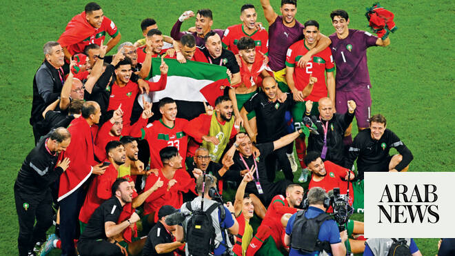

# Analysis: Why does North African football outperform the Middle East on the world stage?

Source: https://www.arabnews.com/node/2650182/football
Captured source: https://www.arabnews.com/node/2650182/football
Published: 2026-07-08T23:39:43+03:00
Modified: 2026-07-09T02:32:46+03:00
Author: Ali Khaled

## Summary

DUBAI: Four years ago, Morocco smashed the glass ceiling for Arab teams at the World Cup. A sensational run to the semifinal, where they lost 2-0 to France, goes beyond the wildest dreams of even European and South American nations, never mind those from the region. Arab teams from North Africa have always been several steps ahead of their Middle Eastern counterparts. Egypt

## Image

## Video Or Embed URLs

- https://351049853beef88ac6b0c3831f5ab859.safeframe.googlesyndication.com/safeframe/1-0-45/html/container.html
- https://static.addtoany.com/menu/sm.25.html
- about:blank
- https://www.google.com/recaptcha/api2/aframe
- https://imasdk.googleapis.com/js/core/bridge3.774.0_en.html
- https://cm.g.doubleclick.net/partnerpixels?gdpr=0&us_privacy=1---&gpp_sid=-1&url=https%3A%2F%2Fwww.arabnews.com%2Fnode%2F2650182%2Ffootball

## Text

https://arab.news/8werd

Morocco and Egypt’s World Cup success reflects decades of investment in youth development, stronger leagues and European experience

Experts say diaspora talent, elite players and a winning mindset continue to separate North Africa from its Asian Arab rivals

DUBAI: Four years ago, Morocco smashed the glass ceiling for Arab teams at the World Cup. A sensational run to the semifinal, where they lost 2-0 to France, goes beyond the wildest dreams of even European and South American nations, never mind those from the region.

Arab teams from North Africa have always been several steps ahead of their Middle Eastern counterparts.

Egypt were the first Arab side to participate in the World Cup, in the tournament’s second edition in Italy all the way back in 1934. Morocco were the first to play in the group stages, at Mexico 1970. Tunisia were first to record a victory — a 3-1 win over Mexico in 1978.

Algeria were the first to record two wins in the group stages at the 1982 World Cup in Spain. Morocco were the first to reach the knockouts stages in 1986, and, gloriously, the first to reach the semifinals four years ago in Qatar.

And, this summer, Morocco and Egypt became the first two Arab teams to play in the knockout stages at the same time.

The pride and celebrations across the Arab world has been a joy to behold in recent weeks.

In comparison, success by Arab teams from the Asian Football Federation have been sporadic to non-existent, with almost all high points provided by seven-time qualifiers Saudi Arabia, including a successful debut campaign at USA 94 and a famous win over Argentina in Qatar.

So why do the North Africans succeed where the Middle Easterners fail?

Pragmatically, they have better domestic leagues, player development and a longer history in the game.

It is no surprise that Morocco, by far the most successful of all Arab nations, is also home to the state-of-the-art Mohammed VI Football Academy. Since its inauguration in 2009, its impact on player development, in both the men’s and women’s game, has been immense.

Beyond doing the basics at home, there is perhaps a factor just as important at play. A sense of adventure and a winning mentality that now sees many Moroccan footballers, and to a lesser extent their North African neighbors, succeed at the highest levels of the game.

“There are obviously different issues when it comes to each country but this World Cup has reinforced two major themes,” John Duerden, a football journalist and expert on Asian and African football, told Arab News.

“The North African nations are closely integrated into the European ecosystem. They send players to the big leagues in big numbers. This makes a difference. This obviously does not happen in Asia.

“Not many players in Saudi Arabia, Jordan, Qatar and Iraq are exposed to those levels of football and when the pressure was on, against high-level opposition, mistakes were made at crucial times and the game that had been competitive was lost.”

At the 2026 World Cup, Morocco famously has a squad in which every single player plays outside of their home country.

Meanwhile, Tunisia may have endured a dismal World Cup campaign, but even they could claim the 20 of their 26-man squad play their club football in highly competitive European leagues.

Critics will rightly say this did them little good in three comprehensive group defeats, but generally speaking, having a squad battle-hardened after years of playing football at the highest level certainly doesn’t harm either.

Contrast that with the teams from the Middle East.

With the exception of Saud Abdulhamid, the defender who has played for Roma and is now in the French Ligue 1 with Lens, no other member of the Saudi squad at the 2026 World Cup plays abroad.

It follows that few of them are used to the intensity that facing dominant European and South American nations demands to compete at the highest level. Tournaments such as the Arabian Gulf Cup, and even the far more competitive AFC Asian Cup, are still no match for the World Cup.

When Salem Al-Dawsari and several other players were loaned to the Spanish La Liga ahead of the 2018 World Cup in Russia, it struck as trying to cram a long-term program into a few short months. But you cannot cut corners in football development.

Since the Saudi captain’s brief period at Villarreal, hardly any Saudi footballer has looked to play abroad, and the result is that eight years on, the Green Falcons were still looking for their talismanic, but aging, leader to carry all the goal scoring hopes. The gamble failed.

Like Abdulhamid, Jordan’s brilliant Mousa Al-Taamari plays in Ligue 1, for Rennes, and though Al-Nashama have a total of 15 players playing abroad, almost all are in mostly modest leagues across Arab nations and not the level-raising European ones.

Iraq have several players that compete abroad and in the European league, but were dealt cruel hand by being placed in a group that included France, Norway and Senegal.

One major factor that plays against the Asian Arab teams is that, unlike their African counterparts, they rarely have opportunities to select eligible players that are born and raised abroad.

“And then there is the diaspora,” Duerden said. “Morocco have fielded an entire team born and raised in Europe. Some countries have more opportunities in this field than others. Iraq are starting to make use of this but it is becoming a much bigger part of international football.”

Gary Meenaghan, a Dubai-based football writer, has witnessed first-hand the performances from Arab teams and has mixed with visiting and diaspora fans. He believes that, for the reasons mentioned above, the Middle East Arab teams simply lack star quality.

“For me, the big difference between the African Arab teams and the Asian Arab teams is that the African Arab teams have genuine stars,” he told Arab News.

“Morocco have Hakimi, Egypt have Salah. Saudi Arabia don’t have that, Qatar don’t have that, Jordan don’t have that, Iraq don’t have that … Morocco and Egypt both have that.”

Success breeds success, and over time teams with world-class players will be judged by a higher standard.

In the past, Arab teams would show up at the World Cup with little hope or ambition of making the knockouts stages. The odd win would be seen as success.

To an extent that has changed in recent decades, but there is little doubt that the expectations from a team such as Morocco far exceed that of Jordan, Iraq, Qatar and even Saudi Arabia.

“With that star comes higher expectations because you have someone who can change a game. Even if you play badly, you can still win with that ace up the sleeve,” Meenaghan added.

“So the fans were expectant. Even going into this (quarter-final) against France, Morocco fans who I’ve spoken to are quite confident that they can get something. I don’t know many teams who’d be confident against France, but Morocco fans are.”

Led by semifinal veterans from four years ago, the quality of Morocco’s team now easily surpasses many European and South American nations, never mind fellow Arab ones.

Despite Egypt’s wonderful run in the tournament and the heartbreaking manner of their defeat to Argentina, Meenaghan says that they are not quite at the stage that Morocco are at.

“(Before) Egypt-Argentina, I don’t think many fans were confident despite having Mohamed Salah,” he said. “But perhaps that’s because Salah was subdued and looked injured in the previous match and they’ve never been in that situation before.

“Morocco have the experience of four years ago, whereas Egypt don’t, so that likely tempered expectations too.

“Despite that inexperience, Egyptian fans expected their team to get through the group whereas none of the Asian Arab teams — with maybe the exception of Saudi Arabia — genuinely believed they would progress. Maybe Iraq, but they obviously had a very tough group.”

So why are the Arab teams from AFC still lacking that belief that will take them to the next level?

“Possibly because Morocco have opened the door and shown what’s possible for African Arab teams,” Meenaghan said.

“We haven’t had that yet from the Asian Arab sides. As a result, I don’t think that same belief or expectation exists. No one’s really gone too deep yet, so until someone does, it’s harder to believe.

“They can certainly hope for it, but there’s no expectation — no sense of a God-given right to progress. The feeling is always, ‘hopefully we get through,’ rather than, ‘we have to get through because anything less will be a failure.’

“I mean, can you imagine if Morocco had failed to progress this year? It would have been a disaster. For the Asian Arab teams, it felt more like playing to par.”

Perhaps that strikes at the heart of the matter. All the factors, the youth academies, the long-term planning, the adventurous spirit to play abroad and improve oneself, and the smart use of the eligibility rules, ultimately point to a major point of difference.
