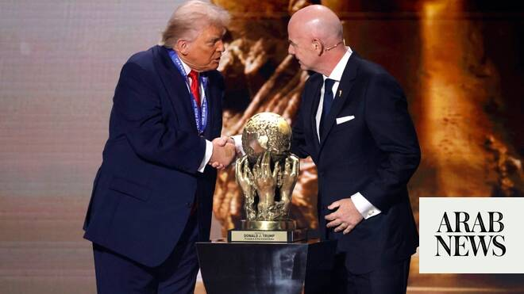

# Analysis: Has FIFA abandoned fair play?

Source: https://www.arabnews.com/node/2650243/sport
Captured source: https://www.arabnews.com/node/2650243/sport
Published: 2026-07-09T18:48:10+03:00
Modified: 2026-07-09T23:12:38+03:00
Author: Ali Khaled

## Summary

DUBAI: For a few joyous weeks, those nagging concerns were put to bed. The FIFA World Cup has a habit of doing that to football fans. As the game’s flagship event kicked off across Mexico, the US and Canada, supporters from the 48 competing nations, not to mention millions of others around the globe, were caught up in the euphoria of non-stop matches taking place in some of

## Image

## Video Or Embed URLs

- https://e3c305adf18aed32ac08a0a4f8efe020.safeframe.googlesyndication.com/safeframe/1-0-45/html/container.html
- https://static.addtoany.com/menu/sm.25.html
- about:blank
- https://www.google.com/recaptcha/api2/aframe
- https://imasdk.googleapis.com/js/core/bridge3.774.0_en.html
- https://cm.g.doubleclick.net/partnerpixels?gdpr=0&us_privacy=1---&gpp_sid=-1&url=https%3A%2F%2Fwww.arabnews.com%2Fnode%2F2650243%2Fsport

## Text

https://arab.news/5ntyc

Controversial disciplinary decisions and political interventions have reignited criticism of football’s governing body

Critics say a series of high-profile incidents has undermined confidence in FIFA’s commitment to the principles of fair play

DUBAI: For a few joyous weeks, those nagging concerns were put to bed. The FIFA World Cup has a habit of doing that to football fans.

For the latest updates, follow us @ArabNewsSport

As the game’s flagship event kicked off across Mexico, the US and Canada, supporters from the 48 competing nations, not to mention millions of others around the globe, were caught up in the euphoria of non-stop matches taking place in some of the world’s most stunning stadiums.

The pre-tournament, and even early-tournament, concerns about FIFA’s organization and priorities were swept aside as fans on the ground and those watching at home seemed to suffer from a case of almost collective, wilful amnesia.

After all, despite the extra security for fans and teams alike, the banning of Somalian referee Omar Artan from entering the US, the treatment of the Iranian squad and officials, among other objectionable steps by the hosts tolerated by FIFA, who really has the time for performative indignation when the action on the pitch gets under way?

When wonderful scenes of fans embracing the locals dominate social media, and the likes of Lionel Messi, Kylian Mbappe, Erling Haaland and Harry Kane are banging in goals in seemingly unprecedented numbers during the group stages?

When newcomers such as Curacao and Cabo Verde have captured the hearts of millions of even the most casual of fans? When icons such as Messi, Cristiano Ronaldo, Mohamed Salah, Salem Al-Dawsari and Riyad Mahrez are playing their last World Cup campaigns?

The goodwill could only last so long. As the tournament has progressed to the round of 32 and beyond, all the old concerns have returned, with reinforcements.

In the last week, FIFA has been accused of favoritism at best and all-out corruption at worst over a number of incidents, raising the question — have they genuinely abandoned the concept of “fair play” that they so loudly espouse?

The conclusion of Argentina’s win over Egypt on Tuesday brought about a venomous reaction that not even FIFA, so often used to fans’ criticism, could have expected.

Regardless of the validity of the decisions that led to a stunning comeback for the reigning champions, the prevalent view, certainly from the Arab world, seemed to be that FIFA has its favorite teams and players and will do everything in its power to safeguard their passage to the later stages of its tournament.

But the ill-will toward FIFA, whose president Gianni Infantino has long been accused of cosying up to the White House, had already been building up.

After the initial outrage, few people cared that a ban on Ronaldo taking part in the opening fixture for an earlier red card during the last of Portugal’s qualifiers had been suspended ahead of the tournament. In fact, it was welcomed by his army of fans.

Fans and media were far less forgiving when, after receiving a phone call from US President Donald Trump, Infantino suspended a one-match ban for the red card US player Folarin Balogun had received against Bosnia and Herzegovina in their round of 32 match, leaving the 25-year-old forward free to face Belgium in the round of 16.

The Belgians were incensed, as were fans, former players, media outlets and football’s lawmakers in Europe. UEFA issued a scathing statement that said FIFA had “crossed a red line.”

Meanwhile, former Liverpool manager and soon to be Germany coach Jurgen Klopp was even more pointedly critical of Infantino and Trump.

“Let’s just say, this is our game, not theirs. These two people, who both have no idea about football, should have nothing to do with that,” he said. “That was a red card, there’s no two ways about it. We’re sorry for Balogun because he didn’t mean to do it, but that’s what the rules say.”

Ashish Prashar, a political strategist, human rights activist and former adviser to the Middle East peace envoy Tony Blair, said: “Infantino never expected Donald Trump and the USA to take credit for the suspension of Folarin Balogun’s red card. That’s where they messed up.

“Power is the most important thing to them, and they don’t understand the culture and rules of football. They don’t.

“Infantino seriously underestimated how power-hungry the USA is. He seriously played himself. This isn’t about the red card being suspended for the USA. It’s about them saying, ‘we can control FIFA’.”

Prashar is the figure behind the #GameOverIsrael campaign, which over the last year or so has called on football authorities to kick Israel out of football in the same way that Russia was after launching its full-scale invasion of Ukraine.

Alarmingly, said Prashar, FIFA and Infantino do not seem to care about public opinion.

“FIFA keeps moving the goal posts and seeing what we’ll accept, between their treatment of Iran and overturning a suspension at the request of White House. They have taken the people’s game and are making a mockery of it,” Prashar told Arab News.

“They believe the public won’t do anything about it so they’re seeing how far they can continue their corruption in broad daylight.

“Every country should question what they are condoning by continuing to participate in this circus.”

The seemingly inconsistent treatments that Argentina and Egypt received on Tuesday night in Atlanta was the final straw for many fans.

On social media, Egyptian and Arab fans were seething, tempering their pride on a sensational performance by the Pharaohs with outright accusations of corruption by the game’s authorities.

For the sake of balance, some Arab and Egyptian figures eschewed the widespread emotional reaction for a more pragmatic approach.

Egyptian referee Mohamed Adel insisted after the match that the officials had taken the right decisions and that none of their interventions, or lack of, had a bearing on the final result.

“Our hopes at 2-0 was that the match was almost over, and the fact we conceded three goals in a quarter of an hour is what is causing the outrage,” he said in a post-match interview.

“But speaking logically and in terms of officiating, this is the same referee who we were leading 2-0 with until the 80th minute.”

Adel said that Egypt’s disallowed goal and Argentina’s winner were dealt with correctly by VAR.

Prashar believes that as long as fans keep watching, nothing at FIFA will change.

“Infantino knows that there are no consequences. We keep watching, we keep going, we keep engaging. Why would he expect anything different?

“This isn’t the first occasion. We all remembered Virgil van Dijk’s reaction to the Argentina v Netherlands match in the 2022 World Cup. It’s more obvious now because Infantino knows there are no consequences.”

He believes Egypt were hard done by against Argentina, but that it is only the tip of the iceberg.

“FIFA can stop goals, suspend red cards … and humiliate entire nations. What we saw in what should have been an Egypt victory is the culmination of years of corruption and lack of accountability,” he said.

“Why don’t the media challenge this? Maybe some still believe in the purity of the game, maybe they know their editors won’t publish it, maybe and probably more accurately it’s because they rely on access journalism, and they will lose access.

“Why doesn’t UEFA or the European federations do anything? Did UEFA speak up for Iran, did UEFA or European nations make a fuss about other countries outside of Europe not being allowed family members or visas for fans? No.

“It’s time Infantino and his team are removed from office and the people take the game back.”

It is a view that many Arab football fans share today. Whether that anger persists when the action returns for the World Cup quarter-finals remains to be seen.

Arab News has contacted FIFA to respond to the latest allegations. At the time of publication, it had yet to receive a response.
