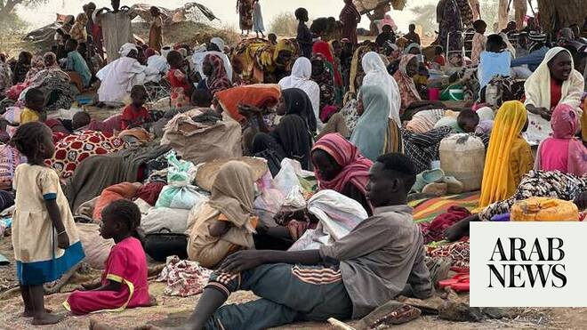

# ICC official says breakthrough made in Darfur investigations

Source: https://www.arabnews.com/node/2650257/middle-east
Captured source: https://www.arabnews.com/node/2650257/middle-east
Published: 2026-07-09T16:26:41+03:00
Modified: 2026-07-09T16:29:33+03:00
Author: Reuters

## Summary

N’DJAMENA, Sudan: ِِA “breakthrough” has been made in the investigation into crimes committed during Sudan’s war in the Darfur region allowing prosecutors to link them to leadership, a senior International Criminal Court official told Reuters. The ICC is investigating attacks on the cities of Al-Geneina, in 2023, and Al-Fashir last year, where UN experts say forces from the

## Image

## Video Or Embed URLs

- https://979b465e70b8d16386c0dd9161092c8a.safeframe.googlesyndication.com/safeframe/1-0-45/html/container.html
- https://static.addtoany.com/menu/sm.25.html
- about:blank
- https://www.google.com/recaptcha/api2/aframe
- https://imasdk.googleapis.com/js/core/bridge3.774.0_en.html
- https://sync.teads.tv/wigo-no-slot
- https://cm.g.doubleclick.net/partnerpixels?gdpr=0&us_privacy=1---&gpp_sid=-1&url=https%3A%2F%2Fwww.arabnews.com%2Fnode%2F2650257%2Fmiddle-east

## Text

https://arab.news/vy4v4

“We have got additional evidence, strong evidence, linking what is occurring in Darfur with leadership levels,” Khan told Reuters

“We are confident that ‌there ⁠are going to ⁠be results in at least a reasonable time”

N’DJAMENA, Sudan: ِِA “breakthrough” has been made in the investigation into crimes committed during Sudan’s war in the Darfur region allowing prosecutors to link them to leadership, a senior International Criminal Court official told Reuters. The ICC is investigating attacks on the cities of Al-Geneina, in 2023, and Al-Fashir last year, where UN experts say forces from the paramilitary Rapid Support Forces committed crimes that bear the “hallmarks of genocide” against people from non-Arab tribes. “We have got additional evidence, strong evidence, linking what is occurring in Darfur with leadership levels. And we are very, very pleased to say that this is a breakthrough for us,” deputy prosecutor Nazhat Shameem Khan told Reuters, following a visit to eastern Chad to meet victims of the attacks. She did not specify the forces the leadership belong to and could not, according ‌to ICC rules, ‌say whether warrants had been or would be applied for. “We are confident that ‌there ⁠are going to ⁠be results in at least a reasonable time,” she added, without giving a timeframe. In international war crimes trials of political leaders it is often hard to link them to specific atrocity crimes committed by lower level perpetrators. Prosecutors need so-called linkage evidence — often in the form of insider witnesses or physical records — of political leadership being briefed about operations and plans on the ground. Al-Geneina and Al-Fashir saw the most intense violence in the war between the Sudanese army and the RSF that continued for more than three years. The RSF now controls both cities, and Khan told the UN Security Council in ⁠January that the paramilitary group had not cooperated with investigations. The RSF has said ‌it did not target civilians in the attacks and would hold individual ‌perpetrators accountable.

WITNESSES SPEAK OF EXECUTIONS AND SEXUAL VIOLENCE A Reuters documentary on the Al-Fashir takeover identified several RSF leaders committing or ‌in the vicinity of attacks through interviews and analysis of videos posted online. Khan said the ICC probes included ‌similar testimonies collected by ICC investigators. Khan said witnesses spoke of executions and sexual violence. “We will ensure [their stories] are also told in the course of our proceedings,” she said. Sudan is not a party to the Rome Statute, and therefore not a member of the ICC, but the UN Security Council gave the court jurisdiction over atrocity crimes committed in Darfur from 2005 onwards. The ‌country’s army-led government has cooperated with investigations on the most recent attacks, but has not handed over several top former leaders accused of genocide and other attacks in ⁠the earlier conflict. No public ⁠warrants have yet been issued during the current war, which began in April 2023. Asked whether countries said to be supporting the commission of these crimes could be pursued, Khan said the court’s jurisdiction applied to individuals contributing to the crimes but not to states, and that the focus was on the crimes committed inside the two cities in order to achieve concrete results. Three countries in West Africa’s Sahel region — Niger, Mali and Burkina Faso — announced last year that they would withdraw from the Rome Statute, and the court said on July 1 that they had submitted letters initiating the process, which takes a year. “I hope they change their minds because I see a great virtue in being part of the Rome Statute family. I think it protects the world,” Khan said. Khan and other court staff currently face US sanctions after the ICC issued arrest warrants for Israeli leaders for alleged war crimes and crimes against humanity in Gaza.
