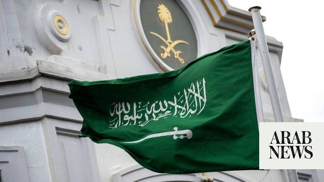

# Saudi Arabia welcomes US decision US to remove Syria from terror blacklist

Source: https://www.arabnews.com/node/2650288/saudi-arabia
Captured source: https://www.arabnews.com/node/2650288/saudi-arabia
Published: 2026-07-09T20:11:16+03:00
Modified: 2026-07-09T20:13:13+03:00
Author: Arab News

## Summary

RIYADH: Saudi Arabia on Thursday welcomed the announcement by the US that it had begun the process of rescinding Syria’s designation as a state sponsor of terrorism. “The Kingdom reaffirms its support for all positive steps taken by the Syrian government that enhance the country’s security and stability, contribute to rebuilding state institutions, and fulfill the aspirations

## Image

## Video Or Embed URLs

- https://3bb70cc0a3fb07e1fd81b75eb6a4987c.safeframe.googlesyndication.com/safeframe/1-0-45/html/container.html
- https://static.addtoany.com/menu/sm.25.html
- about:blank
- https://www.google.com/recaptcha/api2/aframe
- https://imasdk.googleapis.com/js/core/bridge3.774.0_en.html
- https://cm.g.doubleclick.net/partnerpixels?gdpr=0&us_privacy=1---&gpp_sid=-1&url=https%3A%2F%2Fwww.arabnews.com%2Fnode%2F2650288%2Fsaudi-arabia

## Text

https://arab.news/mr4et

RIYADH: Saudi Arabia on Thursday welcomed the announcement by the US that it had begun the process of rescinding Syria’s designation as a state sponsor of terrorism.

“The Kingdom reaffirms its support for all positive steps taken by the Syrian government that enhance the country’s security and stability, contribute to rebuilding state institutions, and fulfill the aspirations of the brotherly Syrian people for a more stable and prosperous Syria,” the Saudi foreign ministry said in a statement.

Washington said Wednesday it will delist Syria as a state sponsor of terrorism, a decades-old designation that severely impeded investment, in a new vote of confidence in leader Ahmad Al-Sharaa.

Secretary of State Marco Rubio notified Congress of the long-expected move, which will be effective in 45 days unless lawmakers take the unlikely step of blocking it.

The Syrian foreign ministry called the move “an important development in the course of Syrian-American relations, which are based on dialogue, mutual respect and shared interests.”

The US decision “paves the way to boost investment, accelerate economic recovery and reintegrate Syria into the global economy,” Syrian Finance Minister Mohammed Barnieh said.
