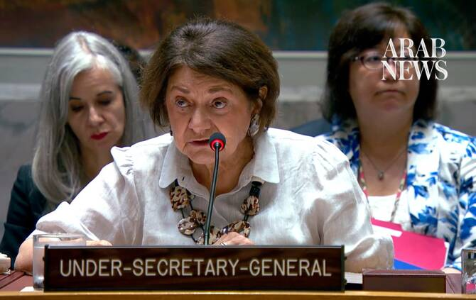

# IAEA has lost all knowledge on Iran’s nuclear program: UN political chief

Source: https://www.arabnews.com/node/2650417/middle-east
Captured source: https://www.arabnews.com/node/2650417/middle-east
Published: 2026-07-10T18:19:19+03:00
Modified: 2026-07-10T20:50:40+03:00
Author: Ephrem Kossaify

## Summary

NEW YORK: The International Atomic Energy Agency lost continuity of knowledge across all of Iran’s declared nuclear facilities following US and Israeli strikes that began Feb. 28, 2026, which “could not be restored,” a senior UN official told the Security Council on Friday. Rosemary DiCarlo, UN under-secretary-general for political and peacebuilding affairs, said the loss

## Image

## Video Or Embed URLs

- https://dec41752ed8c757fd30efce98f17905c.safeframe.googlesyndication.com/safeframe/1-0-45/html/container.html
- about:blank
- https://static.addtoany.com/menu/sm.25.html
- https://imasdk.googleapis.com/js/core/bridge3.774.0_en.html
- https://www.google.com/recaptcha/api2/aframe
- https://cm.g.doubleclick.net/partnerpixels?gdpr=0&us_privacy=1---&gpp_sid=-1&url=https%3A%2F%2Fwww.arabnews.com%2Fnode%2F2650417%2Fmiddle-east

## Text

https://arab.news/863d7

Agency says continuity of knowledge on centrifuges, heavy water and uranium stockpiles cannot be restored after US-Israeli strikes

Guterres urges good-faith engagement as parties point to Islamabad MoU as basis for further talks

NEW YORK: The International Atomic Energy Agency lost continuity of knowledge across all of Iran’s declared nuclear facilities following US and Israeli strikes that began Feb. 28, 2026, which “could not be restored,” a senior UN official told the Security Council on Friday.

Rosemary DiCarlo, UN under-secretary-general for political and peacebuilding affairs, said the loss extended to the production and current inventory of centrifuges, rotors and bellows, heavy water, and uranium ore concentrate, citing the secretary-general’s most recent report on resolution 2231. It was adopted in 2015 and unanimously endorsed the Joint Comprehensive Plan of Action nuclear deal, providing sanctions relief in exchange for curbs on Iran's nuclear program.

The IAEA also reported “a significant deterioration in its situational awareness following the attacks against Iran by the United States and Israel,” DiCarlo said, briefing the council on non-proliferation issues under resolution 2231.

The IAEA had not conducted any in-field verification activities under Iran’s Nuclear Non-Proliferation Treaty Safeguards Agreement, the same instrument that had allowed it to monitor Tehran’s commitments under the JCPOA, DiCarlo said.

She added that the situation has been compounded by Iran’s decision to cease provisional application of its Additional Protocol in February 2021, after which the agency received no updated declarations from Tehran and was unable to conduct complementary access to any sites or locations in the country.

Despite the bleak assessment of the monitoring regime, DiCarlo said parties to the dispute continue to signal openness to a negotiated settlement.

“While significant differences remain between the relevant parties on the way forward regarding resolution 2231 and the JCPOA, they have all underscored the importance of a diplomatic solution and indicated readiness to engage with each other for this purpose,” she said.

The June 17 Islamabad Memorandum of Understanding between the US and Iran contains “several important agreements” already reached on nuclear issues, including resolving the disposition of Iran’s enriched uranium stockpile, on-site down blending of enriched material under IAEA supervision, and a commitment to discuss enrichment and other matters tied to Iran’s nuclear needs.

“Today, a framework for further negotiations remains a critical step towards the peaceful settlement of the Iran nuclear issue,” DiCarlo said.

She added that Secretary-General Antonio Guterres was calling on all parties to engage constructively and in good faith to reach a peaceful, comprehensive and durable resolution consistent with the objectives of resolution 2231 and the broader goal of strengthening international peace and security, adding that the UN “stands ready to support these efforts.”
