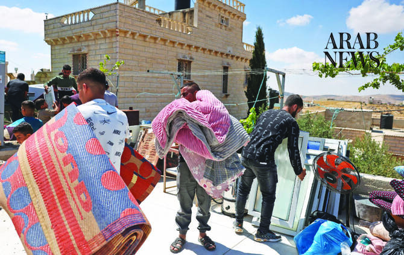

# Several Palestinians injured, detained during settler attack south of Hebron

Source: https://www.arabnews.com/node/2650447/middle-east
Captured source: https://www.arabnews.com/node/2650447/middle-east
Published: 2026-07-10T22:24:03+03:00
Modified: 2026-07-10T22:24:03+03:00
Author: WAFA

## Summary

HEBRON: Several Palestinians, including women and children, sustained bruises and suffered from pepper spray inhalation on Friday after Israeli settlers attacked a family in the Hawara area, east of the town of Yatta, south of Hebron. Israeli occupation forces later detained three Palestinians involved in the incident, according to local sources. Anti-settlement activist Osama

## Image

## Video Or Embed URLs

- https://ac87534797bae01f1a79f799745f032e.safeframe.googlesyndication.com/safeframe/1-0-45/html/container.html
- https://static.addtoany.com/menu/sm.25.html
- about:blank
- https://imasdk.googleapis.com/js/core/bridge3.774.0_en.html
- https://www.google.com/recaptcha/api2/aframe
- https://cm.g.doubleclick.net/partnerpixels?gdpr=0&us_privacy=1---&gpp_sid=-1&url=https%3A%2F%2Fwww.arabnews.com%2Fnode%2F2650447%2Fmiddle-east

## Text

https://arab.news/yh3wx

The attack comes amid a rise in assaults by Israeli settlers against Palestinian communities in the Masafer Yatta region, where repeated attacks on people, homes and agricultural land have been frequently reported in recent years

HEBRON: Several Palestinians, including women and children, sustained bruises and suffered from pepper spray inhalation on Friday after Israeli settlers attacked a family in the Hawara area, east of the town of Yatta, south of Hebron.

Israeli occupation forces later detained three Palestinians involved in the incident, according to local sources.

Anti-settlement activist Osama Makhamreh said that a group of armed settlers attacked the family of Ibrahim Ismail Al-Jabour while they were on their land near their home in the Hawara area.

The Ministry of Education and Higher Education condemned the demolition of a school in the West Bank, describing it as a new crime against Palestinian children and a blatant violation of international humanitarian law and international agreements that guarantee the right to education and prohibit attacks on educational institutions

The settlers beat family members and sprayed pepper spray in their faces.

The assault injured Ibrahim Al-Jabour along with six members of his family: Fatima, Souad, Rawaa and Rahaf Al-Jabour, as well as two children, Mustafa and Habiba Al-Jabour.

All were taken to Yatta Government Hospital for treatment.

Israeli troops then stormed the area, assaulted local residents and detained Qassem Ibrahim Al-Jabour, Yasser Yousef Al-Jabour and Ibrahim Omar Al-Jabour.

The attack comes amid a rise in assaults by Israeli settlers against Palestinian communities in the Masafer Yatta region, where repeated attacks on people, homes and agricultural land have been frequently reported in recent years.

Meanwhile, Israeli soldiers detained two Palestinians during raids across the Bethlehem governorate early on Friday.

Palestinian security sources said that Israeli troops detained Sami Dawoud Al-Zeir, head of the Janata Municipality east of Bethlehem, and Adel Dawoud Al-Asakra, 49, from Al-Asakra area, after raiding and searching their homes.

Israeli forces also entered the nearby communities of Beit Falouh, Rafida, Abu Njeim, Al-Ubeidiya, al-Shawawra, Dar Salah and the Dheisheh refugee camp, but no additional detentions were reported.
