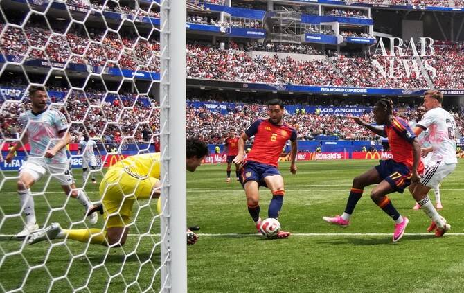

# Merino’s late strike sends Spain past Belgium into World Cup semis

Source: https://www.arabnews.com/node/2650469/sport
Captured source: https://www.arabnews.com/node/2650469/sport
Published: 2026-07-11T00:46:49+03:00
Modified: 2026-07-11T00:47:37+03:00
Author: Reuters

## Summary

INGLEWOOD, California: Spain ‌substitute Mikel Merino fired home from close range in the 88th minute to snatch a 2-1 win for his side over injury-hit Belgium on Friday and ​set up a semifinal clash with France. After the teams went in level at 1-1 following the first half, Spain found the winner when Belgium’s back-up goalkeeper Senne Lammens, who came on in the second period

## Image

## Video Or Embed URLs

- https://d1b27cf4db31bc3e1adcf613b3b61d1b.safeframe.googlesyndication.com/safeframe/1-0-45/html/container.html
- https://static.addtoany.com/menu/sm.25.html
- about:blank
- https://www.google.com/recaptcha/api2/aframe
- https://imasdk.googleapis.com/js/core/bridge3.774.0_en.html
- https://sync.teads.tv/wigo-no-slot
- https://cm.g.doubleclick.net/partnerpixels?gdpr=0&us_privacy=1---&gpp_sid=-1&url=https%3A%2F%2Fwww.arabnews.com%2Fnode%2F2650469%2Fsport

## Text

https://arab.news/7njba

Spain will play France on Tuesday

INGLEWOOD, California: Spain ‌substitute Mikel Merino fired home from close range in the 88th minute to snatch a 2-1 win for his side over injury-hit Belgium on Friday and ​set up a semifinal clash with France. For the latest updates, follow us @ArabNewsSport After the teams went in level at 1-1 following the first half, Spain found the winner when Belgium’s back-up goalkeeper Senne Lammens, who came on in the second period for the injured Thibaut Courtois, failed to hold Pau Cubarsi’s low strike. The ball bounced in front of the keeper, giving Merino just enough time to fire home as the sold-out ‌crowd largely backing ‌Spain erupted on a sweltering day at ​Los ‌Angeles ⁠Stadium. The ​only other ⁠time Spain have reached the semifinals at the World Cup was in 2010, when they won the tournament. They came fourth in 1950 when the final round was a group stage.

For the latest updates, follow us @ArabNewsSport

Spain start aggressively Spain were aggressive early on and Fabian Ruiz gave them the lead in the 30th minute, pouncing after Courtois made a diving save to fire ⁠a shot between defender Timothy Castagne’s legs into ‌the net. Ruiz’s goal vindicated Spain coach ‌Luis de la Fuente’s surprise decision to ​start the Paris St. Germain midfielder ‌in place of Pedri, who came on for Ruiz early ‌in the second half. Belgium responded 11 minutes later through Charles De Ketelaere, who timed his run perfectly and headed Castagne’s cross past keeper Unai Simon, the first goal Spain have conceded in the tournament. The equalizer breathed new ‌life into Belgium and the teams battled to halftime in the oppressive heat. Spain came out energised after ⁠the break ⁠and chipped away at the Belgium defense until Merino, introduced after 86 minutes, finally broke through to the delight of their supporters. Belgium captain Youri Tielemans was taken out of the starting lineup shortly before kickoff after sustaining an injury in the warm-up, with Hans Vanaken replacing him. Belgium were also without midfielder Amadou Onana, who tore his ACL in their round-of-16 win over the United States. Among those in attendance at the sold-out stadium were musicians Courtney Love and Noel Gallagher, American actor Brad Pitt and Spanish actors Penelope Cruz ​and Javier Bardem. European champions Spain ​will face tournament favorites France in Dallas on Tuesday for a spot in the final.
