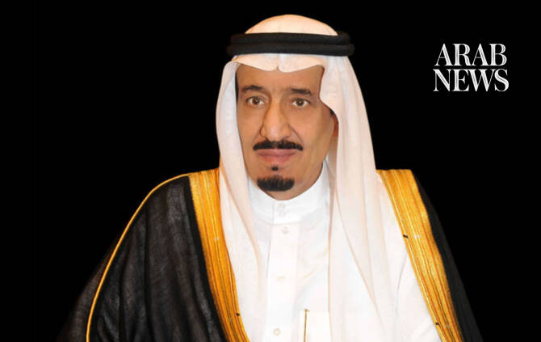

# King Salman issues royal decrees, appoints Prince Abdulaziz bin Salman as industry minister

Source: https://www.arabnews.com/node/2650516/saudi-arabia
Captured source: https://www.arabnews.com/node/2650516/saudi-arabia
Published: 2026-07-11T16:09:19+03:00
Modified: 2026-07-11T17:45:39+03:00
Author: Arab News

## Summary

RIYADH: Saudi Arabia’s King Salman on Saturday issued a series of royal decrees that included ministerial appointments and senior government reshuffles, the Saudi Press Agency reported. Under the decrees, Prince Abdulaziz bin Salman was appointed minister of industry and mineral resources while retaining his role as minister of energy. Former Industry and Mineral Resources

## Image

## Video Or Embed URLs

- https://f315ff09b6bb70265a94b89c343421c6.safeframe.googlesyndication.com/safeframe/1-0-45/html/container.html
- https://static.addtoany.com/menu/sm.25.html
- about:blank
- https://www.google.com/recaptcha/api2/aframe
- https://imasdk.googleapis.com/js/core/bridge3.774.0_en.html
- https://cm.g.doubleclick.net/partnerpixels?gdpr=0&us_privacy=1---&gpp_sid=-1&url=https%3A%2F%2Fwww.arabnews.com%2Fnode%2F2650516%2Fsaudi-arabia

## Text

https://arab.news/c2xum

Former Industry and Mineral Resources Minister Bandar Alkhorayef was relieved of his post and appointed minister of state

RIYADH: Saudi Arabia’s King Salman on Saturday issued a series of royal decrees that included ministerial appointments and senior government reshuffles, the Saudi Press Agency reported.

Under the decrees, Prince Abdulaziz bin Salman was appointed minister of industry and mineral resources while retaining his role as minister of energy.

Former Industry and Mineral Resources Minister Bandar Alkhorayef was relieved of his post and appointed minister of state and member of the Council of Ministers.

King Salman also dismissed Ahmed Al-Ohali as governor of the General Authority for Military Industries. Bandar Alkhorayef was assigned to oversee the authority in addition to his new responsibilities as minister of state.

The royal decrees also relieved Shalaan bin Shalaan of his duties as deputy public prosecutor and appointed him as an adviser at the Royal Court with the rank of minister.

In a separate appointment, Ihsan bin Abbas Bafaqih was named secretary of Jeddah Governorate with the rank of minister.
