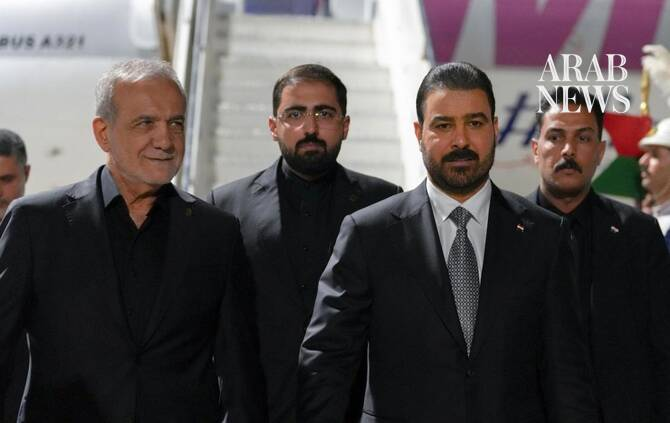

# Iraqi prime minister to visit Washington on Monday; oil and gas deals expected

Source: https://www.arabnews.com/node/2650611/middle-east
Captured source: https://www.arabnews.com/node/2650611/middle-east
Published: 2026-07-12T13:36:40+03:00
Modified: 2026-07-12T13:43:59+03:00
Author: Reuters

## Summary

Baghdad: Iraqi Prime Minister Ali Al-Zaidi ​will travel to Washington on Monday at the head of ‌an official ‌delegation ​after ‌an ⁠official ​invitation, government spokesperson Haider ⁠al-Aboudi said in a press conference on Sunday. “The agreements ⁠to be ‌signed ‌will ​include ‌several memorandums of ‌understanding in the oil and gas sector ‌as Iraq prepares to bring in

## Image

## Video Or Embed URLs

- https://imasdk.googleapis.com/js/core/bridge3.774.0_en.html
- https://0e4595dfcaee05a2a521e1bcdaff5161.safeframe.googlesyndication.com/safeframe/1-0-45/html/container.html
- https://static.addtoany.com/menu/sm.25.html
- about:blank
- https://sync.teads.tv/wigo-no-slot
- https://www.google.com/recaptcha/api2/aframe
- https://cm.g.doubleclick.net/partnerpixels?gdpr=0&us_privacy=1---&gpp_sid=-1&url=https%3A%2F%2Fwww.arabnews.com%2Fnode%2F2650611%2Fmiddle-east

## Text

https://arab.news/nadyy

Baghdad: Iraqi Prime Minister Ali Al-Zaidi ​will travel to Washington on Monday at the head of ‌an official ‌delegation ​after ‌an ⁠official ​invitation, government spokesperson Haider ⁠al-Aboudi said in a press conference on Sunday. “The agreements ⁠to be ‌signed ‌will ​include ‌several memorandums of ‌understanding in the oil and gas sector ‌as Iraq prepares to bring in various ⁠US ⁠companies that will provide momentum to increase oil production capacity,” Al-Aboudi said.
