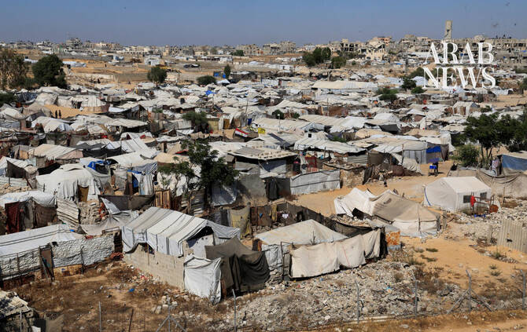

# Israeli attacks in Gaza kill five people, including a girl, say medics

Source: https://www.arabnews.com/node/2650628/middle-east
Captured source: https://www.arabnews.com/node/2650628/middle-east
Published: 2026-07-12T16:07:09+03:00
Modified: 2026-07-12T16:09:08+03:00
Author: Reuters

## Summary

CAIRO: Israeli attacks killed at least five people in the Gaza Strip on Sunday, including a 9-year-old girl, ​Palestinian health officials said. Medics said Israeli gunfire directed at a tent encampment on the eastern side of the Al-Bureij refugee camp in central Gaza killed 9-year-old Tala Abu Matar. The Israeli military did not immediately comment on the girl’s death. An

## Image

## Video Or Embed URLs

- https://ee9734e6847086836d2cee9dfcf0abb9.safeframe.googlesyndication.com/safeframe/1-0-45/html/container.html
- https://static.addtoany.com/menu/sm.25.html
- about:blank
- https://www.google.com/recaptcha/api2/aframe
- https://imasdk.googleapis.com/js/core/bridge3.774.0_en.html
- https://sync.teads.tv/wigo-no-slot
- https://cm.g.doubleclick.net/partnerpixels?gdpr=0&us_privacy=1---&gpp_sid=-1&url=https%3A%2F%2Fwww.arabnews.com%2Fnode%2F2650628%2Fmiddle-east

## Text

https://arab.news/4qwkc

Israeli gunfire at tent encampment on Al-Bureij refugee camp killed 9-year-old Tala Abu Matar, medics say

Israel's military did not immediately comment on Palestinian girl’s death

CAIRO: Israeli attacks killed at least five people in the Gaza Strip on Sunday, including a 9-year-old girl, ​Palestinian health officials said. Medics said Israeli gunfire directed at a tent encampment on the eastern side of the Al-Bureij refugee camp in central Gaza killed 9-year-old Tala Abu Matar. The Israeli military did not immediately comment on the girl’s death. An airstrike at a metal ‌foundry in ‌Gaza City’s Sabra neighborhood killed four ​people. ‌Witnesses ⁠said ​the site ⁠was hit with three Israeli missiles. Israel’s military told Reuters it had struck “terrorist” infrastructure, without giving further details. The ceasefire agreed in October 2025 between Israel and Hamas halted major fighting in the enclave, but it has failed to stop Israeli ⁠attacks that have killed more than ‌1,000 Palestinians since it ‌took effect. Four Israeli soldiers ​have been killed by militants ‌in Gaza over the same period. The latest ‌violence comes as Hamas leaders visited Cairo for further talks over implementing the second phase of US President Donald Trump’s Gaza peace plan. The discussions include Hamas ‌disarmament and Israeli army withdrawals, according to sources close to the talks, ⁠adding that ⁠there had not yet been a breakthrough. Nearly all of Gaza’s 2 million people, most of whom have been displaced several times, now live on a tiny strip of land along the coast, mainly in makeshift tents or damaged buildings, under Hamas control. Hamas-led fighters killed 1,200 people during their cross-border attack into Israel on October 7, 2023, according to Israeli tallies. The ​Gaza health ministry ​said more than 73,000 Palestinians have been killed in the territory since then.
