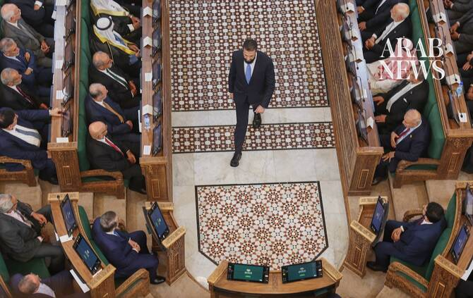

# New Syrian parliament meets for first time in Damascus

Source: https://www.arabnews.com/node/2650631/middle-east
Captured source: https://www.arabnews.com/node/2650631/middle-east
Published: 2026-07-12T16:26:05+03:00
Modified: 2026-07-12T21:17:01+03:00
Author: Reuters

## Summary

DAMASCUS: Syria’s new parliament convened for the first time on Sunday, 19 months after forces led by President Ahmed Al-Sharaa toppled Bashar Assad, a milestone in the country’s political transition. Sharaa, in a speech at parliament in Damascus, told lawmakers to “make this council a model of responsibility and competence” and described it as “a platform for truth and

## Image

## Video Or Embed URLs

- blob:https://www.arabnews.com/07f908f4-1210-4012-9524-9a74b07aa283
- https://imasdk.googleapis.com/js/core/bridge3.774.0_en.html
- https://c611446bbc19984664bbe1835c168c15.safeframe.googlesyndication.com/safeframe/1-0-45/html/container.html
- https://static.addtoany.com/menu/sm.25.html
- about:blank
- https://sync.teads.tv/wigo-no-slot
- https://ep2.adtrafficquality.google/sodar/sodar2/255/runner.html
- https://www.google.com/recaptcha/api2/aframe
- https://cm.g.doubleclick.net/partnerpixels?gdpr=0&us_privacy=1---&gpp_sid=-1&url=https%3A%2F%2Fwww.arabnews.com%2Fnode%2F2650631%2Fmiddle-east

## Text

https://arab.news/jzk96

New lawmakers tasked with drafting Syria's new constitution, laying groundwork for democracy

DAMASCUS: Syria’s new parliament convened for the first time on Sunday, 19 months after forces led by President Ahmed Al-Sharaa toppled Bashar Assad, a milestone in the country’s political transition. Sharaa, in a speech at parliament in Damascus, told lawmakers to “make this council a model of responsibility and competence” and described it as “a platform for truth and justice.” “Syria is writing a glorious history that reflects its heroism, and we face the responsibility of building both the nation and the individual,” he said. The parliament has been seen as a ‌test of Sharaa’s ‌pledge to build an inclusive new order in Syria, which ​was ‌run ⁠as a ​police state ⁠by the Assad family for decades, with a legislative chamber that was seen as a rubber stamp.

Sharaa backs eventual elections

Under the country’s interim governing arrangements, two-thirds of the members of the 210-seat chamber were chosen last year by regional electoral colleges, while Sharaa named the remaining third on July 1. Officials have said this system was necessary because years of war had left millions displaced and made it impossible to rely on accurate population records or voter rolls. Critics say it gave the ⁠executive branch extensive control over the selection process. Sharaa has said he supports ‌holding general elections once infrastructure and documentation allow. A temporary ‌constitutional declaration introduced in 2025 granted parliament limited authorities, and there ​is no requirement for the government to ‌win a parliamentary vote of confidence. The Assembly can propose and approve laws. It has a ‌30-month term that is renewable, and it assumes legislative authority until a permanent constitution is adopted and elections are organized. Abdel Halim Al-Awak, a member of the committee that drafted the constitutional declaration, was elected speaker with 99 votes. Sharaa has said the parliament will be tasked with forming a committee to draft a new constitution.

Women make up 10 percent of lawmakers

Sharaa has reshaped Syria since toppling Assad, building close ties with Western states ⁠and vowing a new era ⁠of freedoms. The chamber has 21 female lawmakers — 15 of whom were among those nominated by Sharaa. Authorities have not issued a breakdown of how many lawmakers hail from ethnic and religious minorities. Unofficial tallies have shown that 10 of the seats chosen last year went to members of religious and ethnic minorities, including Kurds, Christians and Alawites — the sect to which Assad belongs. Four of the seats are vacant because one lawmaker died, while three others reserved for the predominantly Druze province of Sweida have yet to be filled. Authorities have said the selection of lawmakers for Sweida has been ​postponed until “conditions become suitable.” The area has remained ​outside state control since government forces and allied fighters clashed with Druze there last July.
