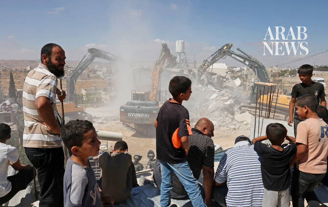

# Israeli bulldozers continue razing agricultural land in Jenin-area village

Source: https://www.arabnews.com/node/2650655/middle-east
Captured source: https://www.arabnews.com/node/2650655/middle-east
Published: 2026-07-12T21:38:17+03:00
Modified: 2026-07-12T21:38:17+03:00
Author: WAFA

## Summary

JENIN: Israeli bulldozers continued on Sunday to raze agricultural land in the village of Zububa, west of Jenin, in the occupied West Bank. Local sources said Israeli bulldozers resumed work in the morning, clearing agricultural areas and uprooting olive trees, causing extensive damage to residents’ property and threatening the livelihoods of dozens of families.

## Image

## Video Or Embed URLs

- https://df410c4d3c0fb321ef67e8453faf6de8.safeframe.googlesyndication.com/safeframe/1-0-45/html/container.html
- https://static.addtoany.com/menu/sm.25.html
- about:blank
- https://imasdk.googleapis.com/js/core/bridge3.776.0_en.html
- https://www.google.com/recaptcha/api2/aframe
- https://cm.g.doubleclick.net/partnerpixels?gdpr=0&us_privacy=1---&gpp_sid=-1&url=https%3A%2F%2Fwww.arabnews.com%2Fnode%2F2650655%2Fmiddle-east

## Text

https://arab.news/rwkrh

Israeli forces bulldozed agricultural land between the villages of Deir Qaddis and Kharbatha Bani Harith, west of Ramallah, on Sunday, according to local sources

JENIN: Israeli bulldozers continued on Sunday to raze agricultural land in the village of Zububa, west of Jenin, in the occupied West Bank.

Local sources said Israeli bulldozers resumed work in the morning, clearing agricultural areas and uprooting olive trees, causing extensive damage to residents’ property and threatening the livelihoods of dozens of families.

The sources added that Israeli forces have destroyed more than 1,500 olive trees belonging to the village since the beginning of the month, following a previous notice ordering the uprooting of olive trees across 128 dunums of land in Zububa.

The ongoing land razing has caused significant losses to Palestinian farmers who depend on olive cultivation as a primary source of income.

Israeli forces bulldozed agricultural land between the villages of Deir Qaddis and Kharbatha Bani Harith, west of Ramallah, on Sunday, according to local sources.

The sources said Israeli military bulldozers leveled hundreds of dunums of land between the two villages, most of it planted with olive trees, as part of work to connect the area to the Israeli colony of Nili.

Israeli settlers attacked Palestinian farmers working on their land in the village of Tayasir, east of Tubas, on Sunday, according to local sources.

The sources said armed Israeli colonists assaulted farmers on the outskirts of the village and obstructed them from working their land.

They added that the outskirts of Tayasir have witnessed repeated attacks by Israeli settlers targeting residents and their property, alongside attempts to establish a new Israeli settlement outpost in the area.
