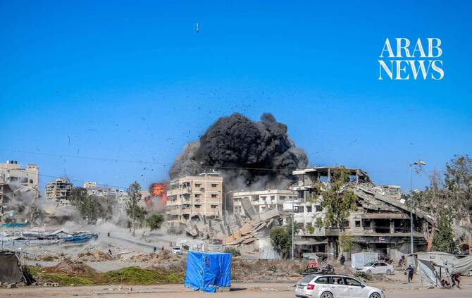

# EU says donors offering $1 bn to help Gaza ‘early recovery’

Source: https://www.arabnews.com/node/2650716/middle-east
Captured source: https://www.arabnews.com/node/2650716/middle-east
Published: 2026-07-13T13:40:04+03:00
Modified: 2026-07-13T20:32:23+03:00
Author: AFP

## Summary

BRUSSELS: The EU said Monday that European donors had put some $1 billion on the table to help initial recovery efforts in war-torn Gaza. EU commissioner for the Mediterranean Dubravka Suica announced the headline figure of “almost 900 million euros or one billion dollars” at the start of a donor meeting in Brussels. “We now need the conditions on the ground that will allow

## Image

## Video Or Embed URLs

- blob:https://www.arabnews.com/7c143cd0-624c-4796-83d7-c44e4c7ff022
- https://imasdk.googleapis.com/js/core/bridge3.776.0_en.html
- https://6fe9e1e23e04001b868a5b2fa0ff9b66.safeframe.googlesyndication.com/safeframe/1-0-45/html/container.html
- about:blank
- https://static.addtoany.com/menu/sm.25.html
- https://sync.teads.tv/wigo-no-slot
- https://www.google.com/recaptcha/api2/aframe
- https://cm.g.doubleclick.net/partnerpixels?gdpr=0&us_privacy=1---&gpp_sid=-1&url=https%3A%2F%2Fwww.arabnews.com%2Fnode%2F2650716%2Fmiddle-east

## Text

https://arab.news/ygb4g

Funds would be used to clear debris left from Israel’s military offensive and rebuild basic services such as water and sanitation

BRUSSELS: The EU said Monday that European donors had put some $1 billion on the table to help initial recovery efforts in war-torn Gaza. EU commissioner for the Mediterranean Dubravka Suica announced the headline figure of “almost 900 million euros or one billion dollars” at the start of a donor meeting in Brussels. “We now need the conditions on the ground that will allow the support to reach the people in Gaza,” Suica said. The funds — which officials said include money already pledged to help Gaza — would be used to clear debris left from Israel’s devastating military offensive and rebuild basic services such as water and sanitation. “The governments of Belgium, Denmark, Finland, France, Germany, Italy, the Netherlands, Norway, Spain, Sweden and Switzerland, together with the European Commission and the European Investment Bank, are participating,” Brussels said. The EU said Suica had on a recent visit to Israel “reached agreement with the Israeli authorities on next steps for the implementation of two major projects in the areas of waste and water management in Gaza.” The commissioner said donors “want to start with so-called early recovery, and it is very important to show that we are willing to do it.” “But to do that, we need disarmament of Hamas in order to start proper recovery,” she said. The humanitarian needs of Gaza remain overwhelming. The United Nations estimates reconstruction will take years and require tens of billions of dollars, as construction materials and debris-clearing equipment remain in critical short supply. Representatives from the US President Donald Trump’s Board of Peace, meant to help prepare for post-war Gaza, attended the Brussels meeting. Suica said that should help “ensure coordination and complementarity in our action” on efforts on rebuilding the territory. The meeting — which included Palestinian Prime Minister Mohammad Mustafa — was also evaluating reforms by the Palestinian Authority in light of further aid. The EU is the biggest international donor to the Palestinians. “We are aware of the great difficulties you face, so I want to recognize your effort,” Suica told Mustafa. “It is crucial that these reforms fully take hold.” The most politically sensitive reform concerns the PA’s system of payments to Palestinian prisoners and to families of those killed in the conflict, often referred to as “martyrs” payments. Suica said the EU was still waiting for an the results of an audit to verify that fund were not falling into the “wrong hands.” Mustafa for his part insisted that the reform program has “exceeded expectations.” A ceasefire was reached in Gaza between Israel and Hamas in October following two years of war, which was sparked by the Palestinian militants’ unprecedented attack on Israel on October 7, 2023. The second phase of the ceasefire, which was to involve Hamas’s disarmament and a gradual withdrawal of Israeli forces from Gaza, has been stalled for months.
