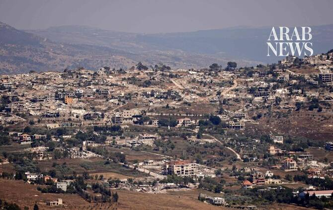

# What to know about the Lebanon-Israel talks set to start in Rome

Source: https://www.arabnews.com/node/2650744/middle-east
Captured source: https://www.arabnews.com/node/2650744/middle-east
Published: 2026-07-13T17:53:51+03:00
Modified: 2026-07-13T17:53:51+03:00
Author: NAJIA HOUSSARI

## Summary

BEIRUT: Lebanese negotiators are set to meet their Israeli counterparts in Rome on Tuesday for a sixth round of direct, US-brokered talks, with the session scheduled to run over two days. The meeting builds on the framework agreement both countries signed in Washington, D.C., on June 26. Under the agreement, implementation will begin on a first pilot zone in southern Lebanon,

## Image

## Video Or Embed URLs

- https://675643b6be354fc1e61735d9f092b0bc.safeframe.googlesyndication.com/safeframe/1-0-45/html/container.html
- https://static.addtoany.com/menu/sm.25.html
- about:blank
- https://www.google.com/recaptcha/api2/aframe
- https://imasdk.googleapis.com/js/core/bridge3.776.0_en.html
- https://cm.g.doubleclick.net/partnerpixels?gdpr=0&us_privacy=1---&gpp_sid=-1&url=https%3A%2F%2Fwww.arabnews.com%2Fnode%2F2650744%2Fmiddle-east

## Text

https://arab.news/cghf6

Military source to Arab News: Pilot zones being worked out in Beirut as Washington presses Israel

US Central Command is responsible for coordination between Lebanon and Israel on implementing the pilot zone mechanism

BEIRUT: Lebanese negotiators are set to meet their Israeli counterparts in Rome on Tuesday for a sixth round of direct, US-brokered talks, with the session scheduled to run over two days.

The meeting builds on the framework agreement both countries signed in Washington, D.C., on June 26.

Under the agreement, implementation will begin on a first pilot zone in southern Lebanon, where Israeli forces will gradually withdraw and the Lebanese Army will assume control under a US-monitored mechanism coordinated with the army command in Beirut.

Representing Lebanon in Rome will be Nada Moawad, the country’s ambassador to Washington; former ambassador Simon Karam; and Brig. Gen. Ziad Haykal, who joins the delegation as an adviser to President Joseph Aoun.

An official source close to the negotiations said the US State Department intends to monitor the talks in detail, and that the venue could revert to Washington if the discussions run into disagreements.

The delegation “is not carrying any new conditions to Rome,” the source told Arab News, adding that the priority is to shore up the ceasefire.

Questions surrounding the launch of the pilot zones, the source added, will be dealt with in Beirut rather than Rome, as no Lebanese military delegation is taking part in the Italian round.

The Lebanese delegation will focus on securing an Israeli military withdrawal, the redeployment of the Lebanese Army across the south and the start of reconstruction, according to official information.

Meanwhile, in Beirut, a military source said the army command has been holding coordination meetings with a US military delegation, which landed in the capital three days ago after a series of shuttle meetings with Israeli military officials.

The talks center on the practical steps required to get the first pilot zone off the ground under the agreed plan.

The Americans, the source told Arab News, “largely understand the Lebanese position” and are pressing Israel to honor its commitments driven by Washington’s own stake in seeing the framework agreement implemented.

The negotiations in Rome are taking place ahead of a meeting scheduled for July 21 in Washington between President Donald Trump and Aoun.

The military source refrained from mentioning the first area from which the Israeli forces will withdraw to allow the Lebanese Army to deploy.

The source highlighted that the Lebanese Army is not present in the “Yellow Line” zone, or Israel’s security buffer zone, to which “Israel keeps adding areas that it has not occupied.”

As for whether the Lebanese Army continues to insist that Israel withdraw from the areas it occupies, rather than being required to assume control of areas that are not occupied, the source replied: “Logic dictates that Israel withdraw so the Lebanese army can deploy.”

The source added that the US military delegation remains in Beirut, and no timeline has yet been set for the Israeli withdrawal or deployment of the Lebanese Army.

US Central Command is responsible for coordination between Lebanon and Israel on implementing the pilot zone mechanism, thus ensuring that operations on the ground are monitored and the implementation phases are overseen.

Among the pilot zones suggested for the withdrawal of the Israeli forces and deployment of the Lebanese army, in accordance with the framework agreement, are the following: Zawtar Sharqieh, Zawtar El-Gharbiye, Yohmor, the vicinity of Beaufort Castle (Qalat Al-Shaqif), Froun and Al-Ghandouriyah.

The ceasefire agreement, announced by the US State Department at the conclusion of the fourth round of Lebanese-Israeli negotiations in Washington, with both sides reaching an agreement under US guidance, called for the swift establishment of “pilot zones” in southern Lebanon, where the Lebanese Armed Forces would exercise full responsibility, with non-state groups forbidden from entering.

The provision was seen as a first step in security arrangements along the border with Israel, and a key test of the Lebanese state’s efforts to maintain a monopoly over weapons.

The “pilot zones” clause has come under domestic criticism in Lebanon because it does not specify the mechanisms for implementation, coordination, or geographical boundaries, nor does it address the issue of the Israeli withdrawal or its timetable.

Opponents said that instead, “it turns the Lebanese Army into a recipient of orders from the Israeli and US sides on how to move and deploy.”

They warned that the framework agreement “could also place the army in confrontation with local residents by pushing the Lebanese Army to enter private homes and conduct search operations without being authorized to do so under Lebanese law.”

The Lebanese Army is deployed, with fixed and mobile checkpoints, across most southern areas north of the “Yellow Line.” It redeployed following the Israeli incursion during the war that began on March 2 to avoid direct confrontation with the Israeli army.

The areas of Zawtar Sharqieh and Zawtar El-Gharbiye, together with Yohmor and Beaufort Castle, overlook the Litani River as well as towns in northern Israel.

Holding these areas means controlling the movement of vehicles, transportation routes and supply lines.

The Israeli news website Walla reported on Monday, citing a security official, an assessment that Israeli forces would begin a gradual withdrawal from the agreed pilot zones in about three weeks, in exchange for the deployment of the Lebanese Army there and efforts to remove infrastructure and armed elements from those areas.

Meanwhile, on Monday, Israeli forces continued setting fire to homes in the occupied border town of Haddatha.

The municipality of Bint Jbeil condemned “the destruction being carried out by the Israeli army in the town, which constitutes a systematic campaign of urban destruction targeting homes and neighborhoods.”

The municipality added that “the demolition and blasting of buildings is accompanied by the use of more than 20 heavy excavators to carry out extensive land-clearing operations.”
