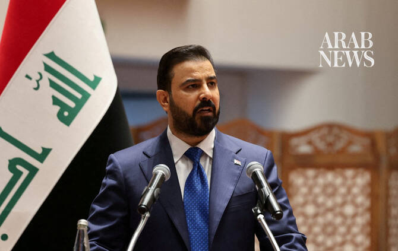

# Iraq’s prime minister seeks big energy investments on US trip

Source: https://www.arabnews.com/node/2650794/middle-east
Captured source: https://www.arabnews.com/node/2650794/middle-east
Published: 2026-07-14T04:18:20+03:00
Modified: 2026-07-14T04:18:20+03:00
Author: Reuters

## Summary

BAGHDAD: Iraq’s new prime minister, Ali Al-Zaidi, aims to secure major US investment in his country’s oil, gas, and power sectors during a visit to the White House this week, after ​the Iran war hammered crude output and state finances. Iraq’s government is increasingly focused on diversifying international partnerships to better cope with regional instability, analysts say,

## Image

## Video Or Embed URLs

- https://3b76b63d63a80f459aadbfde3b8ccb46.safeframe.googlesyndication.com/safeframe/1-0-45/html/container.html
- https://static.addtoany.com/menu/sm.25.html
- about:blank
- https://imasdk.googleapis.com/js/core/bridge3.776.0_en.html
- https://www.google.com/recaptcha/api2/aframe
- https://sync.teads.tv/wigo-no-slot
- https://cm.g.doubleclick.net/partnerpixels?gdpr=0&us_privacy=1---&gpp_sid=-1&url=https%3A%2F%2Fwww.arabnews.com%2Fnode%2F2650794%2Fmiddle-east

## Text

https://arab.news/46gds

Zaidi is using Iraq’s energy sector to strengthen ties with Washington and to ‌reverse a perception among some US energy majors that Iraq is a challenging environment for large-scale investment

BAGHDAD: Iraq’s new prime minister, Ali Al-Zaidi, aims to secure major US investment in his country’s oil, gas, and power sectors during a visit to the White House this week, after ​the Iran war hammered crude output and state finances. Iraq’s government is increasingly focused on diversifying international partnerships to better cope with regional instability, analysts say, an agenda expected to take center stage during the July 13 to July 18 visit. The push represents one of the most explicit attempts in years to bring major US investment into a sector long dominated by Chinese, Russian, and European firms, though Iraqi officials reject suggestions Baghdad is distancing itself from close ally Tehran in favor of deeper ties with Washington. “The Iran war was a turning point,” said Baghdad-based political analyst Ahmed Younis. “It highlighted the risks of overreliance on any single regional partner.” “Zaidi views energy as the fastest route to deeper cooperation with Washington,” he said. The effort includes negotiations with Chevron over major upstream projects, support for US-backed power and liquefied natural gas ventures, security ‌guarantees for American operators ‌in Iraq’s semi-autonomous Kurdistan region, and revived plans for strategic export pipelines linking Iraq to Mediterranean ​markets, ‌according ⁠to Iraqi ​and ⁠US officials. Among recent initiatives approved by Zaidi’s cabinet is an agreement with US-based HKN Energy to develop the Himreen oilfield in northern Iraq. The government has also authorized the Electricity Ministry to finalize a comprehensive cooperation agreement with General Electric aimed at expanding Iraq’s electricity generation and transmission infrastructure. Zaidi said the government planned to “significantly” increase oil production within three years, according to a statement from his office. He made the remarks during a meeting in Washington with Iraqi businesspeople and representatives of the Iraqi Christian community, whom he urged to invest in sectors including education, health care and petroleum products. Such deals are expected to be a focus of a meeting between Zaidi, a multimillionaire who took office in May, and US President Donald Trump, who has given ⁠the new Iraqi prime minister strong backing. “We have directed the Ministries of Oil, Electricity and Communications to ‌give priority to reputable American companies working in energy, telecommunications, technology, and development,” Zaidi said in ‌a statement ahead of the trip.

FOCUS ON US FIRMS VS CHINESE, RUSSIAN AND ​EUROPEAN COMPANIES However, attracting enough investment to develop oilfields and fix infrastructure bottlenecks ‌that have prevented sustained gains in output will not be easy, analysts say. An official document seen by Reuters indicated that in ‌early June the Iraqi cabinet instructed the state-run Basra Oil Company to exempt US energy companies currently in discussions for energy projects from certain regulatory requirements related to preliminary agreements. “The recent decisions regarding Chevron, US operators in the Kurdistan region, and other US energy projects reflect a deliberate policy shift,” said Mohammed Abbas, a former manager at the state-run Basra Oil Company who now works as an energy consultant. “Zaidi is using Iraq’s energy sector to strengthen ties with Washington and to ‌reverse a perception among some US energy majors that Iraq is a challenging environment for large-scale investment.” Four Iraqi oil officials familiar with the talks with US energy companies — including Chevron, ExxonMobil, HKN, and ⁠others — said the push underscored Baghdad’s ⁠broader effort to deepen economic cooperation with the United States. That outreach comes as Iraq grapples with the challenge faced by many oil-producing nations: attracting investment and expanding production while remaining constrained by the OPEC+ producers’ group output limits. Though Iraq holds some of the world’s largest crude oil reserves, longstanding production restraints have complicated ambitions to raise revenues to support a rapidly growing population. Negotiations with Chevron have emerged as one of the most significant elements of Iraq’s strategy. Earlier this year, Chevron entered exclusive discussions with Iraq over the giant West Qurna-2 oilfield, after Baghdad moved to replace Russia’s Lukoil as operator — potentially giving the US company control of one of Iraq’s most productive assets. Several Iraqi lawmakers and analysts indicated that the government’s energy initiatives aim to signal to Washington that Iraq is becoming a more attractive destination for large-scale international investment after years of security concerns, bureaucratic hurdles, and legal disputes. Security has improved markedly since the defeat of Islamic State about a decade ago, though periodic drone attacks and regional tensions continue to pose risks to energy infrastructure. Iraqi officials say security around key oil installations has been reinforced since the Iran ​conflict, with additional measures aimed at reassuring foreign energy companies. “Prime Minister ​Zaidi comes from a business background and understands that winning over American energy companies, especially amid fragile regional security, is no easy task,” said Murad Ismael, a lawmaker and member of Iraq’s parliamentary oil and gas committee.
