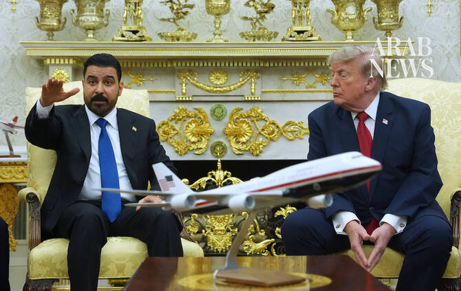

# Trump touts ‘tremendous chemistry’ with new Iraqi Prime Minister Al-Zaidi during White House visit

Source: https://www.arabnews.com/node/2650794/middle-east
Captured source: https://www.arabnews.com/node/2650794/middle-east
Published: 2026-07-14T16:18:20+03:00
Modified: 2026-07-14T22:20:18+03:00
Author: AP

## Summary

WASHINGTON: President Donald Trump gave Iraq’s new prime minister an effusive welcome at the White House on Tuesday, promoting the “tremendous chemistry” between him and a fellow wealthy businessman who arrived at the seat of governmental power without any prior political experience. Ali Al-Zaidi emerged as a consensus candidate in Iraq after months of deadlock over the

## Image

## Video Or Embed URLs

- blob:https://www.arabnews.com/f606b24d-c943-4c37-a4d4-401ff7bf1813
- https://imasdk.googleapis.com/js/core/bridge3.776.0_en.html
- https://eb423671db6fdef22525ca5a2f22e9b6.safeframe.googlesyndication.com/safeframe/1-0-45/html/container.html
- https://static.addtoany.com/menu/sm.25.html
- about:blank
- https://ep2.adtrafficquality.google/sodar/sodar2/255/runner.html
- https://www.google.com/recaptcha/api2/aframe
- https://cm.g.doubleclick.net/partnerpixels?gdpr=0&us_privacy=1---&gpp_sid=-1&url=https%3A%2F%2Fwww.arabnews.com%2Fnode%2F2650794%2Fmiddle-east

## Text

https://arab.news/46gds

Trump: US ⁠would ​be there ⁠for Iraq if it ⁠needed ‌protection

Zaidi is using Iraq’s energy sector to strengthen ties with Washington and to ‌reverse a perception among some US energy majors that Iraq is a challenging environment for large-scale investment

WASHINGTON: President Donald Trump gave Iraq’s new prime minister an effusive welcome at the White House on Tuesday, promoting the “tremendous chemistry” between him and a fellow wealthy businessman who arrived at the seat of governmental power without any prior political experience.

Ali Al-Zaidi emerged as a consensus candidate in Iraq after months of deadlock over the premiership following last year’s parliamentary elections. Trump endorsed Al-Zaidi for the job after he threatened to cut off US support for Iraq if another candidate became the country’s next prime minister.

“Mark my words, I knew what I was doing,” Trump said in the Oval Office as he sat alongside Al-Zaidi for his first visit outside Iraq as prime minister. “This man is going to be a great leader in the Middle East, beyond Iraq. His influence is going to spread all throughout the Middle East.”

Speaking through an interpreter, Al-Zaidi said that he was conveying his greetings from the “oldest civilization in the world” and that the focus of his US visit would be to announce an “economic partnership” between the two countries.

The issue of Iran loomed large in the discussions Tuesday. Iraq has been under pressure to disarm a network of Iran-backed militias operating in the country, some of which launched attacks on US bases and diplomatic facilities after the US and Israel launched their war against Iran in February. Officially, the Iraqi government has given non-state armed groups until the end of September to disarm, but some of the most

powerful militias have said they have no intention of doing so.

Al-Zaidi stressed on Tuesday that there will be no justification for their existence after Sept. 30. A Trump administration official said ahead of the Oval Office meeting that the US will make “informed” decisions based on Iraq’s efforts to disarm Iranian-backed militias inside its borders. The official insisted on anonymity to discuss the administration’s strategy ahead of Al-Zaidi’s visit.

Al-Zaidi has been called ‘Trump of the Middle East’

Iraq’s dominant parliamentary bloc called the Coordination Framework, a coalition of Shiite parties allied with Iran, initially said it would back former Prime Minister Nouri Al-Maliki, whom the Trump administration viewed as too close to Tehran. Trump, a Republican, got personally involved, threatening to block support if Al-Maliki returned to power.

Since Al-Zaidi’s formal installation as prime minister-designate in April, the Trump administration has kept up its outreach to ensure the US can wield significant sway in Iraq, particularly in extricating the Iranian influence that is deeply entrenched inside the country.

The parallel backgrounds of Trump and Al-Zaidi have also bolstered their rapport. Victoria Taylor, director of the Iraq Initiative at the Atlantic Council, noted that Al-Zaidi has been likened to “Trump of the Middle East” considering his business background and lack of political experience.

“When you value business success, I think then it’s very appealing to look at an Iraqi prime minister who is likely a billionaire and can be really pointed to as a political outsider,” she said.

But Taylor added that “the reality is much more complicated,” noting that Al-Zaidi was chosen by the current political infrastructure in Iraq and will be “beholden in some way to that system.”

“I’m not always sure that there’s a full appreciation of the challenge that this prime minister will face in actually trying to really dismantle core parts of the political system,” she said, noting the obstacles that Al-Zaidi will face as he tries to disarm the Iran-backed militias or challenge political corruption.

Underscoring the complicated competing interests that Al-Zaidi is confronting in Iraq, the new prime minister sidestepped a question about Trump’s remarks on the 2020 killing of Iranian Gen. Qassem Soleimani.

“At that time, I wasn’t involved in politics,” Al-Zaidi said. “Let’s talk about the future.”

Renad Mansour, director of the Iraq Initiative at the Chatham House think tank, said he expects that “the US will put significant pressure on Al-Zaidi” to move ahead with disarmament during his Washington visit “and Zaidi will respond by saying, ‘But I need support — intelligence support, technical support, armed support.’”

“There is a scenario in which, if the Iraqi government starts going after these groups, they will also go after the government,” Mansour said. “And this is a scenario that I think that the Iraqi government is apprehensive about.”

Oil pipeline deal is set to be signed, Iraqi officials say

The two governments are also poised to finalize a significant energy deal.

Two Iraqi officials said an agreement is slated to be signed Friday between Iraq, US companies Chevron and TI Capital, and Qatar’s UCC for construction of an oil pipeline that will connect southern Iraq’s Basra to western Iraq’s Haditha and from there to the Ceyhan port in Turkiye and the port of Baniyas on Syria’s coast. The pipeline is projected to carry about 2 million barrels of oil per day. The officials spoke on the condition of anonymity because they were not authorized to comment publicly.

Neither Trump nor Al-Zaidi elaborated on the pending deal publicly during their Oval Office meeting, but the US president said Iraq has “tremendous potential” because of its oil.

Al-Zaidi cracks down on corruption

Al-Zaidi received Trump’s blessing, despite the fact that he was chairman of a bank, Al-Janoob Islamic Bank, that was among the financial institutions banned by Iraq’s central bank in 2024 from dealing in dollars amid pressure from the US to crack down on money laundering and funneling of funds to Iran.

Since taking office, Al-Zaidi has made a public show of cracking down on corruption. His government has conducted raids and arrested dozens of current and former lawmakers and government officials accused of corruption, including some affiliated with former Prime Minister Mohammed Shia Al-Sudani.

The Iraqi premier’s delegation to Washington includes a number of Iraqi businessmen and government officials, and Al-Zaidi’s office said in a statement that the aim of the visit is to “strengthen economic and development partnerships, attract investment, and expand the role of US companies in implementing infrastructure projects” and to further develop the oil-rich country’s energy sector.
