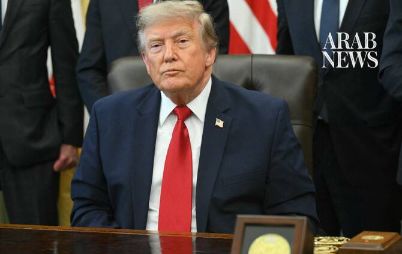

# Trump to address defense technology gathering as the Iran war has reduced US weapon stocks

Source: https://www.arabnews.com/node/2650943/world
Captured source: https://www.arabnews.com/node/2650943/world
Published: 2026-07-15T07:12:51+03:00
Modified: 2026-07-15T07:15:16+03:00
Author: AP

## Summary

WASHINGTON: President Donald Trump is headlining a defense summit at the US Army War College on Wednesday, planning to tout major investments in battlefield technology at a time when the war in Iran has reduced the US supply of Tomahawk cruise missiles and Patriot and THAAD interceptors. The gathering in Carlisle, Pennsylvania, is organized by Republican Sen. David McCormick.

## Image

## Video Or Embed URLs

- https://ef04898bdbd00a0c0dfafbac90e0b8be.safeframe.googlesyndication.com/safeframe/1-0-45/html/container.html
- https://static.addtoany.com/menu/sm.25.html
- about:blank
- https://imasdk.googleapis.com/js/core/bridge3.776.0_en.html
- https://www.google.com/recaptcha/api2/aframe
- https://sync.teads.tv/wigo-no-slot
- https://cm.g.doubleclick.net/partnerpixels?gdpr=0&us_privacy=1---&gpp_sid=-1&url=https%3A%2F%2Fwww.arabnews.com%2Fnode%2F2650943%2Fworld

## Text

https://arab.news/gjtjz

The White House said the summit is bringing together key leaders in defense and some of the largest global investors to spotlight the importance of national security and identify investment opportunities

WASHINGTON: President Donald Trump is headlining a defense summit at the US Army War College on Wednesday, planning to tout major investments in battlefield technology at a time when the war in Iran has reduced the US supply of Tomahawk cruise missiles and Patriot and THAAD interceptors. The gathering in Carlisle, Pennsylvania, is organized by Republican Sen. David McCormick. It has also featured Defense Secretary Pete Hegseth; Gen. Dan Caine, chairman of the Joint Chiefs of Staff; Army Secretary Dan Driscoll; CIA Director John Ratcliffe; and Mike Waltz, US ambassador to the United Nations. Trump has been a frequent visitor to the critical swing state of Pennsylvania, including last month, when he went to a Mack Trucks facility in Macungie, outside Allentown — hoping to boost Republican Rep. Ryan Mackenzie’s reelection chances. Trump carried Pennsylvania in 2016 and 2024, and McCormick is not up for reelection this cycle, but Republicans are increasingly concerned about the war and persistently high cost of living as well as the president’s low approval ratings as they look to maintain control of Congress during November’s midterm elections. The White House said the summit is bringing together key leaders in defense and some of the largest global investors to spotlight the importance of national security and identify investment opportunities. Summit attendees include JPMorgan’s Jamie Dimon, Blackstone President Jon Gray, Lockheed Martin CEO Jim Taiclet, General Dynamics CEO Phebe Novakovic, Boeing CEO Kelly Ortberg, SpaceX director Antonio Gracias, and Shyam Sankar, chief technology officer of analytics and artificial intelligence firm Palantir, McCormick’s office said. Trump spoke at a similar gathering organized by McCormick last year in Pittsburgh that sought to make the city a hot spot for advancement in energy technology and robotics. Then, the senator announced $90 billion in pledged investments in those sectors across Pennsylvania. This year’s summit began on Tuesday. Before Trump’s arrival, multi-analytics threat detection leader ZeroEyes, which is based in Conshohocken, outside Philadelphia, announced a planned $10 million investment in artificial intelligence and machine learning research and development. Pittsburgh-based Gecko Robotics also says it plans to open a new 10,000-square-foot (930-square-meter) manufacturing facility designed to boost integration of robotics into defense manufacturing processes and better expand the nation’s defense industrial base. An analysis released in May found that US military contractors will need at least three years to replenish stockpiles of Tomahawks — used to strike targets deep inside enemy territory — as well as Patriots and THAAD interceptors, which defend against incoming missiles and drones. Stocks have dwindled as the US has repeatedly fired strikes on Iran, adding to concerns that American forces would have limited firepower in any potential future conflict with China. China has a stated goal of ensuring its military is capable of taking Taiwan by force if necessary by 2027, which experts see as more aspirational than a hard deadline. But Chinese President Xi Jinping warned during Trump’s recent visit to Beijing that if Washington mishandles its relations with the self-governing island, the US and China could end up clashing or even find themselves in open conflict. Trump also recently pledged to give Ukraine a license to produce Patriot air-defense systems which could be a major development in its war with Russia — though turning the idea into real weapons is also likely to take years. Trump has sought to correct the shortfall by seeking a historic $1.5 trillion defense budget proposal for 2027. But a package authorizing such spending levels is stalled in Congress, and, even if it eventually moves forward, loads of additional time will still be required to expand production capabilities to accommodate such weapons systems. Jake Loosararian, co-founder and CEO of Gecko Robotics, said US defense companies have “got to supercharge supply chains” to reduce how long it takes for new technology to be ready for widespread production. “President Trump uniquely understands the importance of pragmatic impact today,” Loosararian said. “He also understands big, beautiful things for tomorrow.”
