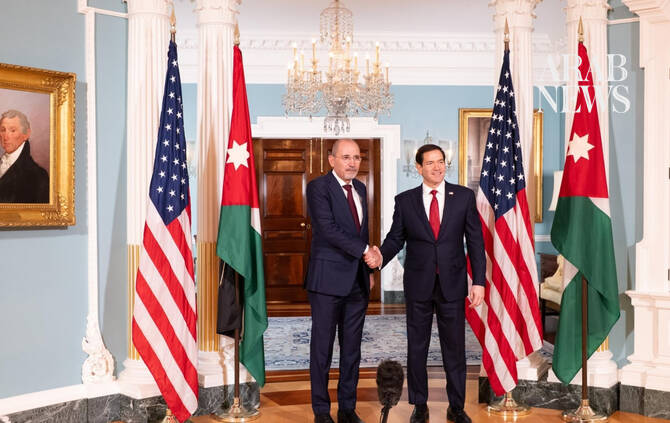

# Safadi and Rubio condemn Iranian attacks as Jordan intercepts more missiles

Source: https://www.arabnews.com/node/2651036/middle-east
Captured source: https://www.arabnews.com/node/2651036/middle-east
Published: 2026-07-15T18:35:00+03:00
Modified: 2026-07-15T18:36:54+03:00
Author: Arab News

## Summary

Jordanian Foreign Minister Ayman Safadi and US Secretary of State Marco Rubio condemned Iranian attacks against Jordan and Gulf Cooperation Council countries during a meeting in Washington

## Image

## Video Or Embed URLs

- https://0f81320998e9af12471a6d528b0b9b5d.safeframe.googlesyndication.com/safeframe/1-0-45/html/container.html
- https://static.addtoany.com/menu/sm.25.html
- about:blank
- https://imasdk.googleapis.com/js/core/bridge3.777.0_en.html
- https://www.google.com/recaptcha/api2/aframe
- https://cm.g.doubleclick.net/partnerpixels?gdpr=0&us_privacy=1---&gpp_sid=-1&url=https%3A%2F%2Fwww.arabnews.com%2Fnode%2F2651036%2Fmiddle-east

## Text

https://arab.news/w4cx3

Jordanian foreign minister held meetings with members of Congress to discuss ways to strengthen Jordan-American relations this week

LONDON: Jordanian Foreign Minister Ayman Safadi and US Secretary of State Marco Rubio condemned Iranian attacks against Jordan and Gulf Cooperation Council countries during a meeting in Washington.

Jordan announced on Wednesday that it intercepted and shot down three Iranian ballistic missiles that violated the country’s airspace, with no casualties or material damage reported by the Jordan News Agency.

Safadi and Rubio also discussed efforts to end escalation and restore calm in the Middle East after the conflict between the US and Iran resumed on July 7, following the collapse of a fragile ceasefire.

Their meeting addressed efforts in the Gaza Strip to implement President Donald Trump’s peace plan, including rebuilding the territory and ensuring access to humanitarian supplies.

Safadi held meetings with members of Congress to discuss ways to strengthen Jordan-American relations, the JNA reported.

US allies in the region, including Jordan, Qatar, Bahrain, Oman, as well as Kuwait and the UAE, have all been targeted by Iranian missiles and drones as the conflict between Tehran and the US resumed last week.

US forces hit Iran after negotiations about the flow of energy shipments from the Strait of Hormuz and Tehran’s nuclear program failed. More than 300 Iranian sites of military and civilian importance were bombed by the US, including a key rail bridge that connects the country to Russia and China. On Wednesday, the US Central Command announced the reimposing of a naval blockade of Iranian ports.
