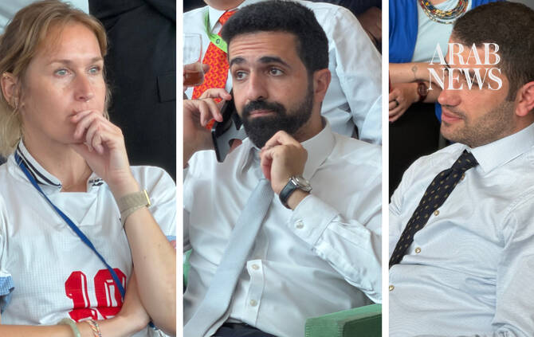

# UN diplomats trade cables for footballs as Argentina take on England in World Cup

Source: https://www.arabnews.com/node/2651081/world
Captured source: https://www.arabnews.com/node/2651081/world
Published: 2026-07-16T02:13:09+03:00
Modified: 2026-07-16T02:52:28+03:00
Author: Ephrem Kossaify

## Summary

NEW YORK CITY: For one afternoon, the corridors of the UN traded the vocabulary of resolutions and official statements for the international language of football. The World Cup semifinal between Argentina and England was showing on two large screens in the delegates lounge on Wednesday, distracting diplomats, aides and other staff, if only for a few minutes at a time, from

## Image

## Video Or Embed URLs

- https://fca8ce2b93c7cf50f60bec3dc57c88e8.safeframe.googlesyndication.com/safeframe/1-0-45/html/container.html
- https://static.addtoany.com/menu/sm.25.html
- about:blank
- https://imasdk.googleapis.com/js/core/bridge3.777.0_en.html
- https://www.google.com/recaptcha/api2/aframe
- https://cm.g.doubleclick.net/partnerpixels?gdpr=0&us_privacy=1---&gpp_sid=-1&url=https%3A%2F%2Fwww.arabnews.com%2Fnode%2F2651081%2Fworld

## Text

https://arab.news/whym8

In their free moments officials gather around big screens in the delegates lounge to watch the semifinal as the language of football briefly replaces the phrasing of resolutions

Even football talk rarely stays free of history and politics; ask a diplomat who they support and the answer is often wrapped in old loyalties, colonial memories or professional caution

NEW YORK CITY: For one afternoon, the corridors of the UN traded the vocabulary of resolutions and official statements for the international language of football.

The World Cup semifinal between Argentina and England was showing on two large screens in the delegates lounge on Wednesday, distracting diplomats, aides and other staff, if only for a few minutes at a time, from sessions at the High-Level Political Forum on Sustainable Development and the parallel business of the Security Council.

Laptops sat open on side tables next to coffee cups, their owners glancing up from them every time the crowd around the big screens stirred. In the front row, a Syrian ambassador worked his way through messages on his phone, half watching the football, half working in what has become a familiar posture during precious moments of collective relaxation at the UN.

It is rare, diplomats and long-time UN watchers said, to see the building’s usual formality loosen up, even briefly. And even when the conversation turns to football, it rarely stays free of history and politics for long.

Ask any diplomat who they are rooting for, and the answer often comes wrapped in old loyalties, colonial memories or simple professional caution.

The Turkish ambassador, Ahmet Yildiz, offered a classic diplomatic dodge when asked who he was supporting, telling Arab News: “I am with whoever wins.”

This particular match ended with a late, 2-1, come-from-behind victory for Argentina that set up a showdown with Spain on Sunday in a final that will cap a World Cup diplomats and UN regulars alike described as unusually rich in upsets.

Agnieszka, a Polish diplomat who is in New York for the political forum, said she was only able to catch parts of games between sessions, but had been following the tournament’s upsets closely.

“A lot of surprises,” she told Arab News. “Yesterday, France was taken out from the game (by Spain), so a lot of surprises. And the situation with Norway: They came so far after, like, 28 or more years.”

Egypt and Morocco’s impressive runs also stood out, she said, adding: “It was very fun to watch, really amazing time, and also for the delegates to change some emotions from very different talks — and look at the green, you know, it’s very helpful.”

Norway’s appearance and performance in the tournament was one of the central storylines of the 2026 World Cup. Led by Erling Haaland and captain Martin Odegaard, the Norwegians returned to the tournament for the first time in 28 years after a perfect qualifying campaign, and advanced all the way to the quarterfinals before falling to a 2-1 defeat by England in Miami, one of a string of tight, single-goal victories by England on their road to the semis.

The fallout from Egypt’s exit, by contrast, has continued to reverberate beyond the final whistle. Mohammed Salah and his teammates led Argentina 2-0 with 11 minutes remaining in their round-of-16 match in Atlanta, only for the defending world champions to score three late goals, including a stoppage-time winner, and pull off a great escape.

Egypt’s football federation has lodged a formal complaint with FIFA over the officiating during the game, objecting in particular to a review by the video assistant referee that chalked off an Egyptian goal, and to a penalty claim that was waved away in the buildup to Argentina’s winner.

FIFA’s refereeing chief, Pierluigi Collina, has defended the decisions as consistent with the rules, but the controversy nevertheless has helped shaped the mood in the delegates lounge

“Egypt is the country that should be upset,” said John, a longtime UN correspondent who has covered the building’s football-watching rituals for years.

“The more I look at this, I mean, when I saw that happen … I see why they’re upset. If it happened to any other team, of course they’d be upset. They should be. Egypt is a major team, as was Morocco.”

He recalled years gone by when football watching at the UN was louder and more visible, with national delegations sitting together in team colors and ambassadors arriving in soccer jerseys.

“Croatians used to be boisterous, and the ambassador too,” he said, adding that even this year, the German mission reliably turned out in numbers until their team was eliminated by Paraguay on June 29.

“Look how the big boys have fallen this year: Brazil, Germany, the Netherlands and now France,” said John. “Italy wasn’t even here. Who knows if it weren’t for that referee whether Argentina would be out by now?”

Mohammed Al-Haidari, a member of Iraq’s mission to the UN, said he was supporting England on Wednesday but it was Egypt’s World Cup journey that had moved him the most.

“They did an amazing job,” he told Arab News. “It surprised all of us and we really wished they had qualified to a more advanced stage.”

Al-Haidari said he has been a football fan since childhood and his instinct is usually to back debutants rather than the favorites.

“I always supported teams that qualified for the first time, first-timers,” he said, but added that he had also, of course, celebrated Iraq’s own qualification for the tournament.

Senyo Agbohlah, from the UN Office of Counter-Terrorism, described his own, multilayered allegiances, shaped by his family roots and personal history.

“I am Ghanaian by birth but British by nationality — born in Ghana, grew up in England — so I’m a big, big England fan,” he told Arab News.

He showed his confidence in the England national team ahead of the big game by adding, “It’s coming home,” a popular chant among English fans that refers to the World Cup trophy. He said he had also followed the fortunes of Ghana and Scotland during the tournament.

A veteran fan who has attended three World Cups in person — Germany in 2006, South Africa in 2010 and Qatar four years ago — he said the 2022 tournament was the best-organized, “especially in terms of pricing,” but praised this year’s rule changes regarding offside and injury time as good for the game, and welcomed the expansion of the competition to 48 teams as a good move for smaller nations in particular, especially African teams.

“I think bigger is better … I’ve loved it,” he said.

Pakistan’s ambassador to the UN, Asim Iftikhar, said he had managed to catch “glimpses, if not the entire game” between meetings, but was particularly struck by the pull of Wednesday’s match between England and Argentina has had on the diplomatic community.

“This is big,” he told Arab News. “So yeah, you can see the level of interest here.”

Pakistan’s international football loyalties, he explained, tend to run toward South American teams.

“If you ask anyone, they will tell you, ‘Brazil is our favorite,’ ‘Argentina is our favorite,’” he said. He traced his own attachment to Argentina back to 1978, when Pakistan won the Hockey World Cup in Buenos Aires in the same year Argentina won the FIFA World Cup on home soil.

He recalled an interesting detail from that year that links Pakistan’s hockey success with Argentina’s World Cup glory: the football team’s coaching staff, having watched Pakistan’s wingers exploit space down the flanks in hockey matches, adapted the strategy for their own attacking play.

“This thing is etched in my memory,” he said.

By the time the second half of Wednesday’s match got underway in Atlanta, the crowd in the lounge had thinned out as delegates were pulled back to sessions upstairs. Their laptops closed and phones went back into pockets until, diplomats said, the next goal — or a break in their schedules — drew them back to the screens.
