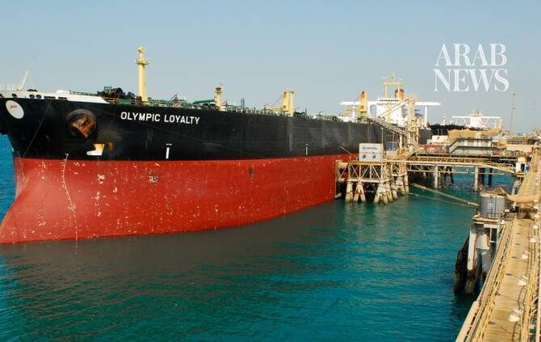

# Iraqi oil loadings briefly suspended after drone hits tanker at Basra, sources say

Source: https://www.arabnews.com/node/2651163/middle-east
Captured source: https://www.arabnews.com/node/2651163/middle-east
Published: 2026-07-16T17:17:43+03:00
Modified: 2026-07-16T17:26:54+03:00
Author: Reuters

## Summary

BASRA: Iraq briefly suspended oil loadings on Thursday before resuming them after a drone hit an oil tanker at its Basra terminal, four Iraqi oil and security sources told Reuters. The drone did not cause damage or fire and it was not immediately clear who launched it, the sources added. The incident was not a direct attack on the terminals or vessels there, the ‌head of

## Image

## Video Or Embed URLs

- https://d85adafbe86244a6a34020d0cc016e0e.safeframe.googlesyndication.com/safeframe/1-0-45/html/container.html
- https://static.addtoany.com/menu/sm.25.html
- about:blank
- https://www.google.com/recaptcha/api2/aframe
- https://imasdk.googleapis.com/js/core/bridge3.777.0_en.html
- https://sync.teads.tv/wigo-no-slot
- https://cm.g.doubleclick.net/partnerpixels?gdpr=0&us_privacy=1---&gpp_sid=-1&url=https%3A%2F%2Fwww.arabnews.com%2Fnode%2F2651163%2Fmiddle-east

## Text

https://arab.news/yskh5

The drone did not cause damage or fire and it was not immediately clear who launched it

“It is ‌not ⁠targeting Basra Oil ⁠Terminal. Its target is another place. Loading is at normal rates depending on the vessels’ availability,” Nazar said

BASRA: Iraq briefly suspended oil loadings on Thursday before resuming them after a drone hit an oil tanker at its Basra terminal, four Iraqi oil and security sources told Reuters. The drone did not cause damage or fire and it was not immediately clear who launched it, the sources added. The incident was not a direct attack on the terminals or vessels there, the ‌head of ‌Iraq’s state oil marketer SOMO told Reuters. “It is ‌not ⁠targeting Basra Oil ⁠Terminal. Its target is another place. Loading is at normal rates depending on the vessels’ availability,” Ali Nazar said. An oil ministry spokesperson said loadings were ongoing at Iraq’s southern ports and that the ministry is investigating the matter. The oil tanker was towed outside the port along with another tanker that was anchored ⁠as a precautionary measure, the four sources said. On ‌Wednesday, a drone came down ‌in Iraq’s Faw port without causing any damage, the state news agency ‌reported, without giving further detail. Operations at the port were ‌not affected. The Iran war has disrupted oil exports from Iraq’s southern terminals due to the effective closure of the Strait of Hormuz. Iraq, OPEC’s second-largest producer, exported 10 million barrels of oil via the ‌Strait of Hormuz in April, down from about 93 million per month before the war, ⁠according to ⁠oil minister Basim Mohammed. Total June exports stood at around 24.5 million barrels, two oil officials told Reuters on July 5. Iraq has also been exporting via Turkiye using the northern Kirkuk-Ceyhan pipeline and has sought to export oil through Syria. Baghdad has been striving to balance its ties with neighboring Iran and the US amid the military escalation between the two. However, Tehran has launched attacks against Iranian Kurdish opposition groups in northern Iraq, while Iran-backed militants in Iraq have launched attacks against Gulf neighbors.
