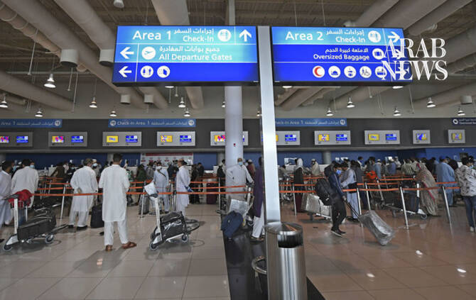

# Airlines resume some Middle East flights but disruption continues

Source: https://www.arabnews.com/node/2651303/middle-east
Captured source: https://www.arabnews.com/node/2651303/middle-east
Published: 2026-07-17T18:44:42+03:00
Modified: 2026-07-17T18:47:36+03:00
Author: Reuters

## Summary

DUBAI: More airlines are restoring flights to parts ‌of the Middle East after the conflict that followed US and Israeli strikes on Iran, but some carriers have kept suspensions in place. Below is an update on the status of airlines’ flights, in alphabetical order: AEGEAN AIRLINES Greece’s largest carrier canceled its flights to Dubai until August 31, and to Irbil and Baghdad

## Image

## Video Or Embed URLs

- https://ff848c85ca2a333318c89d84e667a4b6.safeframe.googlesyndication.com/safeframe/1-0-45/html/container.html
- https://static.addtoany.com/menu/sm.25.html
- about:blank
- https://imasdk.googleapis.com/js/core/bridge3.777.0_en.html
- https://www.google.com/recaptcha/api2/aframe
- https://cm.g.doubleclick.net/partnerpixels?gdpr=0&us_privacy=1---&gpp_sid=-1&url=https%3A%2F%2Fwww.arabnews.com%2Fnode%2F2651303%2Fmiddle-east

## Text

https://arab.news/8wbtj

Greece’s largest carrier canceled its flights to Dubai until August 31

KLM suspended flights to Riyadh, Dammam and Dubai until July 15

DUBAI: More airlines are restoring flights to parts ‌of the Middle East after the conflict that followed US and Israeli strikes on Iran, but some carriers have kept suspensions in place. Below is an update on the status of airlines’ flights, in alphabetical order:

AEGEAN AIRLINES Greece’s largest carrier canceled its flights to Dubai until August 31, and to Irbil and Baghdad until September 30.

AIRBALTIC Flights to Dubai are canceled until October 24.

AIR CANADA The Canadian carrier has canceled flights to Tel Aviv and Dubai until October 24.

AIR FRANCE-KLM Air France has suspended its Beirut flights until August 2. KLM suspended flights to Riyadh, Dammam and Dubai until July 15, according to a statement on its website.

CATHAY PACIFIC The Hong Kong airline has postponed the resumption of its Middle East passenger and freight services. Passenger flights to Dubai and Riyadh will resume on October 25 and 26, pushed back from September ‌1. Its Riyadh ‌freight service, originally planned for August 1, has also been postponed ‌with ⁠timing under review.

DELTA The ⁠US carrier has suspended services for the Atlanta-Tel Aviv route through December 18. It plans to resume New York-JFK to Tel Aviv flights on September 6, while the launch of its Boston-Tel Aviv route, planned for late October, has been delayed until further notice.

FINNAIR The Finnish carrier has canceled its Doha flights until October 2, while continuing to avoid the airspace of Iraq, Iran, Syria and Israel. It will restart Dubai flights, which it operates only in the winter season, in October.

IAG IAG-owned British Airways delayed the resumption of ⁠its flights to Doha until August 1 and to Riyadh until August ‌8. Flights to Dubai, Tel Aviv, Bahrain and Amman are ‌paused until the end of the summer season, and are scheduled to resume on October 25. The airline plans ‌to reduce services to Dubai, Doha, Riyadh and Tel Aviv to one daily flight when they ‌resume, while dropping Jeddah as a destination.

JAPAN AIRLINES Japan Airlines has suspended scheduled Tokyo-Doha flights until August 31 and Doha-Tokyo flights until September 1.

LOT The Polish airline plans to operate its winter route to Dubai from October and to resume operations to Beirut in its Summer 2027 schedule.

LUFTHANSA GROUP SWISS postponed the resumption of flights to Tel ‌Aviv until August, and Brussels Airlines suspended operations until October 24. Lufthansa and SWISS will continue their suspension of Dubai flights until September 13. Lufthansa, SWISS, Austrian ⁠Airlines and Brussels Airlines suspended ⁠flights to Abu Dhabi, Amman, Beirut, Dammam, Riyadh, Irbil, Muscat and Tehran until October 24. After restarting its Irbil, Beirut and Tel Aviv flights, low-cost carrier Eurowings expects to resume the remaining Middle East destinations in autumn. ITA Airways has also extended the suspension of its flights to Riyadh until July 31 and to Dubai until October 24 for operational reasons.

NORWEGIAN AIR The low-cost airline has pushed back planned launches of its Tel Aviv and Beirut services indefinitely, and no new start dates have been decided.

SINGAPORE AIRLINES The carrier extended its Singapore-Dubai flight suspension until October 24, while adding services on the Singapore-London Gatwick and Singapore-Melbourne routes from late March until October 24 to meet higher demand.

TURKISH AIRLINES SunExpress, Turkish Airlines’ joint venture with Lufthansa, plans to resume its Antalya-Dubai route later on July 15.

WIZZ AIR The low-cost airline has suspended flights to Dubai, Abu Dhabi and Amman from mainland European destinations until mid-September.
