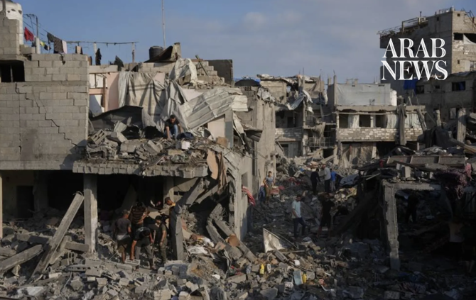

# Israeli strikes kill Palestinians attending Gaza funeral for earlier strike victim

Source: https://www.arabnews.com/node/2651311/middle-east
Captured source: https://www.arabnews.com/node/2651311/middle-east
Published: 2026-07-17T19:49:13+03:00
Modified: 2026-07-17T19:50:04+03:00
Author: Reuters

## Summary

GAZA: An Israeli airstrike killed at least eight Palestinians and wounded 20 attending a funeral in Nuseirat in the central Gaza Strip on Friday for a person killed by another Israeli strike on the area earlier in the day, Gaza health officials said. Those deaths, along with at least three Palestinians killed in separate Israeli airstrikes elsewhere in the enclave, brought

## Image

## Video Or Embed URLs

- https://e53967799d1e542d1b3c2522e160ccd3.safeframe.googlesyndication.com/safeframe/1-0-45/html/container.html
- https://static.addtoany.com/menu/sm.25.html
- about:blank
- https://imasdk.googleapis.com/js/core/bridge3.777.0_en.html
- https://www.google.com/recaptcha/api2/aframe
- https://cm.g.doubleclick.net/partnerpixels?gdpr=0&us_privacy=1---&gpp_sid=-1&url=https%3A%2F%2Fwww.arabnews.com%2Fnode%2F2651311%2Fmiddle-east

## Text

https://arab.news/wzaue

GAZA: An Israeli airstrike killed at least eight Palestinians and wounded 20 attending a funeral in Nuseirat in the central Gaza Strip on Friday for a person killed by another Israeli strike on the area earlier in the day, Gaza health officials said.

Those deaths, along with at least three Palestinians killed in separate Israeli airstrikes elsewhere in the enclave, brought Friday’s toll to at least 12, medics said.

Hamas condemned the Nuseirat strike as a “brutal massacre” against mourners and urged mediators, as well as the United Nations, to act to halt Israeli attacks in Gaza.

The Israeli military said it was checking a Reuters request for comment but did not immediately provide one.

Residents in an area east of Deir al-Balah in the central Gaza Strip said Israeli forces used drones to broadcast audio messages ordering them to leave their homes, forcing some families to flee for safety.

The deaths add to a toll of more than 1,100 Palestinians, mostly civilians, killed by Israeli attacks since an October ceasefire between Israel and Hamas militants took effect, according to Gaza health officials. Hamas does not usually disclose its losses.

The truce halted major fighting but has not stopped near-daily Israeli strikes. Israel says it is targeting militants. Four Israeli soldiers have been killed by militants in Gaza over the same period.

Conflict monitor ACLED, a US-based research group that tracks political violence, said Israeli airstrikes against Hamas and other militants rose to more than 40 in June, the highest monthly total since the ceasefire. Other strikes hit people near the line dividing the two sides, killing and injuring civilians, including women and children, it said.
