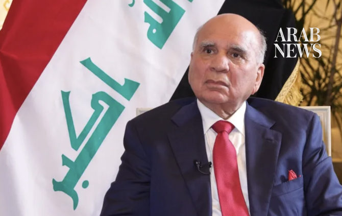

# Iraqi FM to Asharq: We are ready to mediate between Washington and Tehran, and ending the war is a priority

Source: https://www.arabnews.com/node/2651413/middle-east
Captured source: https://www.arabnews.com/node/2651413/middle-east
Published: 2026-07-18T18:57:09+03:00
Modified: 2026-07-18T18:58:00+03:00
Author: Asharq Bloomberg

## Summary

WASHINGTON: Iraq has announced its readiness to play a mediating role between the United States and Iran as part of a diplomatic effort aimed at ending the war and paving the way for renewed dialogue, with Baghdad expressing its willingness to help bridge differences, particularly on economic issues. Iraqi Foreign Minister Fuad Hussein told Asharq’s Washington bureau chief,

## Image

## Video Or Embed URLs

- https://eb54aa090208690a1592c16559a860a0.safeframe.googlesyndication.com/safeframe/1-0-45/html/container.html
- https://static.addtoany.com/menu/sm.25.html
- about:blank
- https://imasdk.googleapis.com/js/core/bridge3.777.0_en.html
- https://www.google.com/recaptcha/api2/aframe
- https://cm.g.doubleclick.net/partnerpixels?gdpr=0&us_privacy=1---&gpp_sid=-1&url=https%3A%2F%2Fwww.arabnews.com%2Fnode%2F2651413%2Fmiddle-east

## Text

https://arab.news/p4rzd

Fuad Hussein: PM will visit Iran on July 23 to present Baghdad's vision for ending the war

WASHINGTON: Iraq has announced its readiness to play a mediating role between the United States and Iran as part of a diplomatic effort aimed at ending the war and paving the way for renewed dialogue, with Baghdad expressing its willingness to help bridge differences, particularly on economic issues.

Iraqi Foreign Minister Fuad Hussein told Asharq’s Washington bureau chief, Hiba Nasr, that Prime Minister Mohammed Ali Al-Zaidi will visit Iran on July 23 following his visit to the United States.

He added that Iraq will present its vision on the need to end the war during the prime minister’s visit to Iran, stressing that any discussion of initiatives, particularly on economic matters, first requires an end to the escalation and that “everything is possible to discuss if the war is ended.”

The Iraqi foreign minister added that Baghdad is ready to play a mediating role between Tehran and Washington, especially on economic issues, stressing that the priority at this stage is to stop the war and create the conditions for dialogue.

Hussein noted that the Iraqi prime minister’s tour will also include a visit to Turkiye on July 28, in addition to a possible visit to Saudi Arabia.

He explained that Iraq had previously played a role in bringing Tehran and Washington closer together during previous administrations, adding that Baghdad is not carrying an American message to Iran but can convey the views it heard in Washington, while also presenting Iraq’s own position.

He pointed out that the Iraqi prime minister raised a number of issues related to the war during his visit to Washington, stressing that Iraq is “ready to be a mediator between the two sides, especially on economic issues.”

He added that “the war has caused direct damage to Iraq and is a harsh war,” explaining that the country is facing difficulties exporting its oil through the Strait of Hormuz, which he described as “the only passage” for Iraqi oil exports, while exports through the Kurdistan pipeline to Turkiye do not exceed about 200,000 barrels per day.

The Iraqi foreign minister stressed that the solution lies in returning to dialogue and ending the war.

Confining weapons to the state

On the domestic front, the Iraqi foreign minister said the issue of armed factions is an internal matter related to politics and the Iraqi Constitution, which does not permit the existence of weapons outside the authority of the state. He stressed that decisions on war and peace should rest solely with the government.

He added that three factions have already handed over their weapons to the armed forces, while dialogue is continuing with four other factions, two of which have announced their intention to surrender their weapons after the departure of US forces next September.

Hussein stressed that Iraq cannot build its economy or attract major companies and investments without providing a secure environment both domestically and regionally.

He said: “We are entering a new phase, and the Iraqi government, especially the prime minister, is giving this issue great attention because it is not possible to rebuild the Iraqi economy, attract major companies to invest or revitalize the economy without providing security. We need a stable domestic security situation, and we also need a stable regional security environment.”

Regarding relations with Syria, Hussein said Baghdad had upgraded its ties with the new Syrian government, noting that his talks in Damascus with President Ahmed Al-Sharaa and Foreign Minister Asaad Al-Shaibani covered oil and economic issues.

He added that the two sides reached understandings on reconstructing the oil pipeline from Iraq to Banias in Syria with the participation of American and Gulf companies, in addition to another project to extend an oil pipeline to Aqaba in Jordan. The Jordanian minister of energy is scheduled to visit Baghdad to discuss the matter.

Partnership with Washington to attract investment

Regarding relations with the United States, the Iraqi foreign minister said ties are based on the Strategic Framework Agreement, expressing Baghdad’s desire to expand investment by American companies in infrastructure and the oil and gas sectors.

He said: “We are facing challenges and we need a strong partner and strong companies capable of investing capital and technology in Iraq, and that partner is the United States, with which we have relations governed by a strategic agreement.”

He also highlighted the improvement in Iraq’s relations with its Arab neighbors, noting positive understandings with Saudi Arabia and continued coordination with Kuwait to resolve outstanding issues, particularly those related to the past, while also strengthening ties with Jordan, Egypt and Syria.

US withdrawal and security cooperation

Regarding the US military presence, Hussein said the withdrawal of American forces is proceeding in accordance with the agreement reached with the previous government and will take place in two phases. He said the final phase would end the military presence and complete the withdrawal from the Kurdistan Region of Iraq by the end of next September, stressing that the United States is committed to the agreement.

He added: “We began talks with the American side regarding the withdrawal of the international coalition forces, including US forces, because what is present is not only the American military but also the broader international coalition. However, we may still need security understandings between the United States and Iraq, and that does not mean there will be no security cooperation in intelligence sharing and the exchange of information. We are living in a time of war, and we do not know what the future holds or where the situation is heading. There is still no clear picture of the future of the region in light of the continuing escalation.”

Hussein stressed that Iraq is working to shield itself from the repercussions of the war, warning that its continuation would lead to further destruction across the region and emphasizing the need to work with all parties to bring the conflict to an end.

He said: “We are trying to protect Iraq. We have succeeded in preventing Iraq from becoming part of this war, but its repercussions have reached us, and we have become one of its victims. The Iraqi economy is a victim of the war because of the closure of the Strait of Hormuz, and it is our duty to protect Iraq.”

He added: “We are not part of this war, we do not believe in war, and we have never believed in expanding it.”

* This interview originally appeared in Arabic in Asharq Bloomberg
