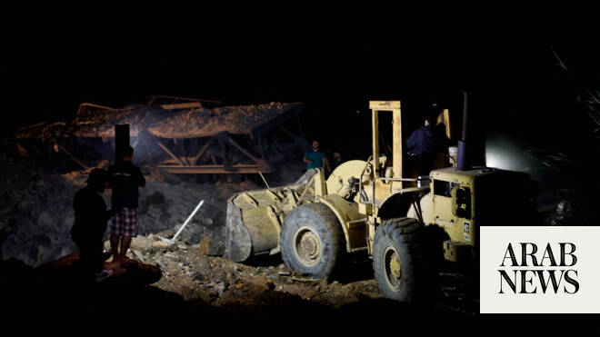

# Lebanon army reports Israeli ‘acts of aggression’ in ‘violation of ceasefire’

Source: https://www.arabnews.com/node/2640197/middle-east
Captured source: https://www.arabnews.com/node/2640197/middle-east
Published: 2026-04-17T03:44:53+03:00
Modified: 2026-04-17T12:19:45+03:00
Author: ReutersAP

## Summary

BEIRUT: Lebanon’s army reported “acts of aggression” by Israel on Friday, saying they violated a ceasefire that took effect at midnight, even as a 10-day truce raised hopes of halting weeks of devastating conflict.

## Image

## Video Or Embed URLs

- blob:https://www.arabnews.com/696ceb65-ea11-4ef1-8ef8-42e80dd5bc9c
- https://imasdk.googleapis.com/js/core/bridge3.772.0_en.html
- about:blank
- https://static.addtoany.com/menu/sm.25.html
- https://gum.criteo.com/syncframe?origin=publishertagids&topUrl=www.arabnews.com&gdpr=0&gdpr_consent=&gpp=&gpp_sid=-1
- https://www.google.com/recaptcha/api2/aframe
- https://cm.g.doubleclick.net/partnerpixels?gdpr=0&us_privacy=1---&gpp_sid=-1&url=https%3A%2F%2Fwww.arabnews.com%2Fnode%2F2640197%2Fmiddle-east

## Downloaded Video

- [01_lebanon-army-reports-israeli-acts-of-aggression-in-violation-of-ceasef.mp4](../../../rendered-clips/2026-06-22/01_lebanon-army-reports-israeli-acts-of-aggression-in-violation-of-ceasef.mp4)

## Text

https://arab.news/849z9

Truce begins amid reports of shelling, uncertainty on the ground

Fragile deal tied to wider regional diplomacy and unresolved tensions

BEIRUT: Lebanon’s army reported “acts of aggression” by Israel on Friday, saying they violated a ceasefire that took effect at midnight, even as a 10-day truce raised hopes of halting weeks of devastating conflict.

In a post on X early Friday, the Lebanese army urged residents in the south to exercise caution “in light of a number of violations” following “several Israeli acts of aggression.”

The warning came shortly after the ceasefire began, with Lebanon’s state-run National News Agency reporting Israeli shelling in the southern villages of Khiam and Dibbine roughly 30 minutes after the truce took effect. Israel’s military said it was looking into the reports.

The ceasefire, announced by US President Donald Trump, is aimed at pausing fighting between Israeli forces and Hezbollah militants in Lebanon, though Hezbollah is not formally a party to the agreement. The deal is also seen as part of broader efforts to sustain a parallel truce involving Iran, the United States and Israel.

Despite the agreement, tensions remained high. Israeli Prime Minister Benjamin Netanyahu said Israel agreed to the ceasefire to advance diplomatic efforts but made clear that troops would remain in southern Lebanon, where Israeli forces have been battling Hezbollah and pushing to establish what he described as a 10-kilometer “security zone.”

“That is where we are, and we are not leaving,” Netanyahu said.

Hezbollah signaled it may continue to resist Israeli presence, warning that any “occupation” of Lebanese territory gives it the right to respond depending on developments — a stance that could further strain the ceasefire.

Under the terms outlined by the US State Department, Israel retains the right to act against imminent threats but is otherwise expected to halt offensive operations against Lebanese targets. The language has raised concerns that Israel could still carry out strikes under certain conditions, as seen in past ceasefire arrangements.

Fighting continued up to the final moments before the truce, with Hezbollah launching rockets into northern Israel and air raid sirens sounding in border communities minutes before midnight.

On the ground, the situation remains fluid. Celebratory gunfire echoed across Beirut as the truce began, while displaced families started returning to southern areas despite official warnings to wait until the ceasefire proves stable.

The agreement follows intense diplomatic efforts, including rare contacts between Israeli and Lebanese officials and mediation led by Washington. It also intersects with broader regional negotiations involving Iran, with officials indicating tentative progress toward extending a separate ceasefire linked to that conflict.

Still, with over a million people displaced in Lebanon and key issues unresolved, the durability of the truce remains uncertain.
