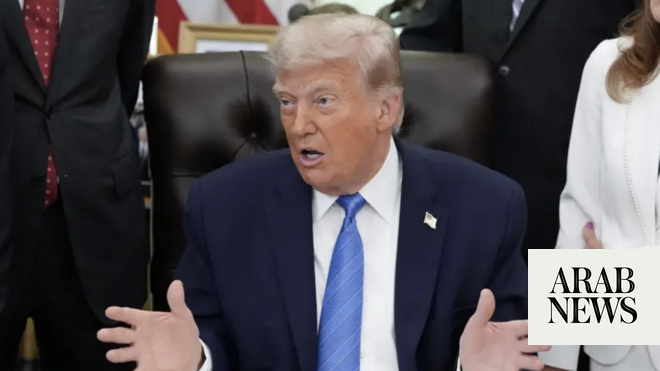

# Trump vows to take Iran oil terminals, launch new strikes

Source: https://www.arabnews.com/node/2646679/middle-east
Captured source: https://www.arabnews.com/node/2646679/middle-east
Published: 2026-06-11T15:33:07+03:00
Modified: 2026-06-11T19:46:45+03:00
Author: Agencies

## Summary

WASHINGTON/TEHRAN/DUBAI: President Donald Trump on Thursday said the US would hit Iran “VERY HARD TONIGHT,” threatening in a social media post to “assume total control” of Iran’s oil and gas industries, including the key Kharg Island, in the “not too distant future.” Trump gave no details of how the US would seize Iran’s oil terminals, but any such operation would almost

## Image

## Video Or Embed URLs

- blob:https://www.arabnews.com/96b0c185-0607-423f-8f1b-80a6a4f9b811
- https://imasdk.googleapis.com/js/core/bridge3.775.0_en.html
- https://truthsocial.com/@realDonaldTrump/116731447139970106/embed
- https://e5d732aadc4a0d2f248713206fc0d6e0.safeframe.googlesyndication.com/safeframe/1-0-45/html/container.html
- about:blank
- https://static.addtoany.com/menu/sm.25.html
- https://ep2.adtrafficquality.google/sodar/sodar2/255/runner.html
- https://www.google.com/recaptcha/api2/aframe
- https://cm.g.doubleclick.net/partnerpixels?gdpr=0&us_privacy=1---&gpp_sid=-1&url=https%3A%2F%2Fwww.arabnews.com%2Fnode%2F2646679%2Fmiddle-east

## Downloaded Video

- [01_iran-foreign-ministry-says-us-strikes-render-ceasefire-practically-mea.mp4](../../../rendered-clips/2026-07-07/01_iran-foreign-ministry-says-us-strikes-render-ceasefire-practically-mea.mp4)

## Text

https://arab.news/jztkn

Iran’s foreign ministry: ‘Responsibility for the extremely serious consequences of this criminal act lies with the leaders of the US’

The US military said it had carried out a new round of strikes against Iranian military targets

WASHINGTON/TEHRAN/DUBAI: President Donald Trump on Thursday said the US would hit Iran “VERY HARD TONIGHT,” threatening in a social media post to “assume total control” of Iran’s oil and gas industries, including the key Kharg Island, in the “not too distant future.”

Trump gave no details of how the US would seize Iran’s oil terminals, but any such operation would almost certainly require the involvement of US ground troops.

He talked about a possible seizure of Kharg Island earlier in the US-Israeli war in Iran, which began on February 28.

Kharg Island is at the heart of Iran’s oil export industry, a lynchpin of the country’s battered economy. It sits off Iran’s Gulf coast, hundreds of kilometers northwest of the narrow, strategic Strait of Hormuz.

The post comes after the US and Iran traded strikes for a second day, pushing the Middle East closer to the resumption of a full-scale war.

The American attack, which lasted into Thursday morning in Iran, appeared more intense and wider than the day before.

The latest US strikes on the country was condemned by Iran’s foreign ministry, saying the attacks rendered the nearly two-month ceasefire “practically meaningless.”

In a statement, the ministry said “the illegal and criminal attacks perpetrated by the United States in recent hours not only constitute a flagrant violation … but also render the ceasefire practically meaningless.”

It added that the “responsibility for the extremely serious consequences of this criminal act lies with the leaders of the United States.”

The US military carried out a new round of strikes against Iranian military targets after President Donald Trump warned Tehran would be hit “very hard” if efforts to secure a peace agreement fail.

US Central Command (CENTCOM) said its forces conducted what it described as additional self-defense strikes at the direction of the commander in chief.

In a statement posted on its official social media account, CENTCOM said US forces struck Iranian military surveillance capabilities, communications systems and air defense sites across Iran early Thursday.

The command said US Marine Corps, Air Force and Navy assets used precision-guided munitions against targets that posed a threat to American forces and international commercial shipping transiting regional waters.

“The strikes are in response to Iran’s unwarranted and continued aggression,” CENTCOM said, adding that US forces “remain vigilant, lethal and ready.”

Earlier, CENTCOM said American forces began “additional self-defense strikes” at 12:15 a.m. (midnight) Arabic Standard Time (AST) against multiple targets in Iran.

Trump told reporters at the White House that the United States would continue military action while still pursuing diplomacy.

“We’re going to be attacking them, attacking them very hard,” Trump said, citing Iran’s downing of a US Apache helicopter in the Strait of Hormuz.

The president said Washington remains committed to reaching an agreement with Tehran.

“We want a deal that is meaningful, we want a deal that works,” Trump said.

He added that Iran had already agreed in principle not to obtain a nuclear weapon, but said a final agreement had yet to be signed.

Trump also claimed the United States had been secretly removing “millions of barrels of oil” from Iran, saying the operation had helped prevent global crude prices from rising sharply.

Defense Secretary Pete Hegseth said Iran would be “unwise” to further challenge the United States following the latest military action.

“Right now, they’re defensive strikes to ensure we protect our people,” Hegseth said during a visit to the US naval base at Guantanamo Bay, Cuba.

“Iran would be unwise to challenge us further.”

Hegseth said Trump remained focused on securing an agreement that would permanently prevent Iran from acquiring a nuclear weapon.

“President Trump is seeking a deal. But not just a deal, a great deal on behalf of the American people so that Iran never gets a nuclear weapon,” he said.

– with Reuters, AFP, AP
