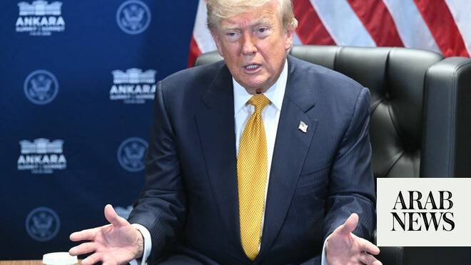

# Trump says interim accord with Iran to end war is “over”

Source: https://www.arabnews.com/node/2650076/middle-east
Captured source: https://www.arabnews.com/node/2650076/middle-east
Published: 2026-07-08T11:24:50+03:00
Modified: 2026-07-08T12:38:00+03:00
Author: Arab News

## Summary

ANKARA: US President Donald Trump said on Wednesday that the memorandum of understanding signed with Iran to end the conflict was “over”, adding he didn’t want to engage with Tehran. The interim ceasefire agreement signed between Washington and Tehran - under the mediation of Pakistan - was intended to provide a 60-day window for negotiations on a permanent agreement, but

## Image

## Video Or Embed URLs

- blob:https://www.arabnews.com/af797853-e63b-4519-bd93-95cbc3ed6d79
- https://imasdk.googleapis.com/js/core/bridge3.774.0_en.html
- https://2980e04803daf1034c5c47163e7e9c12.safeframe.googlesyndication.com/safeframe/1-0-45/html/container.html
- about:blank
- https://static.addtoany.com/menu/sm.25.html
- https://www.google.com/recaptcha/api2/aframe
- https://cm.g.doubleclick.net/partnerpixels?gdpr=0&us_privacy=1---&gpp_sid=-1&url=https%3A%2F%2Fwww.arabnews.com%2Fnode%2F2650076%2Fmiddle-east

## Downloaded Video

- [01_trump-says-interim-accord-with-iran-to-end-war-is-over.mp4](../../../rendered-clips/2026-07-08/01_trump-says-interim-accord-with-iran-to-end-war-is-over.mp4)

## Text

https://arab.news/wxumz

Trump said the ceasefire with Iran was over, calling Tehran “sick”

NATO chief Mark Rutte says overnight strikes on Iran by US forces “absolutely necessary”

ANKARA: US President Donald Trump said on Wednesday that the memorandum of understanding signed with Iran to end the conflict was “over”, adding he didn’t want to engage with Tehran.

The interim ceasefire agreement signed between Washington and Tehran - under the mediation of Pakistan - was intended to provide a 60-day window for negotiations on a permanent agreement, but indirect talks in Qatar ended last week with no sign of headway and the US military unleashed a new wave of strikes against Iran on Tuesday.

“To me, I think it’s over. I don’t want to deal with them,” Trump said ahead of a NATO summit in the Turkish capital Ankara.

“They’re scum. They’re sick people. They’re led by sick people,” he added alongside NATO Secretary General Mark Rutte.

“As far as I'm concerned, it’s just a waste of time dealing with them.”

The US on Tuesday also revoked a license allowing Iran to sell oil after three tankers were hit by projectiles in the Strait of Hormuz.

Under the interim US-Iran agreement, the US Treasury issued a June 22 general license to allow the sale of crude oil and petrochemical and petroleum products of Iranian origin through Aug. 21. In revoking that license on Tuesday, it gave Iran until July 17 to wind down any transactions.

The overnight strikes on Iran by US forces were “absolutely necessary”, NATO chief Mark Rutte said on Wednesday as the alliance began a key summit in Ankara.

“I think it was absolutely necessary because when you have a ceasefire and Iran is basically violating the ceasefire - we see what happened yesterday with ships being attacked - I think it is totally crucial that the US forcefully react,” he told journalists.

He also said: “I expect allies to re-confirm today that Iran should completely re-open Strait of Hormuz .”
