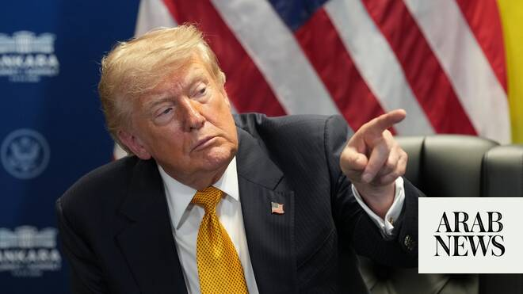

# Trump says interim accord to end Iran war is ‘over’, warns of new US strikes

Source: https://www.arabnews.com/node/2650076/middle-east
Captured source: https://www.arabnews.com/node/2650076/middle-east
Published: 2026-07-08T11:24:50+03:00
Modified: 2026-07-08T17:27:58+03:00
Author: Reuters

## Summary

ANKARA/DUBAI: President Donald Trump said an interim agreement to end the war with Iran ​was “over” and that the United States was likely to launch new strikes on Wednesday night following Iranian attacks on US bases in the Gulf. In a flare-up of hostilities that pushed up oil prices, Iran said on Wednesday it had targeted US military sites in Bahrain and Kuwait after US

## Image

## Video Or Embed URLs

- blob:https://www.arabnews.com/12ec849d-57cd-4bb7-933a-e8b76581286e
- https://imasdk.googleapis.com/js/core/bridge3.774.0_en.html
- https://4af49b7bb3f1dc030674e410a3a9183a.safeframe.googlesyndication.com/safeframe/1-0-45/html/container.html
- about:blank
- https://static.addtoany.com/menu/sm.25.html
- https://sync.teads.tv/wigo-no-slot
- https://ep2.adtrafficquality.google/sodar/sodar2/255/runner.html
- https://www.google.com/recaptcha/api2/aframe
- https://cm.g.doubleclick.net/partnerpixels?gdpr=0&us_privacy=1---&gpp_sid=-1&url=https%3A%2F%2Fwww.arabnews.com%2Fnode%2F2650076%2Fmiddle-east

## Downloaded Video

- [01_us-president-donald-trump-is-pictured-at-the-nato-summit-in-ankara-tur.mp4](../../../rendered-clips/2026-07-08/01_us-president-donald-trump-is-pictured-at-the-nato-summit-in-ankara-tur.mp4)

## Text

https://arab.news/wxumz

“I’ll give a little warning: We’re going to hit them hard tonight,” Trump said before a meeting with Zelensky

“As far as I’m concerned, it’s just a waste of time dealing with them,” he said

ANKARA/DUBAI: President Donald Trump said an interim agreement to end the war with Iran ​was “over” and that the United States was likely to launch new strikes on Wednesday night following Iranian attacks on US bases in the Gulf. In a flare-up of hostilities that pushed up oil prices, Iran said on Wednesday it had targeted US military sites in Bahrain and Kuwait after US forces struck Iranian targets in response to attacks on tankers in the Strait of Hormuz. The attacks further undermined a shaky ceasefire agreement and dented hopes of turning the memorandum of understanding signed on June 17 into a permanent peace deal to end the war, which began with US-Israeli airstrikes on Iran on February 28. “If we make a deal with Iran I’m not sure that will stick,” Trump said, “because I found them to be very dishonorable people.” But Trump did not explicitly say Washington would return to full-fledged war and it was not immediately clear whether or not the negotiations on reaching a permanent deal would continue.

Oil prices rise, stocks fall Asked before a NATO summit in Turkiye whether the memorandum of understanding ‌was over, Trump said: “It’s ‌a very interesting question. To me, I think it’s over. I don’t want to deal with them.” “They’re scum. ​They’re ‌sick people. ⁠They’re led ​by ⁠sick people,” he told reporters in Ankara. “As far as I’m concerned, it’s just a waste of time dealing with them,” he said, before adding: “Now, I’ll let our wonderful negotiators keep talking if they want, but I don’t see it. I don’t like these people, you know that.” A source familiar with the Ankara talks said Trump did not repeat his comments about the interim deal being over when NATO leaders met at the summit, but the president later warned of new strikes in comments to reporters. “I’ll give a little warning: We’re going to hit them hard tonight,” Trump said before a meeting with Ukrainian President Volodymyr Zelensky. The latest attacks have heightened safety and security concerns around the Strait of Hormuz, with shipping data showing at least four oil and gas tankers had turned back rather than try to transit the waterway, a vital supply route. Trump has at times stepped back from ⁠threats he has made against Iran, but oil prices jumped and global bond markets tumbled. Brent crude futures leapt more ‌than 5 percent, the most in a day since late May, to $78.48 a barrel. While that was far below ‌the peaks above $120 seen during the height of the fighting, it was enough to inject some fresh inflation ​risk into the bond market, particularly since months of conflict have drawn down ‌global oil inventories. Wall Street’s main indexes were set to open lower.

Iran and US trade blame Iran’s Revolutionary Guards (IRGC) said they had targeted US military sites in Bahrain ‌and Kuwait and that they had shot down a US MQ-9 drone attempting to interfere in the operation. Bahrain’s army later said it had thwarted Iranian attacks. The US had earlier unleashed new military strikes and revoked a license allowing Iran to sell oil in response to attacks on three tankers in the strait. The US Central Command said more than 60 small boats used by the IRGC were among the targets hit in an operation it said was intended to impose a heavy cost on Iran for strikes on shipping in violation of the ‌ceasefire. Trump said the US had “knocked out 28 boats last night” and would probably hit more later. NATO Secretary General Mark Rutte told reporters before the NATO summit that the new attacks by the US on Iran were “absolutely necessary.” EU foreign ⁠policy chief Kaja Kallas later said ⁠on X the exchanges of fire “complicate already fraught talks to end the war. Iran’s attacks on Bahrain and Kuwait are unacceptable.” Iran’s top joint military command, Khatam Al-Anbiya Central Headquarters, called the US strikes a “blatant act of aggression,” threatened a “crushing response,” and warned that Tehran would not allow US interference in the management of the strait. A top Iranian negotiator, parliament speaker Mohammad Baqer Qalibaf, accused the US of breaching the ceasefire agreement. “The era of bullying and extortion is over,” Qalibaf said in a post on X. “We don’t fold.” Iranian media earlier reported explosions in Iran’s main oil hub of Kharg Island, on Qeshm Island and in the southern port cities of Sirik and Bandar Abbas. CENTCOM made no mention of Kharg Island, from which Iran exports 90 percent of its crude oil. A US official told Reuters that strikes targeted Iranian air defense systems, coastal surveillance systems, surface-to-air missiles, anti-ship cruise missiles and drone launch sites. No civilian deaths were reported in Iran.

Iran seeks to leverage control of the strait Control of the Strait of Hormuz has given Tehran immense leverage, effectively allowing it to force a stalemate with the world’s most powerful military. Analysts say Tehran uses attacks on ships to underscore that leverage as it negotiates a long-term peace deal with the US Under the interim US-Iran agreement, the US Treasury issued a June 22 general license to allow the sale of crude ​oil and petrochemical and petroleum products of Iranian origin through August 21. In revoking ​that license on Tuesday, it gave Iran until July 17 to wind down any transactions. Iran’s foreign ministry condemned the move as a breach of the framework agreement to end the war. The ministry said Iran would take any measure it deemed necessary to safeguard its interests and national security.
