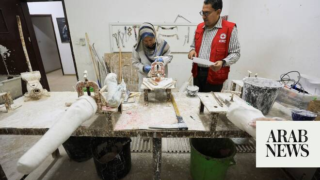

# Rehab center becomes lifeline for thousands maimed in Gaza war

Source: https://www.arabnews.com/node/2650235/middle-east
Captured source: https://www.arabnews.com/node/2650235/middle-east
Published: 2026-07-09T15:20:01+03:00
Modified: 2026-07-09T15:31:51+03:00
Author: Reuters

## Summary

KHAN YOUNIS, Gaza Strip: Tens of thousands of Palestinians in Gaza now live with permanent injuries after more than two years of war, as a shattered healthcare system struggles with severe shortages of medical supplies and rehabilitation equipment. At the Palestine Red Crescent Society Rehabilitation Center in Khan Younis, dozens of children and young adults attend daily

## Image

## Video Or Embed URLs

- blob:https://www.arabnews.com/573acdd8-faf6-4a06-9815-b23fe8814ec5
- https://imasdk.googleapis.com/js/core/bridge3.774.0_en.html
- https://6fa9be802d59819ee39bb1e7bb3c55ac.safeframe.googlesyndication.com/safeframe/1-0-45/html/container.html
- about:blank
- https://static.addtoany.com/menu/sm.25.html
- https://www.google.com/recaptcha/api2/aframe
- https://cm.g.doubleclick.net/partnerpixels?gdpr=0&us_privacy=1---&gpp_sid=-1&url=https%3A%2F%2Fwww.arabnews.com%2Fnode%2F2650235%2Fmiddle-east

## Downloaded Video

- [01_rehab-center-becomes-lifeline-for-thousands-maimed-in-gaza-war.mp4](../../../rendered-clips/2026-07-09/01_rehab-center-becomes-lifeline-for-thousands-maimed-in-gaza-war.mp4)

## Text

https://arab.news/mkm5p

Palestine Red Crescent Society Rehabilitation Center in Khan Younis offers physical and psychological therapy

KHAN YOUNIS, Gaza Strip: Tens of thousands of Palestinians in Gaza now live with permanent injuries after more than two years of war, as a shattered healthcare system struggles with severe shortages of medical supplies and rehabilitation equipment.

At the Palestine Red Crescent Society Rehabilitation Center in Khan Younis, dozens of children and young adults attend daily sessions of physical and psychological therapy. The services have become indispensable to their recovery, yet remain critically under‑resourced, highlighting the severe lack of rehabilitation facilities across Gaza and the inability of existing centers to meet the overwhelming needs.

Among the patients is Mohammad Khalifa, an amputee who lost his leg during the conflict. Determined to restore his independence, he now undergoes intensive rehabilitation while grappling with the daily realities of life with a prosthesis.

“Everyone here was injured in the war and live with different conditions, including paralysis and spinal cord injuries. Sadly, most of them are children and young people,” said Mohammad Khalifa.

Nearby, Tamer Al-Sharif is recovering from shrapnel wounds that left him paralyzed. He says rehabilitation helps maintain his condition while he waits for treatment he cannot receive inside Gaza.

“I need medical treatment outside Gaza because I suffer from joint stiffness and spinal injuries. I need spinal stabilization surgery, but that treatment is not available here. Rehabilitation helps prevent my muscles from atrophying and further suffering,” said Tamer Al-Sharif.

For many patients, the center offers more than rehabilitation. It provides a chance to regain mobility, rebuild confidence and begin recovering from the physical and psychological scars of war.

“We face major challenges due to shortages of medical supplies, including physical therapy equipment. Patients also struggle to reach the hospital from different parts of Gaza. We hope the crossings can be opened so essential rehabilitation supplies can enter, and patients can be allowed to travel abroad for treatment,” said Tareq Al-Hanafi, director of Palestine Red Crescent Rehabilitation Center.

The scale of rehabilitation needs remains immense. According to Gaza’s Government Media Office, more than 19,000 people now require long-term care, including over 5,400 amputees, 1,500 people living with paralysis, and 1,200 who have lost their vision.

For thousands of people wounded by the war in Gaza, recovery is a long and difficult journey. Despite scarce resources, rehabilitation remains their best hope of regaining mobility, independence and a sense of normalcy.
