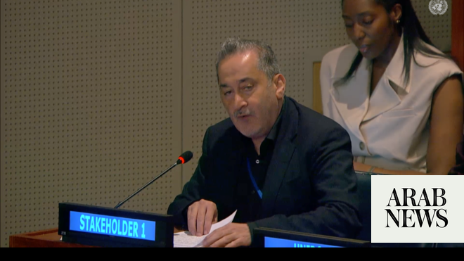

# Saudi green building leader: Cities key to meeting UN sustainable development goals by 2030

Source: https://www.arabnews.com/node/2650322/saudi-arabia
Captured source: https://www.arabnews.com/node/2650322/saudi-arabia
Published: 2026-07-09T23:17:24+03:00
Modified: 2026-07-10T02:21:15+03:00
Author: Ephrem Kossaify

## Summary

NEW YORK: At the UN’s annual High-Level Political Forum on Sustainable Development, Faisal AlFadl, secretary-general of the Saudi Green Building Forum, argued that sustainable development goal 11 on sustainable cities is uniquely positioned to accelerate progress across the entire 2030 Agenda because, unlike the other 16 goals, it is grounded in physical space where people

## Image

## Video Or Embed URLs

- blob:https://www.arabnews.com/b49e34d6-a89b-4d0a-bb70-d01b40d39970
- https://imasdk.googleapis.com/js/core/bridge3.774.0_en.html
- https://bc1666f906b70c556b2be8b484f9085d.safeframe.googlesyndication.com/safeframe/1-0-45/html/container.html
- about:blank
- https://static.addtoany.com/menu/sm.25.html
- https://www.google.com/recaptcha/api2/aframe
- https://cm.g.doubleclick.net/partnerpixels?gdpr=0&us_privacy=1---&gpp_sid=-1&url=https%3A%2F%2Fwww.arabnews.com%2Fnode%2F2650322%2Fsaudi-arabia

## Downloaded Video

- [01_saudi-green-building-leader-cities-key-to-meeting-un-sustainable-devel.mp4](../../../rendered-clips/2026-07-10/01_saudi-green-building-leader-cities-key-to-meeting-un-sustainable-devel.mp4)

## Text

https://arab.news/wxvqn

Faisal AlFadl, secretary-general of Saudi Green Building Forum, says urban planning can advance nearly every goal at once

Riyadh Metro, Red Sea project proof that sustainable cities drive progress, he tells Arab News

NEW YORK: At the UN’s annual High-Level Political Forum on Sustainable Development, Faisal AlFadl, secretary-general of the Saudi Green Building Forum, argued that sustainable development goal 11 on sustainable cities is uniquely positioned to accelerate progress across the entire 2030 Agenda because, unlike the other 16 goals, it is grounded in physical space where people actually live.

“Goal 11, because it’s a geo space, is the only SDG that is spatial,” AlFadl told Arab News.

“If you get it done, it’s immediately affecting the other 17, because you affect hunger, water, energy — everything a citizen deals with in his daily life.”

Speaking at UN headquarters on Thursday during a session on SDG 11 and its interlinkages with other goals, AlFadl told delegates that cities functioned as an “integration platform” where a single investment could simultaneously advance water, energy, infrastructure, climate resilience and economic opportunity.

“Every decision in our cities can advance multiple goals at once,” he said, adding that with more than half the world’s population living in urban areas, no other goal could be met without progress on SDG 11.

The forum, established in 2015, has become the central platform for UN member states to present voluntary national reviews tracking progress toward the 2030 Agenda.

This year’s forum comes as Saudi Arabia presents its third VNR, which AlFadl described as reflecting a shift from breadth to prioritization.

“They feel like, hey, we’ve done the 17 goals one way or another but now we have priorities — where do we still have more stress on resources?” he said, noting that Saudi officials had indicated that more than half of national SDG targets were already considered on track, sharpening focus on the remainder.

The Saudi Green Building Forum, a nongovernmental organization focused on sustainable construction, documented 312 green projects across the Arab region in 2025, with Saudi Arabia accounting for a large share of that total, according to AlFadl.

He said the projects, which span decarbonization, resource efficiency and sustainable materials, illustrated synergies between SDGs 6, 7, 9, 11 and 12 — water, energy, industry and infrastructure, cities and responsible consumption.

Among the flagship examples he cited were the Riyadh Metro, which he described as transformative infrastructure supporting mobility for residents and visitors alike, and the Red Sea tourism development, which he said moved beyond conventional sustainability into “sufficiency.”

Developers were allocated a large tract of coastal land but chose to build on roughly 1 percent of it, preserving the surrounding ecosystem while still meeting revenue and tourism targets, AlFadl said.

“It was sufficient enough for our leaders to decide, let’s just use 1 percent,” he said.

“You protected your land, your sea, your coastal areas — rather than a cheap, large-scale destination, you built something expensive because of nature, because of protection.”

On volunteerism, AlFadl highlighted Saudi Arabia’s Qassim region, where almost 334,000 volunteers — nearly one in four residents — have engaged in local sustainable development efforts over the past year.

The forum also co-organized a side event on Monday, titled “Celebrating Volunteer Impact: Youth Leadership and Advancing Sustainable Development Goals by Climate Action,” which brought together 15 leaders and more than 100 volunteers, youths and children.

AlFadl said the event’s related social media posts drew hundreds of thousands of views, underscoring what he called growing public appetite to participate in sustainable development as volunteers rather than only through government channels.

Turning to artificial intelligence, AlFadl said the technology’s growing role in urban planning and data collection raised questions about which data actually served sustainable development.

He is the author of a book, “Green Future: Intelligence Versus Wisdom,” which argues that AI can process vast amounts of urban data but cannot substitute for human judgment in deciding which data matters.

“There’s so much data that’s unnecessarily collected,” he said, citing surveillance-type data on individuals as an example of information that can crowd out more useful metrics, such as tracking a city’s consumption versus production of food to reduce waste.

“That’s where wisdom comes in. The intelligence versus the wisdom.”

Looking toward 2030, AlFadl said a successful “green city” would be defined less by vegetation than by resilience — the capacity to absorb shocks without cascading into further crises. Asked about the broader trajectory of the sustainable development goals, he cautioned against expecting a definitive endpoint.

“We should look at the 17 goals as a momentum, not a fixed line,” he said. “It’s a continuation and integration … we have to make sure we have enough resources, enough data, enough wisdom from our leaders to keep living well.”

The SDG 11 session found that while progress has been made since the goal was last reviewed at in 2024, including expanded use of geospatial data, wider adoption of National Urban Policies and greater recognition of local governments ’role, persistent gaps in housing affordability, slum prevalence, urban sprawl, air pollution and infrastructure resilience mean the goal remains off track for 2030.
