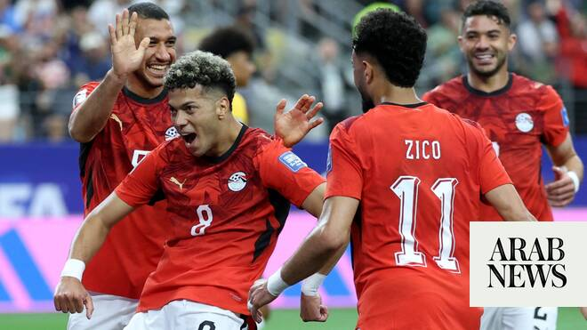

# Major gains for Egypt at 2026 World Cup, say former national team members

Source: https://www.arabnews.com/node/2650372/sport
Captured source: https://www.arabnews.com/node/2650372/sport
Published: 2026-07-10T14:00:38+03:00
Modified: 2026-07-10T14:08:17+03:00
Author: Fady Francis

## Summary

CAIRO: Egypt have made major gains at 2026 World Cup despite their elimination in the knockout stage, former national team members told Arab News recently. Egypt suffered a controversial exit after a late 3-2 loss to reigning world champions Argentina, with many calls from the French referee causing anger and frustration for players and fans.

## Image

## Video Or Embed URLs

- blob:https://www.arabnews.com/d2c34b8b-e12b-45f1-84fa-85db4a67621e
- https://imasdk.googleapis.com/js/core/bridge3.774.0_en.html
- https://ab07b0749dc00d802033d4feabcc55cb.safeframe.googlesyndication.com/safeframe/1-0-45/html/container.html
- about:blank
- https://static.addtoany.com/menu/sm.25.html
- https://www.google.com/recaptcha/api2/aframe
- https://cm.g.doubleclick.net/partnerpixels?gdpr=0&us_privacy=1---&gpp_sid=-1&url=https%3A%2F%2Fwww.arabnews.com%2Fnode%2F2650372%2Fsport

## Downloaded Video

- [01_major-gains-for-egypt-at-2026-world-cup-say-former-national-team-membe.mp4](../../../rendered-clips/2026-07-10/01_major-gains-for-egypt-at-2026-world-cup-say-former-national-team-membe.mp4)

## Text

https://arab.news/8499f

Despite the bitter disappointment at the manner of exit against Argentina, the future is bright for the Pharaohs, according to former stars

CAIRO: Egypt have made major gains at 2026 World Cup despite their elimination in the knockout stage, former national team members told Arab News recently.

For the latest updates, follow us @ArabNewsSport

Egypt suffered a controversial exit after a late 3-2 loss to reigning world champions Argentina, with many calls from the French referee causing anger and frustration for players and fans.

The Egyptian Football Association declared in a statement that they “cannot remain silent regarding the refereeing decisions witnessed during the match against Argentina as well as the failure to make appropriate use of the Video Assistant Referee system.

“Several key incidents raised serious concerns and left profound questions about the consistency and fairness of decisions that directly influenced the course of the game.”

Despite the loss, Egypt made history by recording their first World Cup win and qualification for the knockout stages. In addition, they won their first Round of 16 game.

Former Egyptian national team players and coaches told Arab News that many positives could be taken from the participation.

Taher Abu Zeid, a former Egypt skipper and minister of sports, said: “We now have technical and administrative stability, and this is one of the most important gains from our participation in the World Cup.

“We have an excellent coach (Hossam Hassan) who gained extensive experience from his first World Cup appearance, as well as from his previous experience as a striker for Egypt in the 1990 World Cup.

“He will be able to complete the project for the next phase and achieve great results in the upcoming tournaments.”

Former Egypt coach Farouk Jaafar expressed pride in the team: “The Egyptian national team’s preparations under Hossam Hassan were thorough, benefiting from a diverse schedule of friendly matches.

“Those experiences made Egypt a strong opponent against defending champions Argentina. The team took a two-goal lead, and had it not been for the referee’s decisions, Egypt could have advanced to the next stage.”

Tarek El-Sayed, a former Egypt international player, said that team achieved “significant gains.”

They scored eight goals during a tournament that saw several outstanding performers. This included Karim Hafez and Haitham Hassan against Argentina; Mostafa Zico, who scored two goals in the tournament, and Mostafa Shobeir, who saved a penalty from Lionel Messi. Emam Ashour was also singled out for his excellent performances.

El-Sayed said the presence of young players including Haitham Hassan, Ibrahim Adel, and Mahmoud Saber marks the beginning of a positive future for Egyptian football, and a better FIFA ranking.

The national team will receive $15 million from FIFA for reaching the Round of 16.
