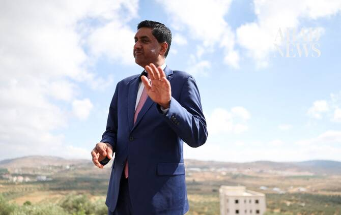

# US Democrat Ro Khanna detained by Israeli settlers during West Bank visit

Source: https://www.arabnews.com/node/2650506/world
Captured source: https://www.arabnews.com/node/2650506/world
Published: 2026-07-11T14:29:44+03:00
Modified: 2026-07-11T22:37:53+03:00
Author: Reuters

## Summary

TURMUS AYYA: US Democratic lawmaker Ro Khanna said he was detained by Israeli settlers armed with US-made rifles during a West Bank visit this week that he ​cast as an unfiltered look at the human toll of Israeli occupation as he weighs a 2028 presidential run. Speaking with Reuters on Thursday in a Palestinian village, Khanna said his group’s van was surrounded by settlers

## Image

## Video Or Embed URLs

- blob:https://www.arabnews.com/42c94844-c9bb-4f3a-a8b7-42037d030fce
- https://imasdk.googleapis.com/js/core/bridge3.774.0_en.html
- about:blank
- https://static.addtoany.com/menu/sm.25.html
- https://www.google.com/recaptcha/api2/aframe
- https://cm.g.doubleclick.net/partnerpixels?gdpr=0&us_privacy=1---&gpp_sid=-1&url=https%3A%2F%2Fwww.arabnews.com%2Fnode%2F2650506%2Fworld

## Downloaded Video

- [01_us-democrat-ro-khanna-detained-by-israeli-settlers-during-west-bank-vi.mp4](../../../rendered-clips/2026-07-12/01_us-democrat-ro-khanna-detained-by-israeli-settlers-during-west-bank-vi.mp4)

## Text

https://arab.news/4ebrw

Khanna said his group’s van was surrounded by settlers wielding M4 rifles a day earlier while touring a part of the southern West Bank

The Representative, who is considering a run for the presidency, said his party’s establishment is “clueless" about how much of a moral test Palestine has become

TURMUS AYYA: US Democratic lawmaker Ro Khanna said he was detained by Israeli settlers armed with US-made rifles during a West Bank visit this week that he ​cast as an unfiltered look at the human toll of Israeli occupation as he weighs a 2028 presidential run. Speaking with Reuters on Thursday in a Palestinian village, Khanna said his group’s van was surrounded by settlers wielding M4 rifles a day earlier while touring a part of the southern West Bank where residents face frequent settler attacks. “We were at a village that Israeli settlers had destroyed, they had destroyed the school, they had destroyed that village, and we were just looking at it,” said Khanna, a progressive lawmaker from California in the US House of Representatives.

“And these hoodlums come in with machine guns – M4, an American-made machine gun – and they detain us. They block off the road. And then they call the IDF and the IDF is on ‌their side, not on ‌the side of the Americans,” Khanna said, referring to the Israeli military. An aide ​to ‌Khanna ⁠who was ​in ⁠the group, Cameron Kasky, said they were held for more than an hour and made appeals to the US Embassy in Jerusalem for help. A group of officers who appeared to be police eventually intervened, leading to their release, Kasky said. The Israeli military said troops and police officers intervened after receiving a report of settlers blocking vehicles near Khirbet Zanuta, a small Palestinian hamlet whose residents were forcibly displaced by violent settler raids following the 2023 Hamas attacks on Israel. “Upon their arrival, the troops dispersed the Israeli civilians and allowed the vehicles to continue on their way,” the military said. Israel’s police did not immediately respond to a request for comment, nor did the US ⁠Embassy in Jerusalem.

Democrats divided over Israel

Khanna is the second Democrat considering a White ‌House bid to visit the region this week. In Tel Aviv on Wednesday, ‌Rahm Emanuel, who was chief of staff to former President Barack Obama, said Israeli ​policies toward Palestinians were eroding support for the US-Israeli alliance. Asked if ‌he was running for president, Khanna said: “I’m strongly considering it and I’m more resolved to consider it after this trip.” Israel’s ‌conduct toward Palestinians has emerged as a flashpoint in Democratic politics ahead of November’s US midterm elections, contributing to primary defeats for some incumbent lawmakers targeted by left-wing challengers who accused them of supporting Israel’s right-wing government.

Israel’s favorability rating among Democrats fell from 59 percent in 2018 to 22 percent in May, according to Reuters/Ipsos polling. While Israel has long enjoyed strong bipartisan US support, an increasing number of Democrats in Congress are now pressing ‌to cut off military aid, which amounts to $3.8 billion per year and includes funding for light weaponry like M4 rifles and missile interceptors that Israel used in the Iran ⁠war. Overlooking a valley dotted with ⁠settler outposts on the outskirts of Turmus Ayya, a village home to thousands of Palestinian American dual nationals, Khanna said he believed his party’s establishment was “clueless about how much of a moral test Palestine, Gaza and Israel have become.” He said he chose to do a visit exclusively to the West Bank, with programming led by Palestinians, to give him an unfiltered view of territory Israel captured in the 1967 Middle East war. “If you’re unwilling to speak up for Palestinian human rights, if you’re unwilling to speak up against the genocide in Gaza, the apartheid in the West Bank, then you are morally compromised,” Khanna said. Israel rejects allegations it carried out a genocide in Gaza or that it institutes an apartheid regime in the West Bank, which has a population of about 3 million Palestinians and around 500,000 Jewish settlers. Most countries and the United Nations regard Israeli settlements in the West Bank as illegal under international law, citing the Fourth Geneva Convention’s prohibition on transferring a civilian population into occupied territory. Israel rejects ​that position, saying the West Bank is disputed territory where ​there has been a Jewish presence for thousands of years. Palestinians view the West Bank, together with Gaza and East Jerusalem, as part of a Palestinian state. Support remains strong among Republicans, though some elements of Trump’s coalition have also called for cutting off aid.
