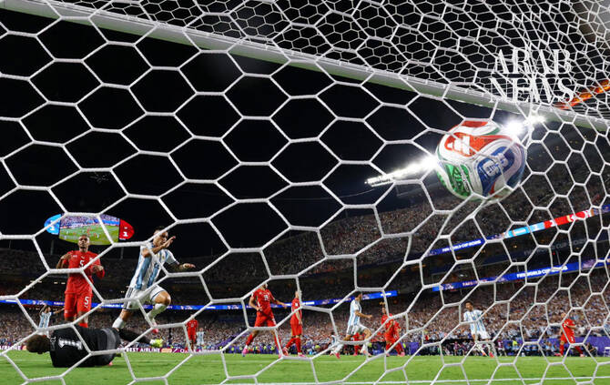

# Argentina sink 10-man Swiss to set up blockbuster World Cup semifinal with England

Source: https://www.arabnews.com/node/2650592/football
Captured source: https://www.arabnews.com/node/2650592/football
Published: 2026-07-12T06:59:22+03:00
Modified: 2026-07-12T10:37:34+03:00
Author: AFP

## Summary

KANSAS CITY: Julian Alvarez scored a breathtaking goal as Argentina battled past 10-man Switzerland 3-1 after extra-time on Saturday, setting up a mouthwatering World Cup semifinal against bitter rivals England. Fans of the South American team dominated the stands in Kansas City and were celebrating as early as the 10th minute when their hero Lionel Messi set up Alexis Mac

## Image

## Video Or Embed URLs

- blob:https://www.arabnews.com/43dc4350-6752-4e7b-acb8-683f8bc0cbfa
- https://imasdk.googleapis.com/js/core/bridge3.774.0_en.html
- https://acc301aa3e51fbe80a7e7b4afbceb1b1.safeframe.googlesyndication.com/safeframe/1-0-45/html/container.html
- about:blank
- https://static.addtoany.com/menu/sm.25.html
- https://gum.criteo.com/syncframe?origin=publishertagids&topUrl=www.arabnews.com&gdpr=0&gdpr_consent=&gpp=&gpp_sid=-1
- https://sync.teads.tv/wigo-no-slot
- https://www.google.com/recaptcha/api2/aframe
- https://cm.g.doubleclick.net/partnerpixels?gdpr=0&us_privacy=1---&gpp_sid=-1&url=https%3A%2F%2Fwww.arabnews.com%2Fnode%2F2650592%2Ffootball

## Downloaded Video

- [01_argentina-sink-10-man-swiss-to-set-up-blockbuster-world-cup-semifinal-.mp4](../../../rendered-clips/2026-07-12/01_argentina-sink-10-man-swiss-to-set-up-blockbuster-world-cup-semifinal-.mp4)

## Text

https://arab.news/rhxdv

Argentina are now unbeaten in their past 12 World Cup matches

England defeated Norway 2-1 in extra time earlier Saturday Florida

KANSAS CITY: Julian Alvarez scored a breathtaking goal as Argentina battled past 10-man Switzerland 3-1 after extra-time on Saturday, setting up a mouthwatering World Cup semifinal against bitter rivals England. Fans of the South American team dominated the stands in Kansas City and were celebrating as early as the 10th minute when their hero Lionel Messi set up Alexis Mac Allister’s opener. Switzerland levelled midway through the second half through Dan Ndoye but minutes later disaster struck when Embolo was sent off after picking up a second yellow card for simulation. The match went to extra-time and Switzerland snuffed out wave after wave of attacks until Alvarez curled a breathtaking strike into the top corner in the 112th minute. Lautaro Martinez added gloss with a late third. The hard-fought victory for Lionel Scaloni’s men at the Arrowhead Stadium means the top four teams in the FIFA rankings will contest the semifinals of the 2026 tournament. Argentina are now unbeaten in their past 12 World Cup matches as they attempt to become the first team since Brazil in 1962 to retain their World Cup crown. The South Americans swept through the group phase but struggled past minnows Cape Verde and needed a spectacular comeback against Egypt. Saturday’s game was another attritional affair against a Swiss team seeking to reach the World Cup semifinals for the first time. Argentina took the lead with their first effort on target when Liverpool midfielder Mac Allister rose between Djibril Sow and Embolo to glance a header into the far corner. Messi was the provider from a corner, taking his tally of assists across six World Cups to 10. He is also joint top of the Golden Boot standings with eight goals, level with French forward Kylian Mbappe but he did not find the net on Saturday. The Swiss struggled to counter-punch but had a good chance on the half hour when goalkeeper Emiliano Martinez was quickly off his line to deny Embolo. Argentina failed to muster another effort on target before the break, with Switzerland outpassing the world champions. The game struggled to catch fire early in the second half but Murat Yakin’s men warmed to their task and got their deserved reward in the 67th minute, when Ndoye swept home following a clever ball from Ricardo Rodriguez. Five minutes later Switzerland shot themselves in the foot when Embolo, who had been booked in the first half, threw himself to the ground and was dismissed following a VAR check. Mac Allister headed wide with the goal at his mercy as the clock ticked down and Messi sent a curling shot narrowly wide but Switzerland held on to force extra-time. They continued to repel constant attacks in the first period of extra-time. But Argentina finally broke Switzerland’s brave resistance with Alvarez’s moment of magic, which was celebrated by the whole squad, who were on the pitch again minutes later following Martinez’s strike. Now the winners will turn their attention to the challenge of facing England in Atlanta on Wednesday after Thomas Tuchel’s men overcame Norway 2-1 earlier on Saturday. Andreas Schjelderup scored in the 36th minute and Nyland made six saves for the ​Vikings, ‌who were ⁠playing in ​their ⁠first World Cup quarterfinal game. "I'm most proud of the fact that we have been here for 6 1/2 weeks and that all the players and the support staff have contributed. We haven't had a boring moment," Norway coach Stale Solbakken said via a translation. "... It's very difficult now, but I think that when some time passes, that in a week or two, everyone can agree that the summer of ‘26 has been fairly OK." Norway subbed out Erling Haaland halfway through extra time. That decision ended his record 14-match streak of competitive international appearances with a goal. The history of matches between England and Argentina is peppered with flashpoints on the pitch, set against a lingering sovereignty dispute over the Falkland Islands, known in Spanish as the Malvinas, in the South Atlantic Ocean. Britain sent a military taskforce in 1982 to reclaim the islands after Argentine troops invaded. Four years later Argentina secured a 2-1 victory over England at the Estadio Azteca with goals from Diego Maradona — one the infamous “Hand of God” goal and the other a dazzling solo effort considered one of the best ever. The teams have faced each other twice in World Cups since 1986 — Argentina won on penalties in 1998 while England gained revenge four years later.
