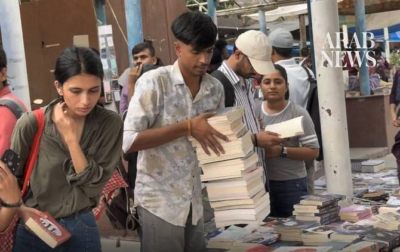

# How decades-old Sunday book market shapes Delhi’s reading habits

Source: https://www.arabnews.com/node/2650637/world
Captured source: https://www.arabnews.com/node/2650637/world
Published: 2026-07-12T17:45:01+03:00
Modified: 2026-07-12T17:46:21+03:00
Author: Sanjay Kumar

## Summary

NEW DELHI: Every Sunday morning, a one-of-a-kind colorful maze takes shape near Delhi Gate, where thousands of paperbacks and hardcovers rise in towers and spill on tarpaulin beds, setting the stage for generations of readers on hours-long treasure hunts. From popular romances to classics in English, Hindi and Urdu, to manga, children’s comics, philosophy, cookbooks and

## Image

## Video Or Embed URLs

- blob:https://www.arabnews.com/a1103d76-4b80-48fc-b530-70f4a14fa438
- https://imasdk.googleapis.com/js/core/bridge3.774.0_en.html
- https://a12a8a6650f1f020c1b5eb2563330981.safeframe.googlesyndication.com/safeframe/1-0-45/html/container.html
- https://static.addtoany.com/menu/sm.25.html
- about:blank
- https://www.google.com/recaptcha/api2/aframe
- https://cm.g.doubleclick.net/partnerpixels?gdpr=0&us_privacy=1---&gpp_sid=-1&url=https%3A%2F%2Fwww.arabnews.com%2Fnode%2F2650637%2Fworld

## Downloaded Video

- [01_people-search-through-volumes-of-secondhand-books-at-sunday-s-market-i.mp4](../../../rendered-clips/2026-07-12/01_people-search-through-volumes-of-secondhand-books-at-sunday-s-market-i.mp4)

## Text

https://arab.news/vdvza

Market’s affordability has allowed people to create their own home libraries

Every weekend, more than 300 book sellers take part in Daryaganj Sunday Patri

NEW DELHI: Every Sunday morning, a one-of-a-kind colorful maze takes shape near Delhi Gate, where thousands of paperbacks and hardcovers rise in towers and spill on tarpaulin beds, setting the stage for generations of readers on hours-long treasure hunts.

From popular romances to classics in English, Hindi and Urdu, to manga, children’s comics, philosophy, cookbooks and coffee-table art albums, the open-air Sunday book bazaar has been serving as a cultural institution for decades.

Initially, and for the longest time, it was located in the Daryaganj market — an old commercial hub in Shahjahanabad, the 17th-century capital of Mughal rulers, where publishers began to settle after India gained independence from British rule.

A few years later, the need for cheaper books emerged amid increasing readership and the expansion of university campuses in the 1950s and 1960s.

Small vendors began to arrive in the area offering secondhand volumes, and, until recently, every Sunday hundreds of them lined a kilometer-long stretch of pavement in Daryaganj.

The market continues to be known as Daryaganj Sunday Patri (Pavement) even after moving in 2019 to Mahila Haat, a former artisan market some five minutes away.

“The Sunday book bazaar is at least 70 years old, and it used to happen at Netaji Subhash Road, Daryaganj. There used to be only few shops in the earlier times, but as people started reading more and people started getting more educated, more and more books started coming here,” said Qamar Sayed, president of the Daryaganj Sunday Patri Welfare Association, who has been selling books at the market since the 1970s.

“When I started the bookshop, my relatives too came into this profession, and more and more people joined. Now it is in Mahila Haat. There are 320 shops.”

Each seller occupies a small space where books are either stacked in piles, neatly arranged, or scattered in a haphazard manner.

“We procure these books from publishers, from junk shop owners who procure books from students, households. We reach out to these scrap dealers and procure the books, then we dust them off and present them here,” Sayed told Arab News.

“Shopkeepers, though not educated, have gained knowledge by being in the profession. We know this is a novel, published by a particular publisher, and that there are publishers whose books have a distinct marking. Even though we are less educated we sense the book, we understand a book by the name of the writer. This is not difficult. You get experience if you keep working in a particular area for long.”

Visitors come from different parts of Delhi and spend hours browsing through books, moving from one stall to another, and at the end many leave with bundled stacks of books.

Aishani Tomar, an undergraduate student of English and political science, visits the market almost every Sunday — looking for new reads and textbooks which, if bought new, would put a strain on her budget.

“I find a lot of students here that are preparing for various exams, too,” she said.

“I think it’s important to make reading accessible for everyone, and books here are sold obviously cheaper.”

While many of the titles are available online and in e-book form, market sellers have not observed a drop in interest, especially among students.

For Jatin Nagdev, a student at Delhi University, reading on a screen produces eye strain and an opportunity to switch to social media apps instead of studying. With physical books it is different, as they help increase his attention span.

“When you are increasing the attention span, you can literally imagine what the stories are,” he said. “It could increase your imagination.”

The market has been credited with expanding the Indian capital’s reading culture over the decades. The access and affordability that it offers has played a significant role in “how Delhi reads and how Delhi purchases its books,” according to Kanupriya Dhinagra, whose monograph, “The Sunday Book Bazar,” explores its history.

“It is also motivating a lot more people to not just read for their exams, but also have a library of their own because here they can afford it,” she told Arab News.

“What that accessibility offered to the readers of Delhi is to go beyond a set reading list. That could happen because of the seemingly chaotic and serendipitous nature of this book market, which would allow a reader to not just look for a certain book, but also find a lot more.”
